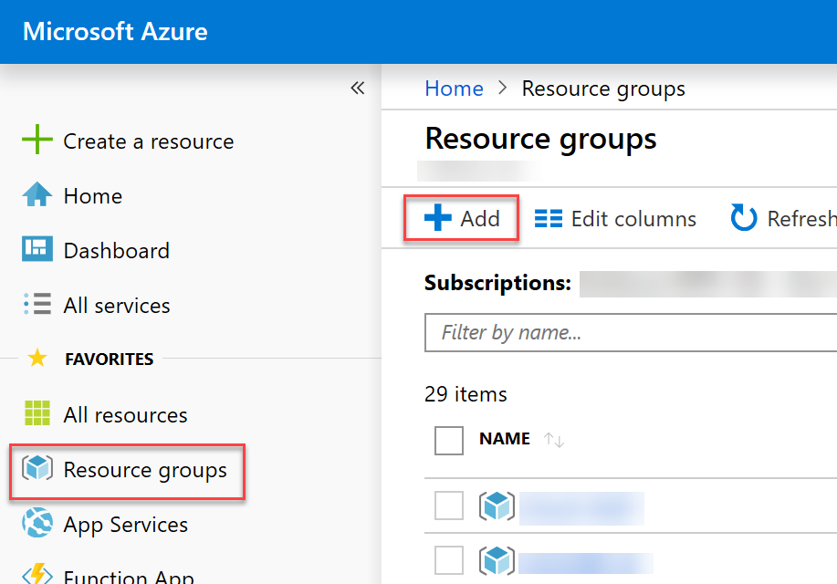
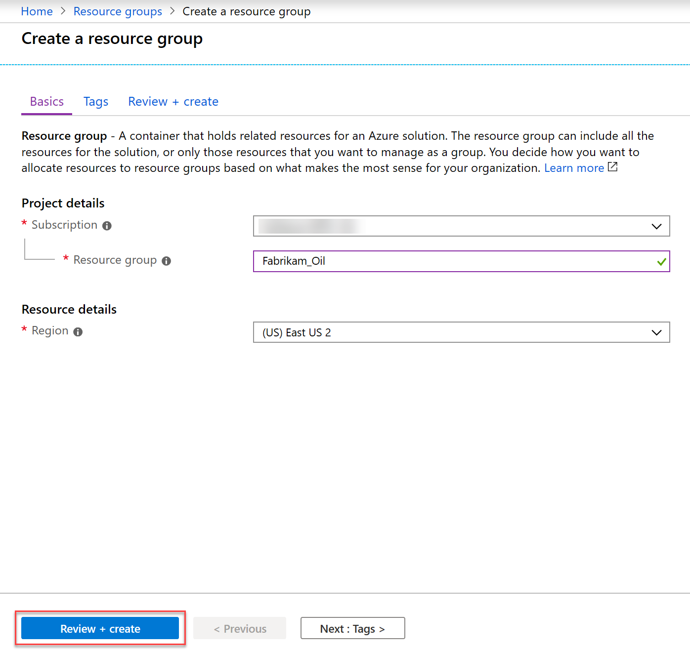

Predictive Maintenance for remote field devices

Before the hands-on lab setup guide

September 2019

Information in this document, including URL and other Internet Web site references, is subject to change without notice. Unless otherwise noted, the example companies, organizations, products, domain names, e-mail addresses, logos, people, places, and events depicted herein are fictitious, and no association with any real company, organization, product, domain name, e-mail address, logo, person, place or event is intended or should be inferred. Complying with all applicable copyright laws is the responsibility of the user. Without limiting the rights under copyright, no part of this document may be reproduced, stored in or introduced into a retrieval system, or transmitted in any form or by any means (electronic, mechanical, photocopying, recording, or otherwise), or for any purpose, without the express written permission of Microsoft Corporation.

Microsoft may have patents, patent applications, trademarks, copyrights, or other intellectual property rights covering subject matter in this document. Except as expressly provided in any written license agreement from Microsoft, the furnishing of this document does not give you any license to these patents, trademarks, copyrights, or other intellectual property.

The names of manufacturers, products, or URLs are provided for informational purposes only and Microsoft makes no representations and warranties, either expressed, implied, or statutory, regarding these manufacturers or the use of the products with any Microsoft technologies. The inclusion of a manufacturer or product does not imply endorsement of Microsoft of the manufacturer or product. Links may be provided to third party sites. Such sites are not under the control of Microsoft and Microsoft is not responsible for the contents of any linked site or any link contained in a linked site, or any changes or updates to such sites. Microsoft is not responsible for webcasting or any other form of transmission received from any linked site. Microsoft is providing these links to you only as a convenience, and the inclusion of any link does not imply endorsement of Microsoft of the site or the products contained therein.

© 2019 Microsoft Corporation. All rights reserved.

Microsoft and the trademarks listed at <https://www.microsoft.com/en-us/legal/intellectualproperty/Trademarks/Usage/General.aspx> are trademarks of the Microsoft group of companies. All other trademarks are property of their respective owners.

**Contents**

<!-- TOC -->

- [Predictive Maintenance for remote field devices before the hands-on lab setup guide](#predictive-maintenance-for-remote-field-devices-before-the-hands-on-lab-setup-guide)
  - [Requirements](#requirements)
  - [Before the hands-on lab](#before-the-hands-on-lab)
    - [Task 1: Provision a resource group](#task-1-provision-a-resource-group)
    - [Task 2: Create an Azure Databricks workspace](#task-2-create-an-azure-databricks-workspace)

<!-- /TOC -->

# Predictive Maintenance for remote field devices before the hands-on lab setup guide

## Requirements

1. Microsoft Azure subscription (non-Microsoft subscription, must be a pay-as-you subscription).

## Before the hands-on lab

Duration: 60 minutes

In the Before the hands-on lab exercise, you will set up your environment for use in the rest of the hands-on lab. You should follow all the steps provided in the Before the hands-on lab section to prepare your environment **before attending** the hands-on lab. Failure to do so will significantly impact your ability to complete the lab within the time allowed.

> **Important**: Most Azure resources require unique names. Throughout this lab you will see the word “SUFFIX” as part of resource names. You should replace this with your Microsoft alias, initials, or another value to ensure the resource is uniquely named.

### Task 1: Provision a resource group

In this task, you will create an Azure resource group for the resources used throughout this lab.

1. Log into the [Azure Portal](https://portal.azure.com)

2. In the left-hand menu, select **Resource Groups**.

3. At the top of the screen press the **Add** button.

   

4. Create a new resource group with the name **Fabrikam_Oil**, ensure the proper subscription and region nearest you are selected. Then select **Review + Create**.

   

5. On the Summary blade, select **Create** to provision your resource group.

### Task 2: Create an Azure Databricks workspace

Azure Databricks is used to train and deploy a machine learning model that predicts an oil pump failure, based on incoming telemetry.

1. Navigate to the [Azure portal](https://portal.azure.com).

2. Select **+ Create a resource**, type in "Databricks" in the search field, then select **Azure Databricks** from the results.

   

3. Select **Create** in the Azure Databricks details page.

4. Within the **Azure Databricks Service** form, complete the following:

   | Field                          | Value                                      |
   | ------------------------------ | ------------------------------------------ |
   | Workspace name                 | _globally unique name_                     |
   | Subscription                   | _select the appropriate subscription_      |
   | Resource Group                 | _select use existing, then `Fabrikam_Oil`_ |
   | Location                       | _select the location nearest to you_       |
   | Pricing tier                   | _select Standard_                          |
   | Deploy in your Virtual Network | _select No_                                |

   

5. Select **Create**.

   

You should follow all steps provided _before_ performing the Hands-on lab.
