<div class="MCWHeader1">
Predictive Maintenance for remote field devices
</div>

<div class="MCWHeader2">
Hands-on lab step-by-step
</div>

<div class="MCWHeader3">
September 2019
</div>

Information in this document, including URL and other Internet Web site references, is subject to change without notice. Unless otherwise noted, the example companies, organizations, products, domain names, e-mail addresses, logos, people, places, and events depicted herein are fictitious, and no association with any real company, organization, product, domain name, e-mail address, logo, person, place or event is intended or should be inferred. Complying with all applicable copyright laws is the responsibility of the user. Without limiting the rights under copyright, no part of this document may be reproduced, stored in or introduced into a retrieval system, or transmitted in any form or by any means (electronic, mechanical, photocopying, recording, or otherwise), or for any purpose, without the express written permission of Microsoft Corporation.

Microsoft may have patents, patent applications, trademarks, copyrights, or other intellectual property rights covering subject matter in this document. Except as expressly provided in any written license agreement from Microsoft, the furnishing of this document does not give you any license to these patents, trademarks, copyrights, or other intellectual property.

The names of manufacturers, products, or URLs are provided for informational purposes only and Microsoft makes no representations and warranties, either expressed, implied, or statutory, regarding these manufacturers or the use of the products with any Microsoft technologies. The inclusion of a manufacturer or product does not imply endorsement of Microsoft of the manufacturer or product. Links may be provided to third party sites. Such sites are not under the control of Microsoft and Microsoft is not responsible for the contents of any linked site or any link contained in a linked site, or any changes or updates to such sites. Microsoft is not responsible for webcasting or any other form of transmission received from any linked site. Microsoft is providing these links to you only as a convenience, and the inclusion of any link does not imply endorsement of Microsoft of the site or the products contained therein.

© 2019 Microsoft Corporation. All rights reserved.

Microsoft and the trademarks listed at <https://www.microsoft.com/en-us/legal/intellectualproperty/Trademarks/Usage/General.aspx> are trademarks of the Microsoft group of companies. All other trademarks are property of their respective owners.

**Contents**

<!-- TOC -->

- [Predictive Maintenance for remote field devices hands-on lab step-by-step](#predictive-maintenance-for-remote-field-devices-hands-on-lab-step-by-step)
  - [Abstract and learning objectives](#abstract-and-learning-objectives)
  - [Overview](#overview)
  - [Solution architecture](#solution-architecture)
  - [Requirements](#requirements)
  - [Before the hands-on lab](#before-the-hands-on-lab)
  - [Exercise 1: Configuring IoT Central with devices and metadata](#exercise-1-configuring-iot-central-with-devices-and-metadata)
    - [Task 1: Model the telemetry data](#task-1-model-the-telemetry-data)
      - [Telemetry Schema](#telemetry-schema)
    - [Task 2: Create an IoT Central Application](#task-2-create-an-iot-central-application)
    - [Task 3: Create the Device Template](#task-3-create-the-device-template)
    - [Task 4: Create and provision real devices](#task-4-create-and-provision-real-devices)
  - [Task 5: Delete the simulated device](#task-5-delete-the-simulated-device)
  - [Exercise 2: Run the Rod Pump Simulator](#exercise-2-run-the-rod-pump-simulator)
    - [Task 1: Generate device connection strings](#task-1-generate-device-connection-strings)
    - [Task 2: Open the Visual Studio solution, and update connection string values](#task-2-open-the-visual-studio-solution-and-update-connection-string-values)
    - [Task 3: Run the application](#task-3-run-the-application)
    - [Task 4: Interpret telemetry data](#task-4-interpret-telemetry-data)
    - [Task 5: Restart a failing pump remotely](#task-5-restart-a-failing-pump-remotely)
  - [Exercise 3: Use Azure Databricks and Azure Machine Learning service to train and deploy predictive model](#exercise-3-use-azure-databricks-and-azure-machine-learning-service-to-train-and-deploy-predictive-model)
    - [Task 1: Create a workflow using Microsoft Flow](#task-1-create-a-workflow-using-microsoft-flow)
  - [Exercise 4: Creating a device set](#exercise-4-creating-a-device-set)
    - [Task 1: Create a device set using a filter](#task-1-create-a-device-set-using-a-filter)
  - [Exercise 5: Creating a useful dashboard](#exercise-5-creating-a-useful-dashboard)
    - [Task 1: Clearing out the default dashboard](#task-1-clearing-out-the-default-dashboard)
    - [Task 2: Add your company logo](#task-2-add-your-company-logo)
    - [Task 3: Add a list of Texas Rod Pumps](#task-3-add-a-list-of-texas-rod-pumps)
    - [Task 4: Add a map displaying the power state of DEVICE001](#task-4-add-a-map-displaying-the-power-state-of-device001)
  - [Exercise 6: Create an Event Hub and continuously export data from IoT Central](#exercise-6-create-an-event-hub-and-continuously-export-data-from-iot-central)
    - [Task 1: Create an Event Hub](#task-1-create-an-event-hub)
    - [Task 2: Configure continuous data export from IoT Central](#task-2-configure-continuous-data-export-from-iot-central)
  - [Exercise 7: Create an Azure Function to predict pump failure](#exercise-7-create-an-azure-function-to-predict-pump-failure)
    - [Task 1: Create an Azure Function Application](#task-1-create-an-azure-function-application)
    - [Task 2: Create a notification table in Azure Storage](#task-2-create-a-notification-table-in-azure-storage)
    - [Task 3: Create a notification queue in Azure Storage](#task-3-create-a-notification-queue-in-azure-storage)
    - [Task 4: Create notification service in Microsoft Flow](#task-4-create-notification-service-in-microsoft-flow)
    - [Task 5: Obtain connection settings for use with the Azure Function implementation](#task-5-obtain-connection-settings-for-use-with-the-azure-function-implementation)
    - [Task 6: Create the local settings file for the Azure Functions project](#task-6-create-the-local-settings-file-for-the-azure-functions-project)
    - [Task 7: Review the Azure Function code](#task-7-review-the-azure-function-code)
    - [Task 8: Run the Function App locally](#task-8-run-the-function-app-locally)
  - [After the hands-on lab](#after-the-hands-on-lab)
    - [Task 1: Delete Lab Resources](#task-1-delete-lab-resources)

<!-- /TOC -->

# Predictive Maintenance for remote field devices hands-on lab step-by-step

## Abstract and learning objectives

In this hands-on-lab, you will build an end-to-end industrial IoT solution. We will begin by leveraging the Azure IoT Central SaaS offerings to quickly stand up a fully functional remote monitoring solution. Azure IoT Central provides solutions built upon recommendations found in the [Azure IoT Reference Architecture](https://docs.microsoft.com/en-us/azure/architecture/reference-architectures/iot/). We will customize this system specifically for rod pumps. Rod pumps are industrial equipment that is heavily used in the oil and gas industry. We will then establish a model for the telemetry data that is received from the pump systems in the field and use this model to deploy simulated devices for system testing purposes.

Furthermore we will establish threshold rules in the remote monitoring system that will monitor the incoming telemetry data to ensure all equipment is running optimally, and can alert us whenever the equipment is running outside of normal boundaries - indicating the need for alternative running parameters, maintenance, or a complete shut down of the pump. By leveraging the IoT Central solution, users can also issue commands to the pumps from a remote location in an instant to automate many operational and maintenance tasks which used to require staff on-site. This lessens operating costs associated with technician dispatch and equipment damage due to a failure.

Above and beyond real-time monitoring and mitigating immediate equipment damage through commanding - you will also learn how to apply the historical telemetry data accumulated to identify positive and negative trends that can be used to adjust daily operations for higher throughput and reliability.

## Overview

The Predictive Maintenance for Remote Field Devices hands-on lab is an exercise that will challenge you to implement an end-to-end scenario using the supplied example that is based on Azure IoT Central and other related Azure services. The hands-on lab can be implemented on your own, but it is highly recommended to pair up with other members at the lab to model a real-world experience and to allow each member to share their expertise for the overall solution.

## Solution architecture

\[Insert your end-solution architecture here. . .\]

## Requirements

1. Microsoft Azure subscription (non-Microsoft subscription, must be a pay-as-you subscription).
2. An Azure Databricks cluster running Databricks Runtime 5.1 or above. Azure Databricks integration with Azure Data Lake Storage Gen2 is **fully supported in Databricks Runtime 5.1 and greater**.

## Before the hands-on lab

Refer to the [Before the hands-on lab setup guide](./Before%20the%20HOL%20-%20Predictive%20Maintenance%20for%20Remote%20Field%20Devices.md) manual before continuing to the lab exercises.

## Exercise 1: Configuring IoT Central with devices and metadata

Duration: X minutes

[Azure IoT Central](https://azure.microsoft.com/en-us/services/iot-central/) is a Software as a Service (SaaS) offering from Microsoft. The aim of this service is to provide a frictionless entry into the Cloud Computing and IoT space. The core focus of many industrial companies is not on cloud computing, therefore they do not necessarily have the personnel skilled to provide guidance and to stand up a reliable and scalable infrastructure for an IoT solution. It is imperative for these types of companies to enter the IoT space not only for the cost savings associated with remote monitoring, but also to improve safety for their workers and the environment.

Fabrikam is one such company that could use a helping hand entering the IoT space. They have recently invested in sensor technology on their rod pumps in the field, and they are ready to implement their cloud-based IoT Solution. Their IT department is small and unfamiliar with cloud-based IoT infrastructure; their IT budget also does not afford them the luxury of hiring a team of contractors to build out a solution for them.

The Fabrikam CIO has recently heard of Azure IoT Central - this online offering will streamline the process of them getting their sensor data to the cloud, where they can monitor their equipment for failures and improve their maintenance practices and not have to worry about the underlying infrastructure. A [predictable cost model](https://azure.microsoft.com/en-us/pricing/details/iot-central/) also ensures that there are no financial surprises.

### Task 1: Model the telemetry data

The first task is to identify the data that the equipment will be sending to the cloud. This data will contain fields that represent the data read from the sensors at a specific instant in time. This data will be used downstream systems to identify patterns that can lead to cost savings, increased safety and more efficient work processes.

The telemetry being reported by the Fabrikam rod pumps are as follows, we will be using this information later in the lab:

#### Telemetry Schema

| Field          | Type     | Description                                                                                                                                                                        |
| -------------- | -------- | ---------------------------------------------------------------------------------------------------------------------------------------------------------------------------------- |
| SerialNumber   | String   | Unique serial number identifying the rod pump equipment                                                                                                                            |
| IPAddress      | String   | Current IP Address                                                                                                                                                                 |
| TimeStamp      | DateTime | Timestamp in UTC identifying the point in time the telemetry was created                                                                                                           |
| PumpRate       | Numeric  | Speed calculated over the time duration between the last two times the crank arm has passed the proximity sensor measured in Strokes Per Minute (SPM) - minimum 0.0, maximum 100.0 |
| TimePumpOn     | Numeric  | Number of minutes the pump has been on                                                                                                                                             |
| MotorPowerkW   | Numeric  | Measured in Kilowatts (kW)                                                                                                                                                         |
| MotorSpeed     | Numeric  | including slip (RPM)                                                                                                                                                               |
| CasingFriction | Numeric  | Measured in PSI (psi)                                                                                                                                                              |

### Task 2: Create an IoT Central Application

1. Access the (Azure IoT Central)[https://azure.microsoft.com/en-us/services/iot-central/] website.

2. Press the _Get started_ button

    

3. If you are not currently logged in, you will be prompted to log in with your Microsoft Azure Account

4. Press the _New Application_ button

    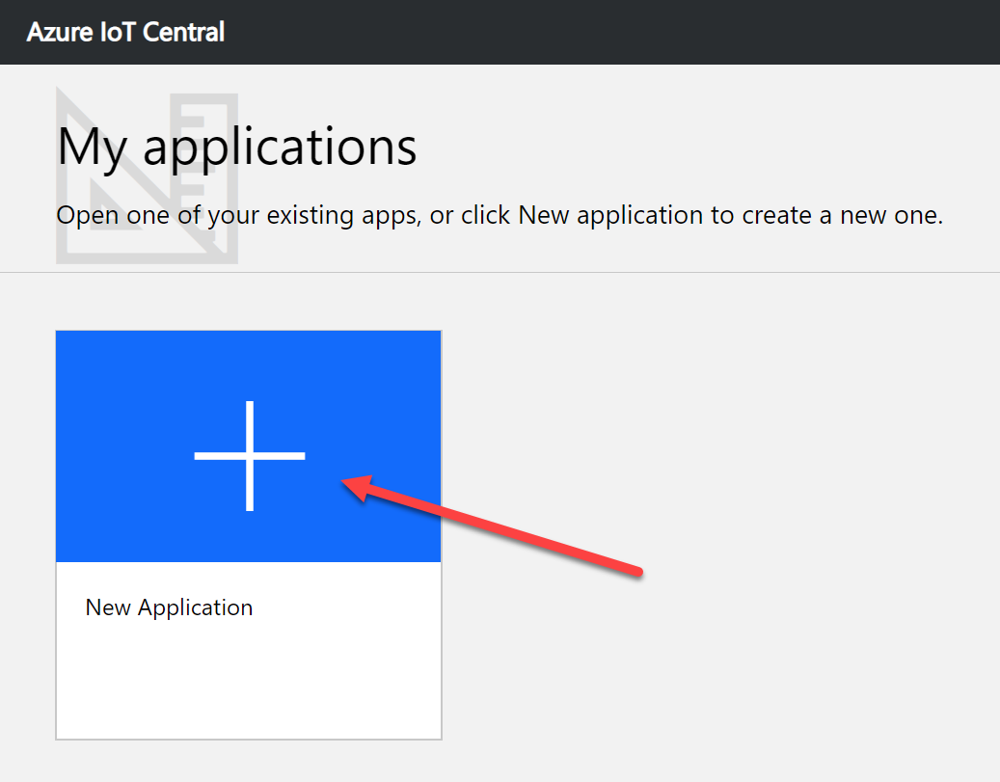

5. Fill the provisioning form

    

    a. *Payment Plan* - feel free to choose either the 7 day trial or the Pay as you Go option.

    b. *Application Template* - select *Custom Application*

    c. *Application Name* - give your application a name of your choice, in this example, we used *fabrikam-oil*

    d. *Url* - this will be the URL for your application, it needs to be globally unique.

    e. Fill out your contact information (First Name, Last Name, Email Address, Phone Number, Country)

    f. Press the *Create* button to provision your application

### Task 3: Create the Device Template

1. Once the application has been provisioned, we need to define the type of equipment we are using, and the data associated with the equipment. In order to do this we must define a _Device Template_. Press either the _Create Device Templates_ button, or the _Device Templates_ menu item from the left-hand menu.

    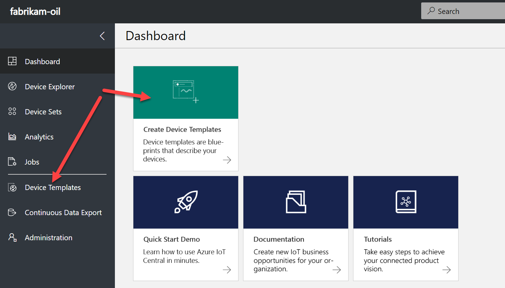

2. Select _Custom_ to define our own type of hardware

    

3. For the device template name, enter _Rod Pump_, then press the _Create_ button.

    

4. The next thing we need to do is define the measurements that will be received from the device. To do this, press the _New_ button at the top of the left-hand menu.

    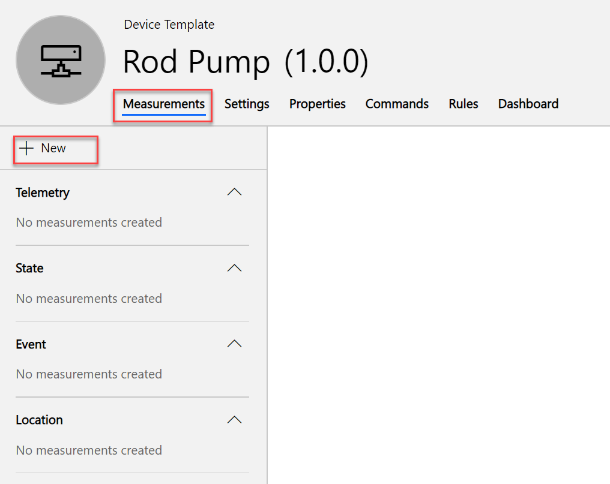

5. From the context menu, select _Telemetry_

    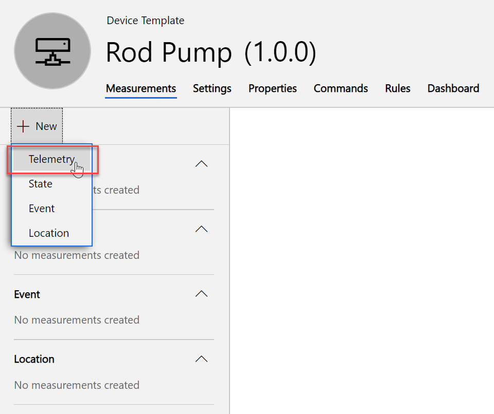

6. Create Telemetry values as follows:

    

    | Display Name    | Field Name     | Units   | Min. Value | Max. Value | Decimal Places |
    | --------------- | -------------- | ------- | ---------- | ---------- | -------------- |
    | Pump Rate       | PumpRate       | SPM     | 0          | 100        | 1              |
    | Time Pump On    | TimePumpOn     | Minutes | 0          |            | 2              |
    | Motor Power     | MotorPowerKw   | kW      | 0          | 90         | 2              |
    | Motor Speed     | MotorSpeed     | RPM     | 0          | 300        | 0              |
    | Casing Friction | CasingFriction | PSI     | 0          | 1600       | 2              |

    

7. Remaining on the measurement tab - we also need to define the current state of the pump, whether it is running or not. Press _New_ and select _State_.

    

8. Add the state with the display name of _Power State_, field name of _PowerState_ with the values _Unavailable_, _On_, and _Off_ - then press the _Save_ button.

    

9. In the device template, Properties are read-only metadata associated with the equipment. For our template, we will expect a property for Serial Number, IP Address, and the geographic location of the pump. From the top menu, select _Properties_, then _Device Property_ from the left-hand menu.

    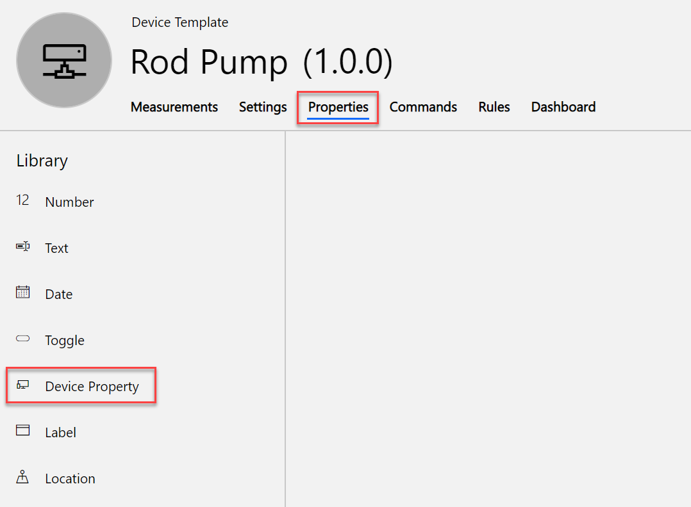

10. Define the device properties as follows:

    

    | Display Name  | Field Name   | Data Type | Description                       |
    | ------------- | ------------ | --------- | --------------------------------- |
    | Serial Number | SerialNumber | text      | The Serial Number of the rod pump |
    | IP Address    | IPAddress    | text      | The IP address of the rod pump    |
    | Pump Location | Location     | location  | The geo. location of the rod pump |

11. Operators and field workers will want to be able to turn on and off the pumps remotely. In order to do this we will define commands. Select the _Commands_ tab, and press the _New_ button to add a new command.

    

12. Create a command as follows, and press _save_:

    a. _Display Name_ - _Toggle Motor Power_
    b. _Field Name_ - _MotorPower_
    c. _Default Timeout_ - _30_
    d. _Data Type_ - _toggle_
    e. _Description_ - _Toggle the motor power of the pump on and off_

    

13. Now, we can define the dashboard by pressing the _Dashboard_ option in the top menu, and selecting _Line Chart_ from the left-hand menu. Define a line chart for each of the telemetry fields (PumpRate, TimePumpOn, MotorPower, MotorSpeed, CasingFriction) - keeping all the default values:

    

    

14. A map is also available for display on the dashboard. Remaining on the Dashboard tab, select _Map_.

    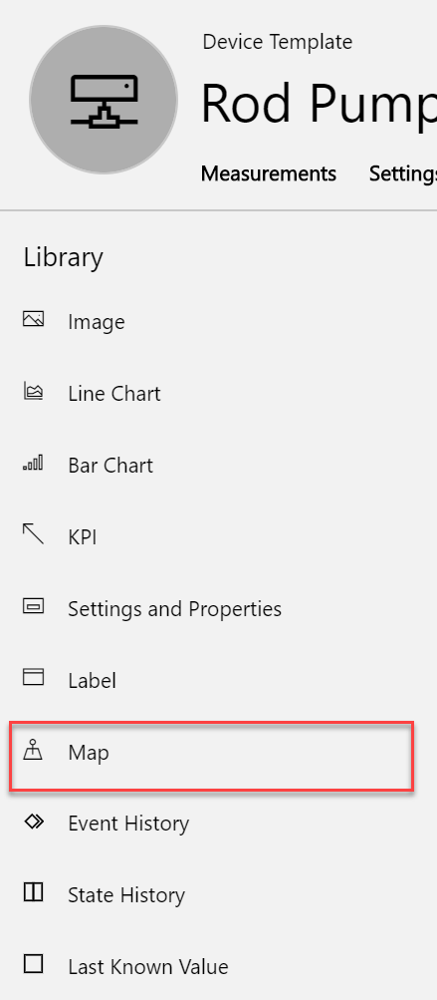

15. Fill out the values for the map settings as follows:

    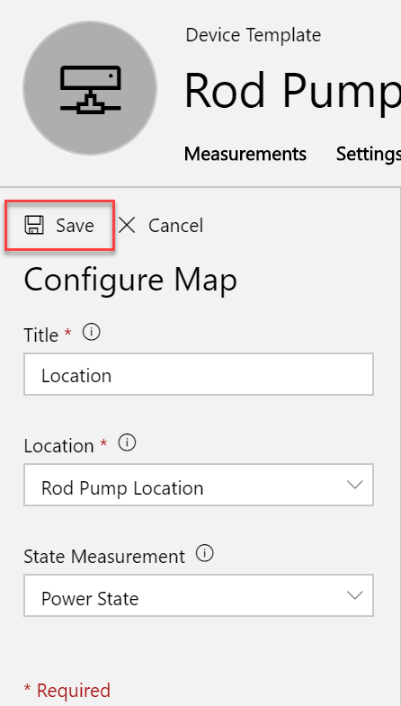

    

16. Finally, we can add an image to represent the equipment. Press on the circle icon left of the template name, and select an image file. The image used in this lab can be found on [PixaBay](https://pixabay.com/photos/pumpjack-texas-oil-rig-pump-591934/).

    

17. Review the application template by viewing its simulated device. IoT Central automatically creates a simulated device based on the template you've created. From the left-hand menu, select _Device Explorer_. In this list you will see a simulated device for the template that we have just created. Select the link for this simulated device, the charts will show a sampling of simulated data.

    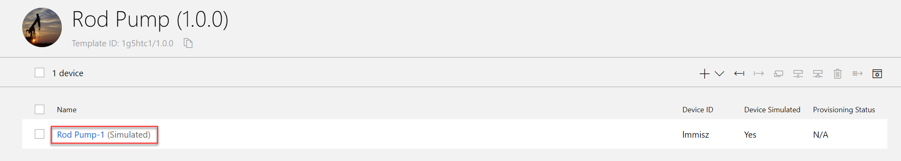

    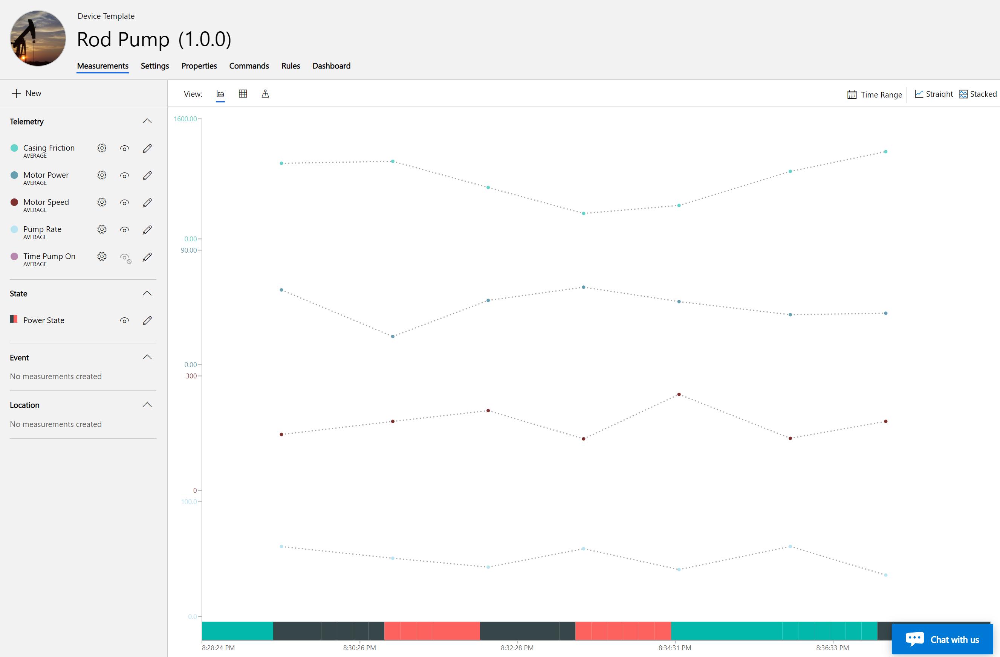

### Task 4: Create and provision real devices

Under the hood, Azure IoT Central uses the [Azure IoT Hub Device Provisioning Service (DPS)](https://docs.microsoft.com/en-us/azure/iot-dps/). The aim of DPS is to provide a consistent way to connect devices to the Azure Cloud. Devices can utilize Shared Access Signatures, or X.509 certificates to securely connect to IoT Central.

[Multiple options](https://docs.microsoft.com/en-us/azure/iot-central/concepts-connectivity) exist to register devices in IoT Central, ranging from individual device registration to [bulk device registration](https://docs.microsoft.com/en-us/azure/iot-central/concepts-connectivity#connect-devices-at-scale-using-sas) via a comma delimited file. In this lab we will register a single device using SAS.

1. In the left-hand menu of your IoT Central application, select _Device Explorer_.

2. Select the _Rod Pump (1.0.0)_ template. This will now show the list of existing devices which at this time includes only the simulated device.

3. Press the _+_ button to add a new device, select _Real_.

    

4. A modal window will be displayed with an automatically generated Device ID and Device Name. You are able to overwrite these values with anything that makes sense in your downstream systems. We will be creating three real devices in this lab. Create the following as real devices:

    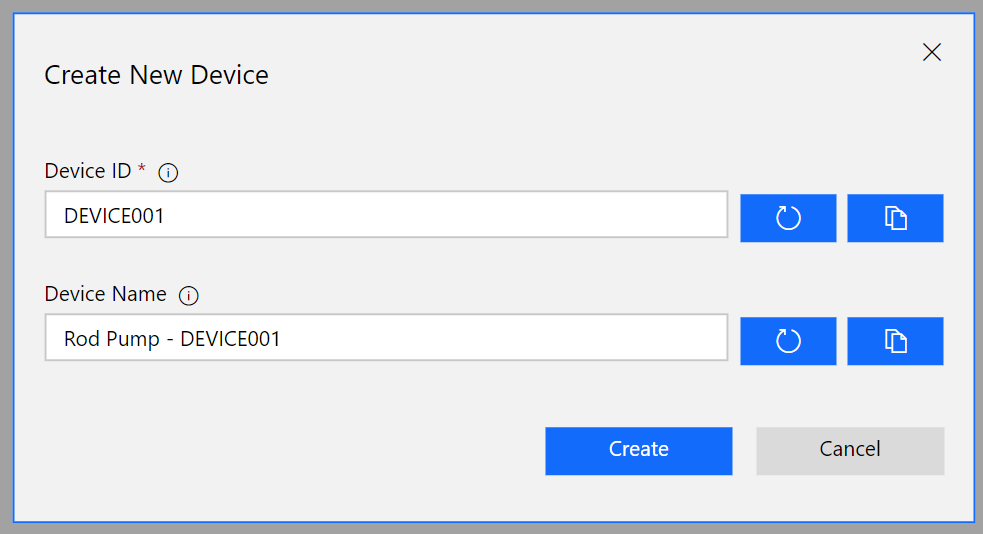

    | Device ID | Device Name          |
    | --------- | -------------------- |
    | DEVICE001 | Rod Pump - DEVICE001 |
    | DEVICE002 | Rod Pump - DEVICE002 |
    | DEVICE003 | Rod Pump - DEVICE003 |

5. Return to the Devices list by selecting _Devices_ in the left-hand menu. Note how all three real devices have the provisioning status of _Registered_.

    

## Task 5: Delete the simulated device

Now that we have registered real devices, we will no longer be needing the simulated pump that was created for us when we defined our template.

1. From the Devices list, check the checkbox next to the simulated pump, then press the **Delete** button.

    

## Exercise 2: Run the Rod Pump Simulator

Duration: X minutes

Included with this lab is source code that will simulate the connection and telemetry of three real pumps. In the previous exercise, we have defined them as DEVICE001, DEVICE002, and DEVICE003. The purpose of the simulator is to demonstrate real-world scenarios that include a normal healthy rod pump (DEVICE002), a gradually failing pump (DEVICE001), and an immediately failing pump (DEVICE003).

### Task 1: Generate device connection strings

1. In IoT Central, select _Devices_ from the left-hand menu. Then, from the devices list, select the link for _Rod Pump - DEVICE001_, and press the _Connect_ button located in the upper right corner of the device's page. Make note of the Scope ID, Device ID, as well as the primary and secondary key values.

    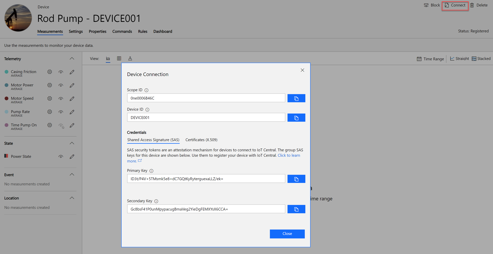

2. Utilizing one of the keys from the values you recorded in #5 we will be generating a connection string to be used within the source code running on the device. We will generate the connection string using command line tooling. Ensure you have Node v.8+ installed, open a command prompt, and execute the following to globally install the key generator utility:

    ```
    npm i -g dps-keygen
    ```

    

    Next, generate the connection string using the key generator utility

    ```
    dps-keygen -di:<Device ID> -dk:<Primary Key> -si:<Scope ID>
    ```

    

    Make note of the connection string for the device.

3. Repeat steps 1 and 2 for DEVICE002 and DEVICE003

### Task 2: Open the Visual Studio solution, and update connection string values

1. Using Visual Studio Code, open the /Hands-on lab/Resources/FieldDeviceSimulator/Fabrikam.FieldDevice.Generator folder.

2. Open _appsettings.json_ and copy & paste the connection strings that you generated in Task 1 into this file.

    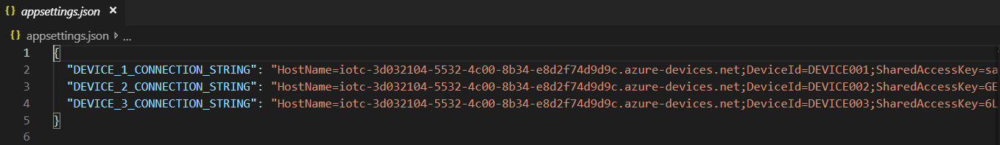

3. Open _Program.cs_, go to line 141 and you will find the _SetupDeviceRunTasks_ method. This method is responsible for creating the source code representations of the devices that we have defined earlier in the lab. Each of these devices is identified by its connection string. Note that DEVICE001 is defined as the pump that will gradually fail, DEVICE002 as a healthy pump, and DEVICE003 as a pump that will fail immediately after a specific amount of time. Line 164 also adds an event handler that gets fired every time the Power State for a pump changes. The power state of a pump gets changed via a cloud to device command - we will be visiting this concept later on in this lab.

4. Open _Device.cs_, this class represents a device in the field. It encapsulates the properties (serial number and IP address) that are expected in the properties for the device in the cloud. It also maintains its own power state. Line 86 shows the _SendDevicePropertiesAndInitialState_ method which updates the reported properties from the device to the cloud. This is also refered to as _Device Twins_. Line 131 shows the _SendEvent_ method that sends the generated telemetry data to the cloud.

### Task 3: Run the application

1. Using Visual Studio Code, Debug the current project by pressing _F5_.

2. Once the menu is displayed, select option 1 to generate and send telemetry to IoT Central

    

3. Allow the simulator to start sending telemetry data to IoT Central, you will see output similar to the following:

    

4. Allow the simulator to run while continuing with this lab.

5. After some time has passed, in IoT Central press the _Devices_ item in the left-hand menu. Note that the provisioning status of DEVICE001, DEVICE002, and DEVICE003 now indicate _Provisioned_.

    

### Task 4: Interpret telemetry data

DEVICE001 is the rod pump that will gradually fail. Upon running the simulator for approximately 10 minutes (or 1100 messages), you can take a look at the Motor Power chart in the Device Dashboard, or on the measurements tab and watch the power consumption decrease.

1. In IoT Central, select the _Devices_ menu item, then select the link for _Rod Pump - DEVICE001_ in the Devices list.

2. Ensure the _Measurements_ tab is selected, then you can toggle off all telemetry values except for Motor Power so the chart will be focused solely on this telemetry property.

    

3. Observe how the Motor Power usage of DEVICE001 gradually degrades.

    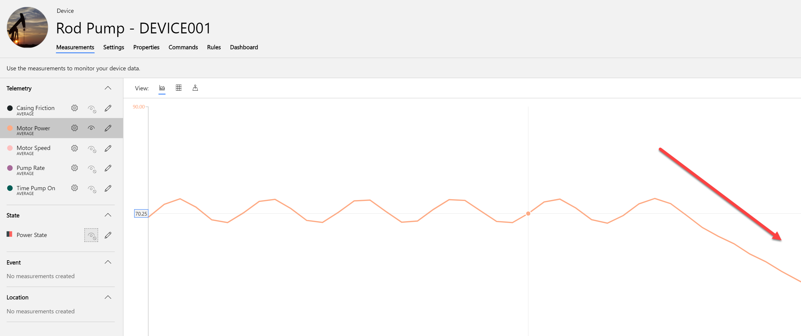

4. Press the _Rules_ tab, and select the alert for _Low Motor Power (kW)_, be sure to set the _Time Range_ to the _Last Hour_ for a higher level look at the telemetry values received. Notice how when the pump is operating normally, it is over the 30 kW line shown by the horizontal dotted line on the chart. Once the pump starts failing, you see the gradual decrease of pump power usage as it ventures below the 30 kW threshold.

    

5. Repeat 1-4 and observe that DEVICE002, the non-failing pump, remains above the 30 kW threshold. DEVICE003 is also a failing pump, but displays an immediate failure versus a gradual one.

    

    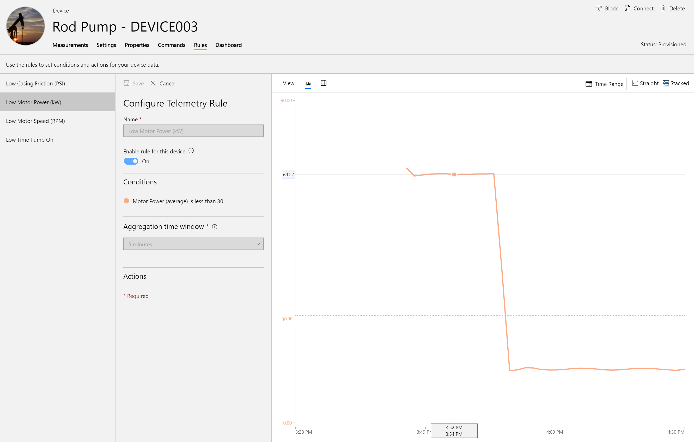

### Task 5: Restart a failing pump remotely

After observing the failure of two of the rod pumps, you are able cycle the power state of the pump remotely. The simulator is setup to receive the Toggle Motor Power command from IoT Central, and will update the state accordingly and start/stop sending telemetry to the cloud.

1. In IoT Central, select _Devices_ from the left-hand menu, then press _Rod Pump - DEVICE001_ from the device list. Observe that even though the pump has in all purposes failed, that there is still power to the motor - indicated by the Power State bar at the bottom of the device's Measurements chart.

    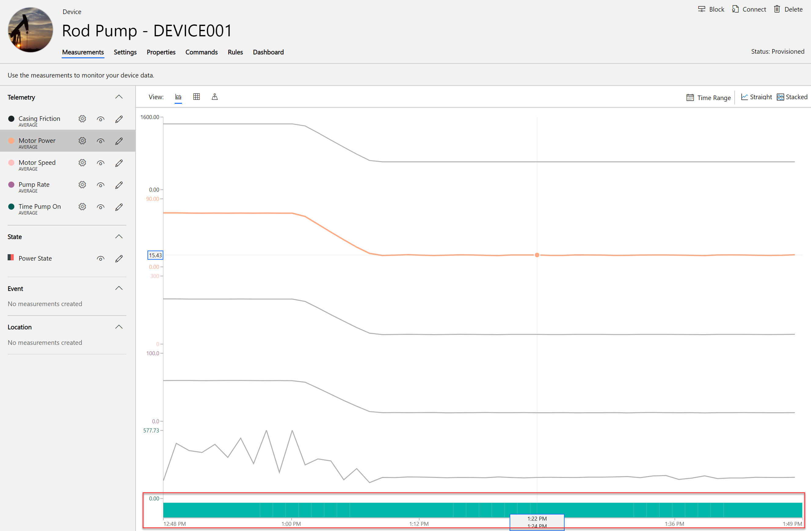

2. In order to recover DEVICE001, select the _Commands_ tab. You will see the _Toggle Motor Power_ command. Press the _Run_ button on the command to turn the pump motor off.

    

3. The simulator will also indicate that the command has been received from the cloud. Note in the output of the simulator, that DEVICE001 is no longer sending telemetry due to the pump motor being off.

    

4. After a few moments, return to the _Measurements_ tab of _DEVICE001_ in IoT Central. Note the receipt of telemetry has stopped, and the state indicates the motor power state is off.

    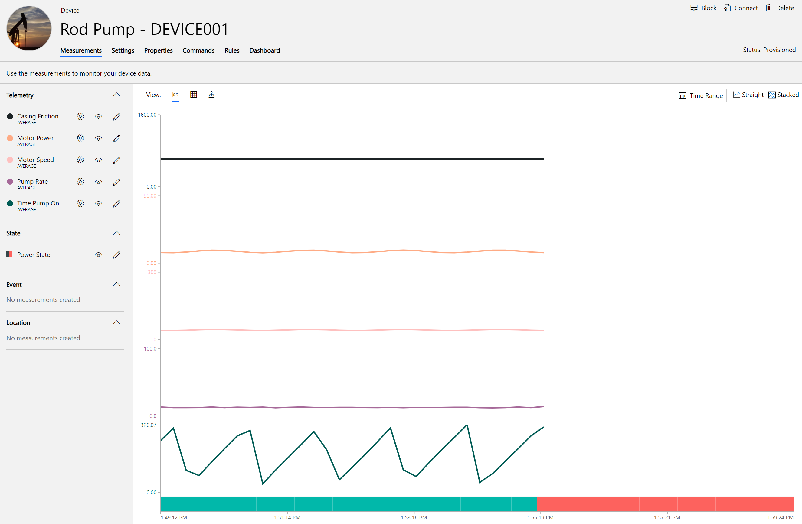

5. Return to the _Commands_ tab, and toggle the motor power back on again by pressing the _Run_ button once more. On the measurements tab, you will see the Power State switch back to online, and telemetry to start flowing again. Due to the restart of the rod pump - it has now recovered and telemetry is back into normal ranges!

    

    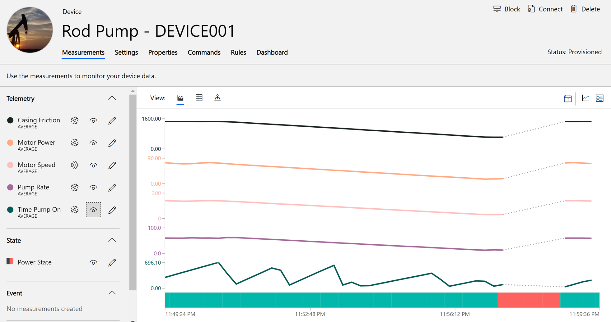

## Exercise 3: Use Azure Databricks and Azure Machine Learning service to train and deploy predictive model

Duration: X minutes

In this exercise, we will use Azure Databricks to train a deep learning model for anomaly detection by training it to recognize normal operating conditions of a pump. We use three data sets for training: A set of telemetry generated by a pump operating under normal conditions, a pump that suffers from a gradual failure, and a pump that immediately fails.

After training the model, we validate it, then register the model in your Azure Machine Learning service workspace. Finally, we deploy the model in a web service hosted by Azure Container Instances for real-time scoring from the Azure function.

### Task 1: Create a workflow using Microsoft Flow


## Exercise 4: Creating a device set

Device sets allow you to create logical groupings of IoT Devices in the field by the properties that defined them. In this case, we will want to create a device set that contains only the rod pumps located in the state of Texas (this will exclude the simulated Rod Pump).

### Task 1: Create a device set using a filter

1. In the left-hand menu, select the _Device sets_ menu item. You will see a single default device set in the list.Press the _+ New_ button in the upper right-hand side of the listing.

    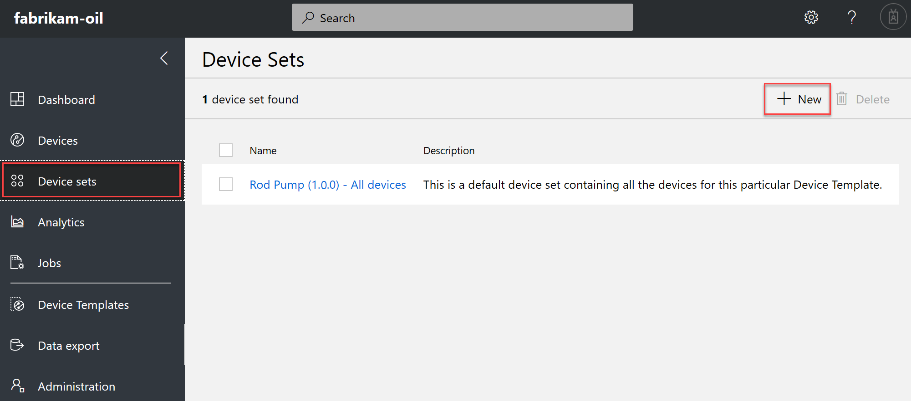

2. In the field, all Texas pumps are located in the 192.168.1.\* subnet, so we will create a filter to include only those pumps in this device set. Create the Device set with a condition as follows:

    

    | Field               | Value                      |
    | ------------------- | -------------------------- |
    | Device Set Name     | Texas Rod Pumps            |
    | Description         | Rod pumps located in Texas |
    | Device Template     | Rod Pump (1.0.0)           |
    | Condition: Property | IP Address                 |
    | Condition: Operator | contains                   |
    | Condition: Value    | 192.168.1.                 |

3. Note how the device list for this device set is automatically filtered to include only the real devices based on their IP Address. You are now able to act upon this group of devices as a single unit in IoT Central.

    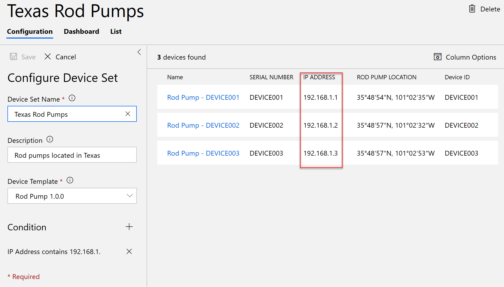

4. Similar to devices, you are also able to create a dashboard specific to this Device Set. Press the _Dashboard_ tab from the top menu, then press the _Edit_ button on the right-hand side of the screen.

    

5. In this case, we will add a map that will show the location and current power state of each rod pump in the device set. From the _Library_ menu, select _Map_

    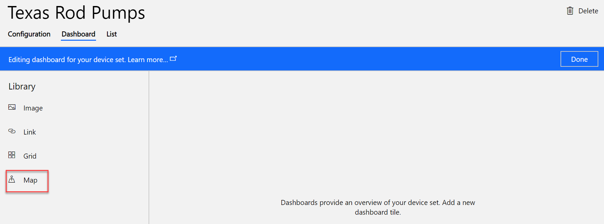

6. Configure the map as follows, and press _Save_:

    | Field             | Value                       |
    | ----------------- | --------------------------- |
    | Device Template   | Rod Pump (1.0.0)            |
    | Device Instance   | Rod Pump - DEVICE001        |
    | Title             | Rod Pump - DEVICE001 Status |
    | Location          | Rod Pump Location           |
    | State Measurement | Power State                 |

    

7. End Dashboard editing by pressing the _Done_ button on upper-right corner of the dashboard editor.

    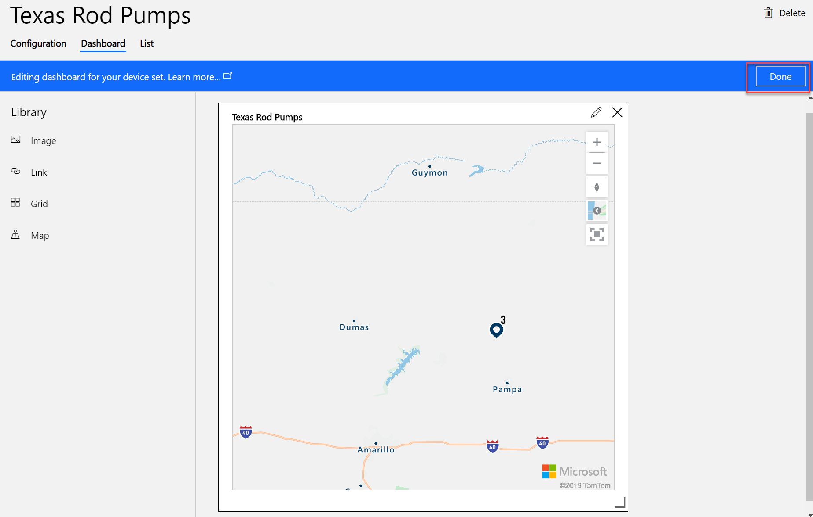

8. Observe how the device set now has a map displaying markers for each device in the set. Feel free to adjust to zoom to better infer their location.

## Exercise 5: Creating a useful dashboard

One of the main features of IoT Central is the ability to visualize the health of your IoT system at a glance. Creating a customized dashboard that best fits your business is instrumental in improving business processes. In this exercise, we will go over adding a main dashboard that will be displayed upon entry to the IoT Central application.

### Task 1: Clearing out the default dashboard

1. In the left-hand menu, press the _Dashboard_ item. Then, in the upper right corner of the dashboard - press the _Edit_ button.

    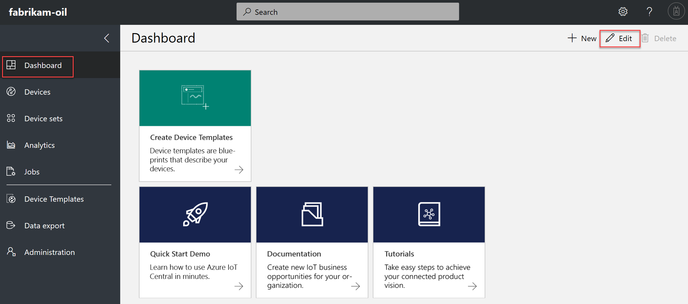

2. Press the _X_ on each tile that you do not wish to see on the dashboard to remove them. The _X_ will display when you hover over the tile.

    

### Task 2: Add your company logo

1. Remaining in the edit mode of the dashboard, select _Image_ from the _Library_ menu.

    

2. Configure the logo with the following file _/Media/fabrikam-logo.png_.

    

3. Resize the logo on the dashboard using the handle on the lower right of the logo tile.

    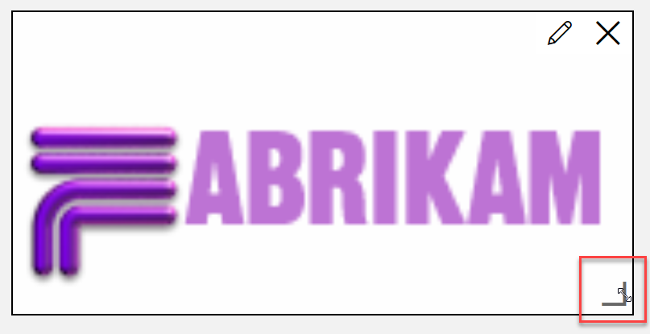

### Task 3: Add a list of Texas Rod Pumps

In the previous exercise, we created a device set that contains the devices located in Texas. We will leverage this device set to display this filtered information.

1. Remaining in the edit dashboard mode, select _Device Set Grid_ from the _Library_ menu.

2. Configure the device list by selecting the _Texas Rod Pumps_ Device Set, and assigning it the title of _Texas Rod Pumps_.

3. Add columns by pressing the _Add/Remove_, we will add _Device ID_ and _IP Address_.

4. Press the _Save_ button to add the tile to the dashboard.

    

    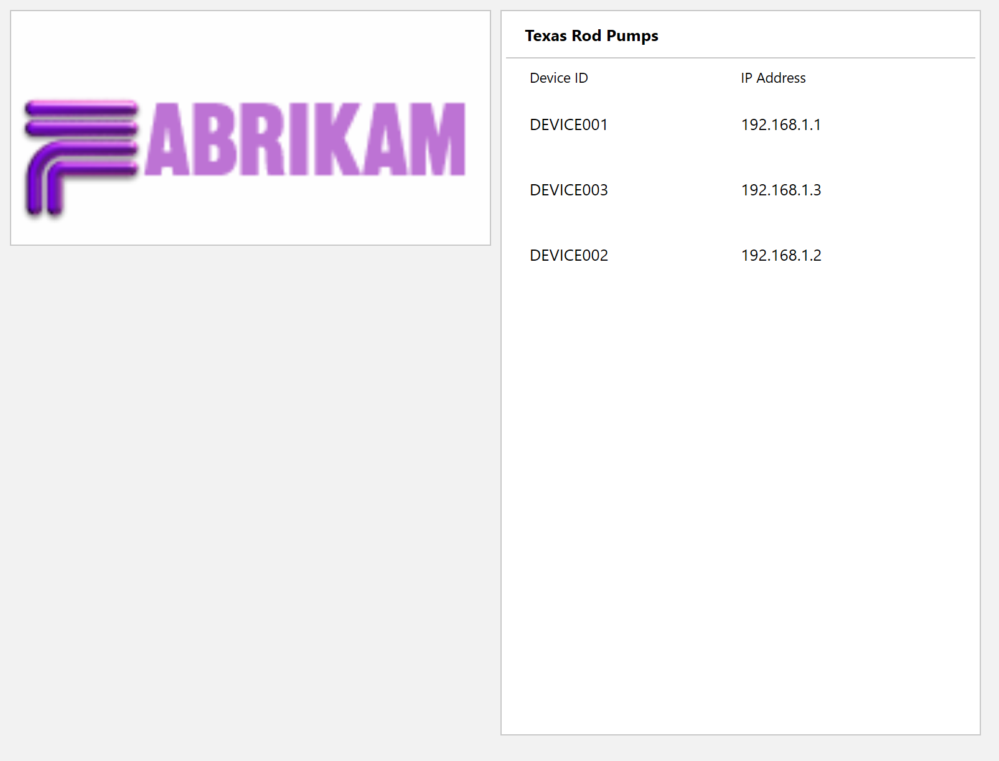

### Task 4: Add a map displaying the power state of DEVICE001

It is beneficial to see the location and power state of certain critical Texas rod pumps. We will add a map that will display the location and current power state of DEVICE001.

1. Select _Map_ from the _Library_ menu, configure the map as follows, and press _Save_:

    | Field             | Value                       |
    | ----------------- | --------------------------- |
    | Device Template   | Rod Pump (1.0.0)            |
    | Device Instance   | Rod Pump - DEVICE001        |
    | Title             | Rod Pump - DEVICE001 Status |
    | Location          | Rod Pump Location           |
    | State Measurement | Power State                 |

    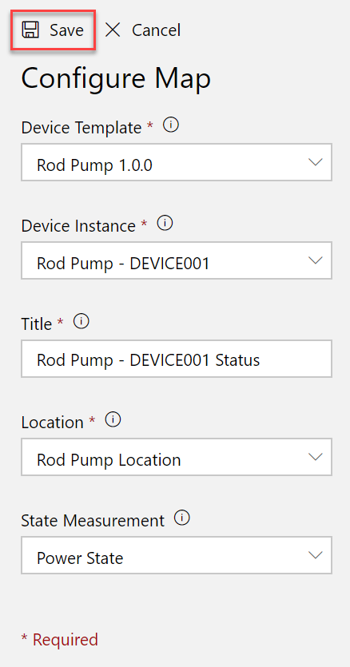

    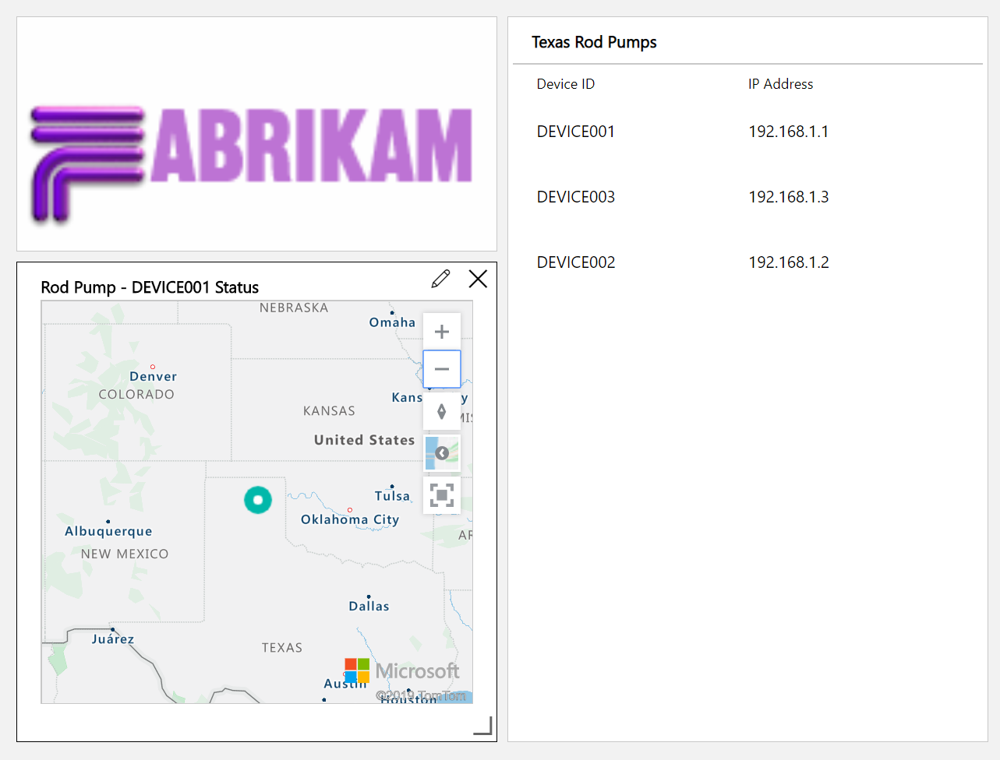

2. Press the _Done_ button in the upper right corner of the Dashboard to finish editing.

    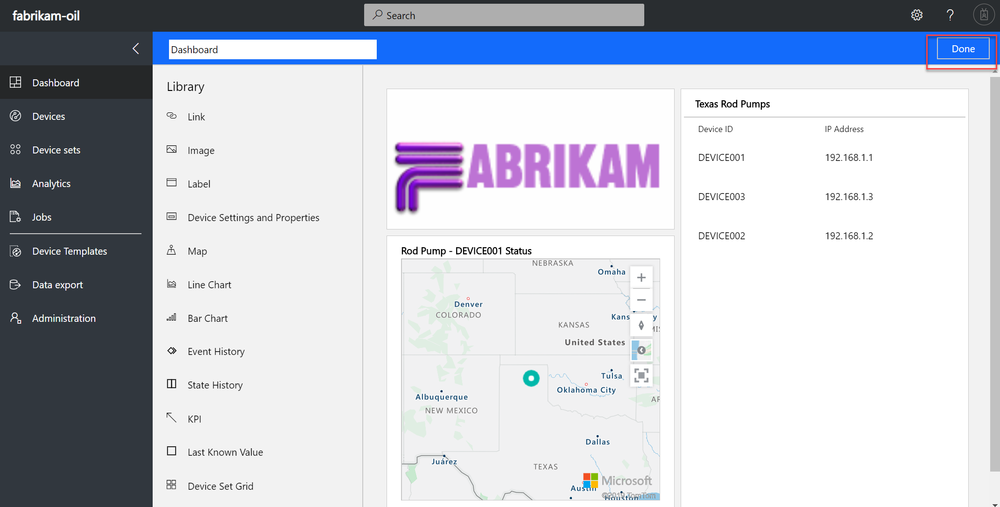

## Exercise 6: Create an Event Hub and continuously export data from IoT Central

IoT Central provides a great first stepping stone into a larger IoT solution. Earlier in this lab, we responded to a crossed threshold by initiating an email sent to Fabrikam field workers through Flow directly from IoT Central. While this approach certainly does add value, a more mature IoT solution typically involves a machine learning model that will process incoming telemetry to logically determine if a failure of a pump is imminent. The first step into this implementation is to create an Event Hub to act as a destination for IoT Centrals continuously exported data.

### Task 1: Create an Event Hub

The Event Hub we will be creating will act as a collector for data coming into IoT Central. The receipt of a message into this hub will ultimately serve as a trigger to send data into a machine learning model to determine if a pump is in a failing state. We will also create a Consumer Group on the event hub to serve as an input to an Azure Function that will be created later on in this lab.

1. Log into the [Azure Portal](https://portal.azure.com).

2. In the left-hand menu, select **Resource Groups**.

3. Open your **Fabrikam_Oil** resource group.

4. On the top of the screen, press the **Add** button, when the marketplace screen displays search for and select **Event Hubs**, this will allow you to create a new Event Hub Namespace resource.

   

5. Configure the event hub as follows, and press the **Create** button:

   | Field          | Value                                 |
   | -------------- | ------------------------------------- |
   | Name           | _anything must be globally unique_    |
   | Pricing Tier   | Standard                              |
   | Subscription   | _select the appropriate subscription_ |
   | Resource Group | Fabrikam_Oil                          |
   | Location       | _select the location nearest to you_  |

   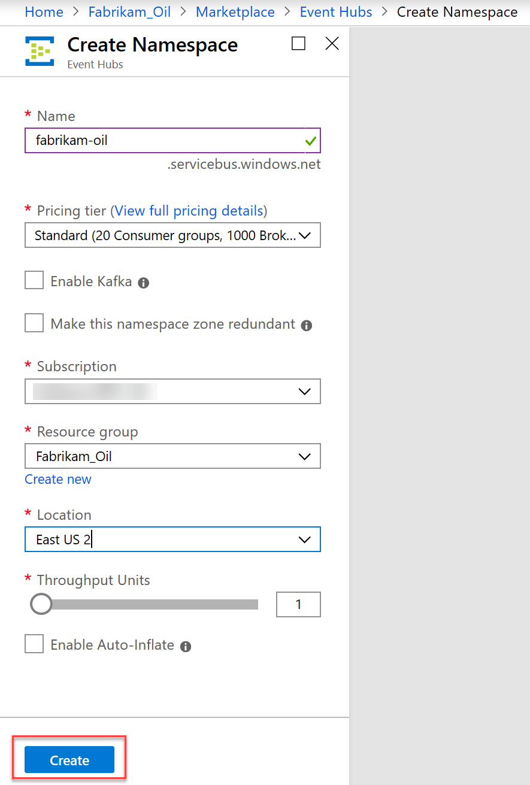

6. Once the Event Hubs namespace has been created, open it and press the **+ Event Hub** button at the top of the screen.

   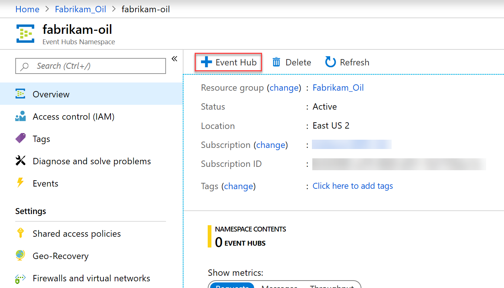

7. In the Create Event Hub form, configure the hub as follows and press the **Create** button:

   | Field        | Value            |
   | ------------ | ---------------- |
   | Name         | iot-central-feed |
   | Pricing Tier | 1                |
   | Subscription | 1                |
   | Capture      | Off              |

   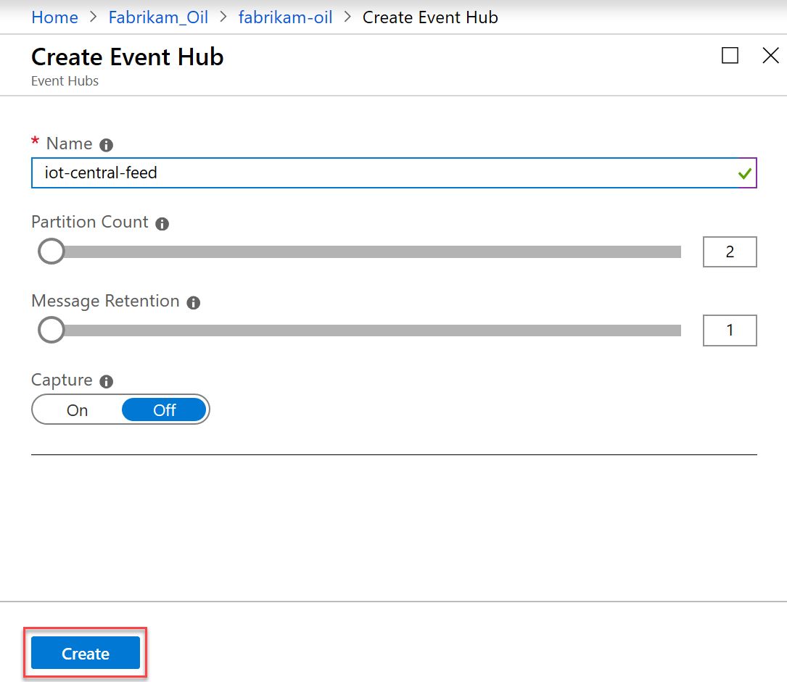

8. Once the Event Hub has been created, open it by selecting _Event Hubs_ in the left-hand menu, and selecting the hub from the list.

   

9. From the top menu, press the **+ Consumer Group** button to create a new consumer group for the hub. Name the consumer group _ingressprocessing_ and press the **Create** button.

   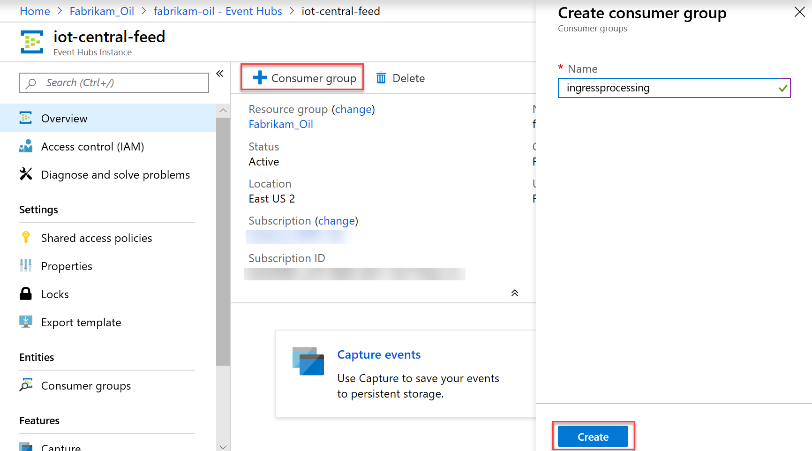

### Task 2: Configure continuous data export from IoT Central

1. Return to the IoT Central application, from the left-hand menu, select **Data Export**

   

2. From the _Data Export_ screen, press the **+ New** button from the upper right menu, and select **Azure Event Hubs**

   

3. IoT Central will automatically retrieve Event Hubs namespaces and Event Hubs from the connected Azure Account. Configure the data export as follows and press the **Save** button:

   | Field                | Value                                            |
   | -------------------- | ------------------------------------------------ |
   | Display Name         | Event Hub Feed                                   |
   | Enabled              | On                                               |
   | Event Hubs Namespace | _select the namespace you created in Exercise 6_ |
   | Event Hub            | iot-central-feed                                 |
   | Measurements         | On                                               |
   | Devices              | Off                                              |
   | Device Templates     | Off                                              |

   

4. The Event Hub Feed export will be created, and then started (it may take a few minutes for the export to start)

   

   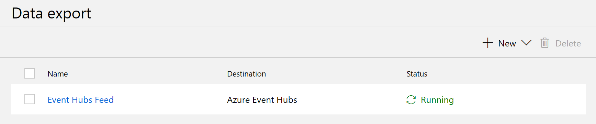

## Exercise 7: Create an Azure Function to predict pump failure

We will be using an Azure Function to read incoming telemetry from IoT Hub and send it to the HTTP endpoint of our predictive maintenance model. The function will receive a 0 or 1 from the model indicating whether or not a pump should be maintained to avoid possible failure. A notification will also be initiated through Flow to notify Field Workers of the maintenance required.

### Task 1: Create an Azure Function Application

1. Return to the [Azure Portal](https://portal.azure.com).

2. From the left-hand menu, select the **Create a resource** item.

3. From the top menu, press the **+ Add** button, and search for Function App.

4. Configure the Function App as follows and press the **Create** button:

   | Field         | Value                                           |
   | ------------- | ----------------------------------------------- |
   | App Name      | _your choice, must be globally unique_          |
   | Subscription  | _select the appropriate subscription_           |
   | ResourceGroup | use existing, and select Fabrikam_Oil           |
   | OS            | Windows                                         |
   | Hosting Plan  | Consumption                                     |
   | Location      | _select the location nearest to you_            |
   | Runtime Stack | .Net Core                                       |
   | Storage       | select Create new, and retain the default value |

   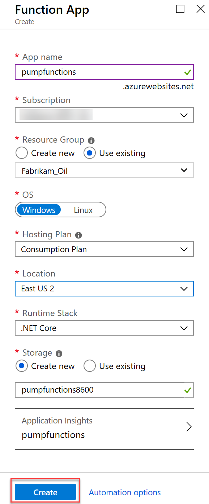

### Task 2: Create a notification table in Azure Storage

One of the things we would like to avoid is sending repeated notifications to the workforce in the field. Notifications should only be sent once every 24 hour period per device. To keep track of when a notification was last sent for a device, we will use a table in a Storage Account.

1. In the [Azure Portal](https://portal.azure.com), select **Resource groups** from the left-hand menu, then select the **Fabrikam_Oil** link from the listing.

2. Select the link for the storage account that was created in Task 1.

   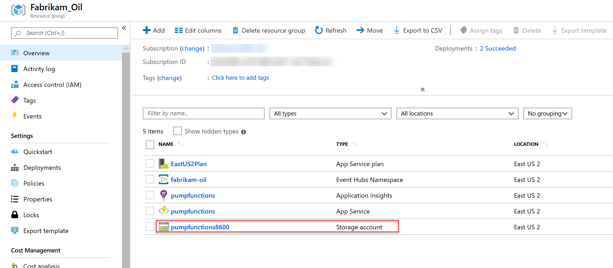

3. From the Storage Account left-hand menu, select **Tables** from the _Table service_ section, then press the **+ Table** button, and create a new table named **DeviceNotifications**.

   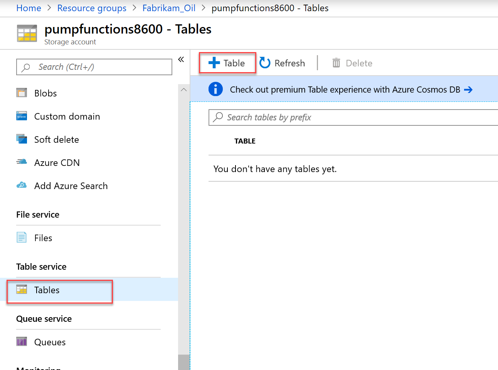

4. Keep the Storage Account open in your browser for the next task.

### Task 3: Create a notification queue in Azure Storage

There are many ways to trigger flows in Microsoft Flow. One of them is having Flow monitor an Azure Queue. We will use a Queue in our Azure Storage Account to host this queue.

1. From the Storage Account left-hand menu, select **Queues** located beneath the _Queue service_ section, then press the **+ Queue** button, and create a new queue named **flownotificationqueue**

   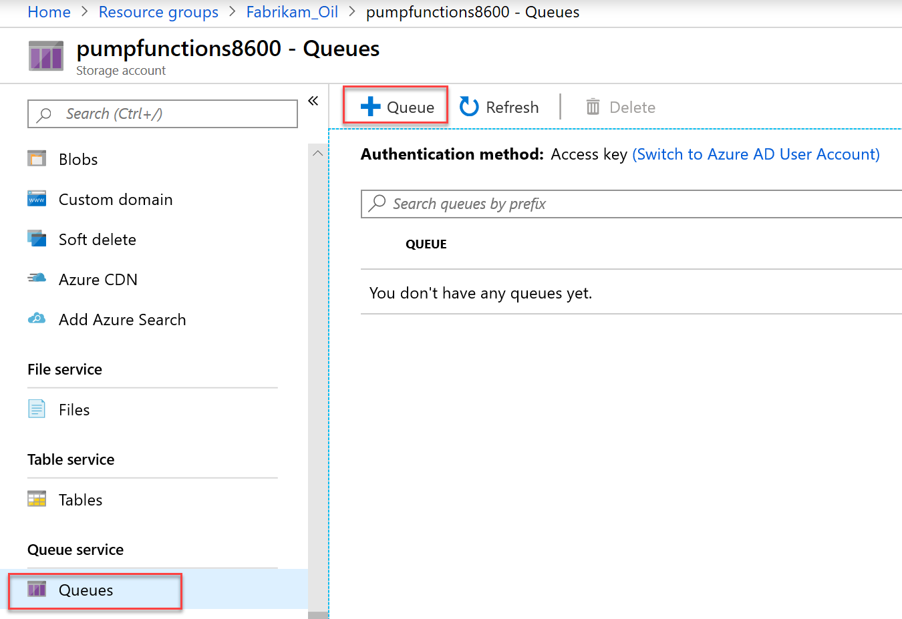

2. Obtain the Shared Storage Key for the storage account by selecting **Access keys** located in the _Settings_ section in the Azure Storage Account left-hand menu. Copy the _Key_ value of _key1_ and retain this value, we will be using it later in the next task. Also retain the name of your Storage Account (in the image below, the name of the Storage Account is _pumpfunctions8600_)

   

### Task 4: Create notification service in Microsoft Flow

We will be using [Microsoft Flow](https://flow.microsoft.com/) as a means to email the workforce in the field. This flow will respond to new messages placed on the queue that we created in Task 3.

1. Access [Microsoft Flow](https://flow.microsoft.com) and sign in (create an account if you don't already have one).

2. From the left-hand menu, select **+ Create**, then choose **Instant flow**

   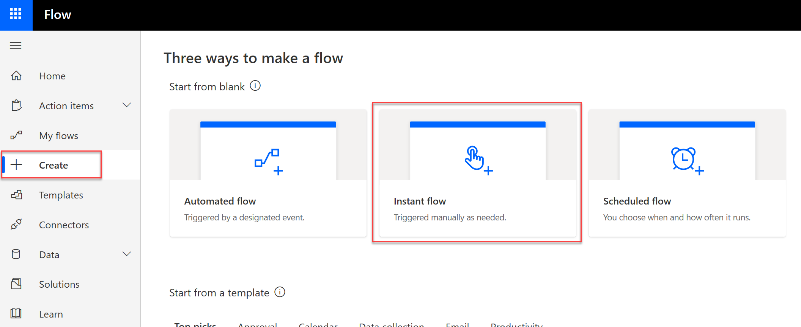

3. When the dialog displays, select the **Skip** link at the bottom to dismiss it

   

4. From the search bar, type _queue_ to filter connectors and triggers. Then select the **When there are messages in a queue** item from the filtered list of Triggers.

   

5. Fill out the form as follows, then press the **Create** button:

   | Field                | Value                                      |
   | -------------------- | ------------------------------------------ |
   | Connection Name      | Notification Queue                         |
   | Storage Account Name | _enter the generated storage account name_ |
   | Shared Storage Key   | _paste the Key value recorded in Task 3_   |

   

6. In the queue step, select the **flownotificationqueue** item, then press the **+ New step** button

   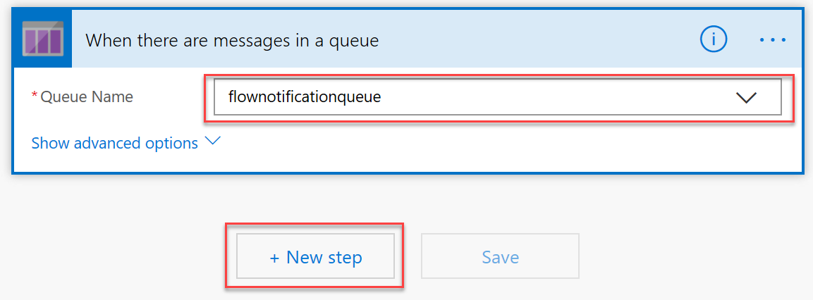

7. In the search box for the next step, search for _email_, then select the **Send an email notification (V3)** item from the filtered list of Actions.

   

8. You may need to accept the terms and conditions of the SendGrid service, a free service that provides the underlying email capabilities of this email step.

9. In the Send an email notification (v3) form, fill it out as follows, then press the **+ New Step** button.

   | Field      | Value                                                                                |
   | ---------- | ------------------------------------------------------------------------------------ |
   | To         | _enter your email address_                                                           |
   | Subject    | Action Required: Pump needs maintenance                                              |
   | Email Body | _put cursor in the field, then press **Message Text** from the Dynamic Content menu_ |

   

10. In the search bar for the next step, search for _queue_ once more, then select the **Delete message** item from the filtered list of Actions.

    

11. In the Delete message form, fill it out as follows, then press the **Save** button.

    | Field       | Value                                                                               |
    | ----------- | ----------------------------------------------------------------------------------- |
    | Queue Name  | flownotificationqueue                                                               |
    | Message ID  | _put cursor in the field, then press **Message ID** from the Dynamic Content menu_  |
    | Pop Receipt | _put cursor in the field, then press **Pop Receipt** from the Dynamic Content menu_ |

    

12. Microsoft will automatically name the Flow, you are able to edit this Flow in the future by selecting **My flows** from the left-hand menu

    

### Task 5: Obtain connection settings for use with the Azure Function implementation

1. Once the Function App has been provisioned, open the **Fabrikam_Oil** resource group and select the link for the Storage Account that was created in the last task.

   

2. From the left-hand menu, select **Access Keys** and copy the key 1 Connection String, keep this value handy as we'll be needing it in the next task.

   

3. Return to the **Fabrikam_Oil** resource group, and select the link for the Event Hubs Namespace

   

4. With the Event Hubs Namespace resource open, in the left-hand menu select the **Shared access policies** item located in Settings, then select the **RootManageSharedAccessKey** policy.

   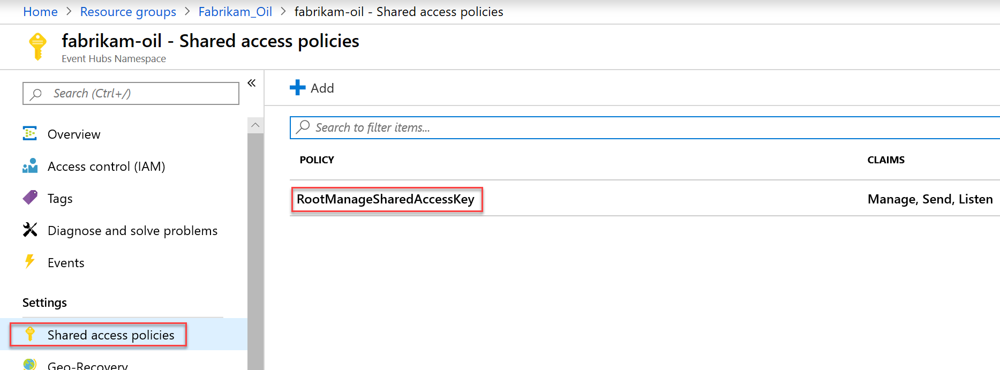

5. A blade will open where you will be able to copy the Primary Connection string, keep this value handy as we'll be needing it in the next task.

   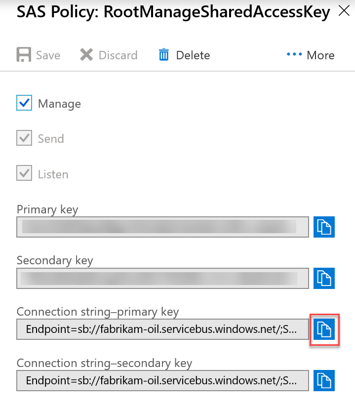

### Task 6: Create the local settings file for the Azure Functions project

It is recommended that you never check in secrets, such as connection strings, into source control. One way to do this is to use settings files. The values stored in these files mimic environment values used in production. The local settings file is never checked into source control.

1. Using Visual Studio Code, open the /Hands-on lab/Resources/FailurePredictionFunction folder.

2. In this folder, create a new file named _local.settings.json_ and populate it with the values obtained in the previous task as follows, then save the file:

   ```json
   {
      "IsEncrypted": false,
      "Values": {
        "AzureWebJobsStorage": "<paste storage account connection string>",
        "FUNCTIONS_WORKER_RUNTIME": "dotnet",
        "fabrikam-oil_RootManageSharedAccessKey_EVENTHUB": "<paste event hub namespace connection string>",
        "PredictionModelEndpoint": "<paste prediction model endpoint>"
      }
   }
   ```

### Task 7: Review the Azure Function code

1. Observe the static _Run_ function, it identifies that the function will run every time the _iot-central-feed_ event hub receives a message. It also uses a specific Consumer Group, these are used when there is a possibility that more than one process may be utilizing the data received in the hub. This ensures that dependent processes receive all messages once - thus avoiding any contingency problems. The method receives an array (batch) of events from the hub on each execution, as well as an instance of a logger in case you wish to see values in the console (locally or in the cloud).

   ```c#
   public static async Task Run([EventHubTrigger("iot-central-feed", Connection = "fabrikam-oil_RootManageSharedAccessKey_EVENTHUB",
                                ConsumerGroup = "ingressprocessing")] EventData[] events, ILogger log)
   ```

2. On line 30, the message body received from the event is deserialized into a Telemetry object - the Telemetry class matches the telemetry sent by the pumps. The Telemetry class can be found in the `Models/Telemetry.cs` file.

3. On line 32, the device id is pulled from the system properties of the event. This will let us know from which device the telemetry data came from.

4. TODO UPDATE ONCE FINALIZED: Lines X through X sends the received telemetry to the Prediction Model endpoint. This service will respond with a 1 - meaning the pump requires maintenance, or a 0 meaning no maintenance notifications should be sent.

5. TODO UPDATE ONCE FINALIZED: Lines X through X checks Table storage to ensure a notification for the specific device hasn't been sent in the last 24 hours. If a notification is due to be sent, it will update the table storage record with the current timestamp and send a notification by queueing a message onto the _flownotificationqueue_ queue.

### Task 8: Run the Function App locally

1. Press <kbd>Ctrl</kbd>+<kbd>F5</kbd> to run the Azure Function code.

2. After some time, you should see log statements indicating that a message has been queued (indicating that Microsoft Flow will send a notification email).

   

3. Once a message has been placed on the _flownotificationqueue_, it will trigger the notification flow that we created and send an email to the field workers. These emails are sent in 5 minute intervals.

   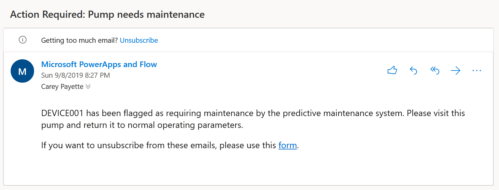

## After the hands-on lab

Duration: X minutes

### Task 1: Delete Lab Resources

1. In IoT Central, select _Administration_ from the left-hand menu. In the _Application Settings_ screen, delete the application by pressing the _Delete_ button. This will automate the removal of the IoT Application as well as all of its resources.

   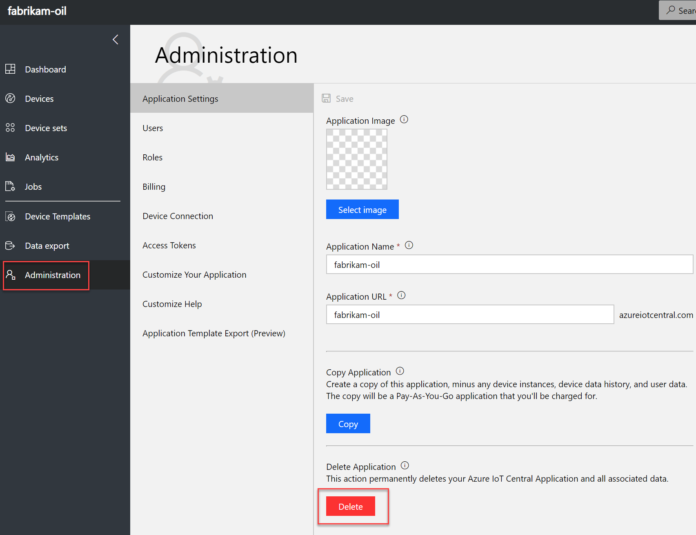

2. In the [Azure Portal](https://portal.azure.com), select **Resource Groups**, open the resource group that you created in Exercise 6, and press the **Delete resource group** button.

   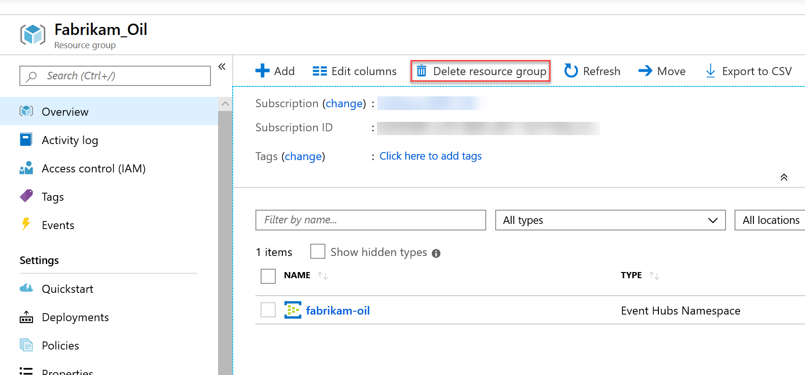

3. Delete Microsoft Flows that we created. Access Microsoft Flow and login. From the left-hand menu, select **My flows**. Press on the ellipsis button next to each flow that we created in this lab and select **Delete**.

   
