<div class="MCWHeader1">
Predictive Maintenance for Remote Field Devices
</div>

<div class="MCWHeader2">
Hands-on lab step-by-step
</div>

<div class="MCWHeader3">
September 2019
</div>


Information in this document, including URL and other Internet Web site references, is subject to change without notice. Unless otherwise noted, the example companies, organizations, products, domain names, e-mail addresses, logos, people, places, and events depicted herein are fictitious, and no association with any real company, organization, product, domain name, e-mail address, logo, person, place or event is intended or should be inferred. Complying with all applicable copyright laws is the responsibility of the user. Without limiting the rights under copyright, no part of this document may be reproduced, stored in or introduced into a retrieval system, or transmitted in any form or by any means (electronic, mechanical, photocopying, recording, or otherwise), or for any purpose, without the express written permission of Microsoft Corporation.

Microsoft may have patents, patent applications, trademarks, copyrights, or other intellectual property rights covering subject matter in this document. Except as expressly provided in any written license agreement from Microsoft, the furnishing of this document does not give you any license to these patents, trademarks, copyrights, or other intellectual property.

The names of manufacturers, products, or URLs are provided for informational purposes only and Microsoft makes no representations and warranties, either expressed, implied, or statutory, regarding these manufacturers or the use of the products with any Microsoft technologies. The inclusion of a manufacturer or product does not imply endorsement of Microsoft of the manufacturer or product. Links may be provided to third party sites. Such sites are not under the control of Microsoft and Microsoft is not responsible for the contents of any linked site or any link contained in a linked site, or any changes or updates to such sites. Microsoft is not responsible for webcasting or any other form of transmission received from any linked site. Microsoft is providing these links to you only as a convenience, and the inclusion of any link does not imply endorsement of Microsoft of the site or the products contained therein.

© 2019 Microsoft Corporation. All rights reserved.

Microsoft and the trademarks listed at <https://www.microsoft.com/en-us/legal/intellectualproperty/Trademarks/Usage/General.aspx> are trademarks of the Microsoft group of companies. All other trademarks are property of their respective owners.

**Contents** 

<!-- TOC -->

- [Predictive Maintenance for Remote Field Devicesmhands-on lab step-by-step](#predictive-maintenance-for-remote-field-devicesmhands-on-lab-step-by-step)
  - [Abstract and learning objectives](#abstract-and-learning-objectives)
  - [Overview](#overview)
  - [Solution architecture](#solution-architecture)
  - [Requirements](#requirements)
  - [Exercise 1: Configuring IoT Central with devices and metadata](#exercise-1-configuring-iot-central-with-devices-and-metadata)
    - [Task 1: Model the telemetry data](#task-1-model-the-telemetry-data)
      - [Telemetry Schema](#telemetry-schema)
    - [Task 2: Create an IoT Central Application](#task-2-create-an-iot-central-application)
    - [Task 3: Create the Device Template](#task-3-create-the-device-template)
    - [Task 4: Create and provision real devices](#task-4-create-and-provision-real-devices)
  - [Exercise 2: Running the Rod Pump Simulator](#exercise-2-running-the-rod-pump-simulator)
    - [Task 1: Generate device connection strings](#task-1-generate-device-connection-strings)
    - [Task 2: Open the Visual Studio solution, and update connection string values](#task-2-open-the-visual-studio-solution-and-update-connection-string-values)
    - [Task 3: Run the application](#task-3-run-the-application)
    - [Task 4: Interpret telemetry data](#task-4-interpret-telemetry-data)
    - [Task 5: Restart a failing pump remotely](#task-5-restart-a-failing-pump-remotely)
  - [Exercise 3: Creating a notification action on a telemetry rule](#exercise-3-creating-a-notification-action-on-a-telemetry-rule)
    - [Task 1: Create a workflow using Microsoft Flow](#task-1-create-a-workflow-using-microsoft-flow)
  - [Exercise 4: Creating a device set](#exercise-4-creating-a-device-set)
    - [Task 1: Create a device set using a filter](#task-1-create-a-device-set-using-a-filter)
  - [Exercise 5: Creating a useful dashboard](#exercise-5-creating-a-useful-dashboard)
    - [Task 1: Clearing out the default dashboard](#task-1-clearing-out-the-default-dashboard)
    - [Task 2: Add your company logo](#task-2-add-your-company-logo)
    - [Task 3: Add a list of Texas Rod Pumps](#task-3-add-a-list-of-texas-rod-pumps)
    - [Task 3: Add a map displaying the power state of DEVICE001](#task-3-add-a-map-displaying-the-power-state-of-device001)
  - [Exercise 6: Create an Event Hub and continuously export data from IoT Central](#exercise-6-create-an-event-hub-and-continuously-export-data-from-iot-central)
    - [Task 1: Create an Event Hub](#task-1-create-an-event-hub)
    - [Task 2: Configure continuous data export from IoT Central](#task-2-configure-continuous-data-export-from-iot-central)
  - [After the hands-on lab](#after-the-hands-on-lab)
    - [Task 1: Delete the IoT Central application and Resource Group](#task-1-delete-the-iot-central-application-and-resource-group)

<!-- /TOC -->

# Predictive Maintenance for Remote Field Devicesmhands-on lab step-by-step 

## Abstract and learning objectives 

In this hands-on-lab, you will build an end-to-end industrial IoT solution. We will begin by leveraging the Azure IoT Central SaaS offerings to quickly stand up a fully functional remote monitoring solution. Azure IoT Central provides solutions built upon recommendations found in the [Azure IoT Reference Architecture](https://docs.microsoft.com/en-us/azure/architecture/reference-architectures/iot/). We will customize this system specifically for rod pumps. Rod pumps are industrial equipment that is heavily used in the oil and gas industry.  We will then establish a model for the telemetry data that is received from the pump systems in the field and use this model to deploy simulated devices for system testing purposes. 

Furthermore we will establish threshold rules in the remote monitoring system that will monitor the incoming telemetry data to ensure all equipment is running optimally, and can alert us whenever the equipment is running outside of normal boundaries - indicating the need for alternative running parameters, maintenance, or a complete shut down of the pump. By leveraging the IoT Central solution, users can also issue commands to the pumps from a remote location in an instant to automate many operational and maintenance tasks which used to require staff on-site. This lessens operating costs associated with technician dispatch and equipment damage due to a failure.

Above and beyond real-time monitoring and mitigating immediate equipment damage through commanding - you will also learn how to apply the historical telemetry data accumulated to identify positive and negative trends that can be used to adjust daily operations for higher throughput and reliability.

## Overview

The Predictive Maintenance for Remote Field Devices hands-on lab is an exercise that will challenge you to implement an end-to-end scenario using the supplied example that is based on Azure IoT Central and other related Azure services. The hands-on lab can be implemented on your own, but it is highly recommended to pair up with other members at the lab to model a real-world experience and to allow each member to share their expertise for the overall solution.

## Solution architecture

\[Insert your end-solution architecture here. . .\]

## Requirements

1.  Number and insert your custom workshop content here . . . 

## Exercise 1: Configuring IoT Central with devices and metadata

Duration: X minutes

[Azure IoT Central](https://azure.microsoft.com/en-us/services/iot-central/) is a Software as a Service (SaaS) offering from Microsoft. The aim of this service is to provide a frictionless entry into the Cloud Computing and IoT space. The core focus of many industrial companies is not on cloud computing, therefore they do not necessarily have the personnel skilled to provide guidance and to stand up a reliable and scalable infrastructure for an IoT solution. It is imperative for these types of companies to enter the IoT space not only for the cost savings associated with remote monitoring, but also to improve safety for their workers and the environment.

Fabrikam is one such company that could use a helping hand entering the IoT space. They have recently invested in sensor technology on their rod pumps in the field, and they are ready to implement their cloud-based IoT Solution. Their IT department is small and unfamiliar with cloud-based IoT infrastructure; their IT budget also does not afford them the luxury of hiring a team of contractors to build out a solution for them.

The Fabrikam CIO has recently heard of Azure IoT Central - this online offering will streamline the process of them getting their sensor data to the cloud, where they can monitor their equipment for failures and improve their maintenance practices and not have to worry about the underlying infrastructure. A [predictable cost model](https://azure.microsoft.com/en-us/pricing/details/iot-central/) also ensures that there are no financial surprises.


### Task 1: Model the telemetry data

The first task is to identify the data that the equipment will be sending to the cloud. This data will contain fields that represent the data read from the sensors at a specific instant in time. This data will be used downstream systems to identify patterns that can lead to cost savings, increased safety and more efficient work processes.

The telemetry being reported by the Fabrikam rod pumps are as follows, we will be using this information later in the lab:

#### Telemetry Schema
| Field          | Type     | Description                                                                                                                                                                        |
| -------------- | -------- | ---------------------------------------------------------------------------------------------------------------------------------------------------------------------------------- |
| SerialNumber   | String   | Unique serial number identifying the rod pump equipment                                                                                                                            |
| IPAddress      | String   | Current IP Address                                                                                                                                                                 |
| TimeStamp      | DateTime | Timestamp in UTC identifying the point in time the telemetry was created                                                                                                           |
| PumpRate       | Numeric  | Speed calculated over the time duration between the last two times the crank arm has passed the proximity sensor measured in Strokes Per Minute (SPM) - minimum 0.0, maximum 100.0 |
| TimePumpOn     | Numeric  | Number of minutes the pump has been on                                                                                                                                             |
| MotorPowerkW   | Numeric  | Measured in Kilowatts (kW)                                                                                                                                                         |
| MotorSpeed     | Numeric  | including slip (RPM)                                                                                                                                                               |
| CasingFriction | Numeric  | Measured in PSI (psi)                                                                                                                                                              |

### Task 2: Create an IoT Central Application

1.  Access the (Azure IoT Central)[https://azure.microsoft.com/en-us/services/iot-central/] website.

2.  Press the *Get started* button 

    

3.   If you are not currently logged in, you will be prompted to log in with your Microsoft Azure Account

4.   Press the *New Application* button

        

5.   Fill the provisioning form
        
        

        a. *Payment Plan* - feel free to choose either the 7 day trial or the Pay as you Go option.

        b.  *Application Template* - select *Custom Application*

        c.  *Application Name* - give your application a name of your choice, in this example, we used *fabrikam-oil*

        d.  *Url* - this will be the URL for your application, it needs to be globally unique.

        e. Fill out your contact information (First Name, Last Name, Email Address, Phone Number, Country)

        f. Press the *Create* button to provision your application

### Task 3: Create the Device Template

1.   Once the application has been provisioned, we need to define the type of equipment we are using, and the data associated with the equipment. In order to do this we must define a *Device Template*. Press either the *Create Device Templates* button, or the *Device Templates* menu item from the left-hand menu.


2. Select *Custom* to define our own type of hardware


3.   For the device template name, enter *Rod Pump*, then press the *Create* button.


4.   The next thing we need to do is define the measurements that will be received from the device. To do this, press the *New* button at the top of the left-hand menu.


5.  From the context menu, select *Telemetry*


6.  Create Telemetry values as follows:


| Display Name    | Field Name     | Units   | Min. Value | Max. Value | Decimal Places |
| --------------- | -------------- | ------- | ---------- | ---------- | -------------- |
| Pump Rate       | PumpRate       | SPM     | 0          | 100        | 1              |
| Time Pump On    | TimePumpOn     | Minutes | 0          |            | 2              |
| Motor Power     | MotorPowerKw   | kW      | 0          | 90         | 2              |
| Motor Speed     | MotorSpeed     | RPM     | 0          | 300        | 0              |
| Casing Friction | CasingFriction | PSI     | 0          | 1600       | 2              |


7. Remaining on the measurement tab - we also need to define the current state of the pump, whether it is running or not. Press *New* and select *State*.


8. Add the state with the display name of *Power State*, field name of *PowerState* with the values *Unavailable*, *On*, and *Off* - then press the *Save* button.


9. In the device template, Properties are read-only metadata associated with the equipment. For our template, we will expect a property for Serial Number, IP Address, and the geographic location of the pump. From the top menu, select *Properties*, then *Device Property* from the left-hand menu. 
        


10. Define the device properties as follows:


| Display Name  | Field Name   | Data Type | Description                       |
| ------------- | ------------ | --------- | --------------------------------- |
| Serial Number | SerialNumber | text      | The Serial Number of the rod pump |
| IP Address    | IPAddress    | text      | The IP address of the rod pump    |
| Pump Location | Location     | location  | The geo. location of the rod pump |

11.  Operators and field workers will want to be able to turn on and off the pumps remotely. In order to do this we will define commands. Select the *Commands* tab, and press the *New* button to add a new command.


12.  Create a command as follows, and press *save*:
        
        a. *Display Name* - *Toggle Motor Power*
        b. *Field Name* - *MotorPower*
        c. *Default Timeout* - *30*
        d. *Data Type* - *toggle*
        e. *Description* - *Toggle the motor power of the pump on and off*


13. Let's now define some Rules that will monitor the incoming telemetry data. Select the *Rules* tab, press the *New* button, and select *Telemetry*.

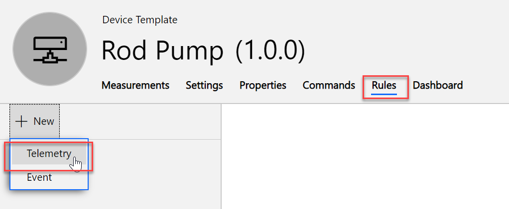

14. Create Telemetry rules as follows (we will defer rule actions until later in the lab):

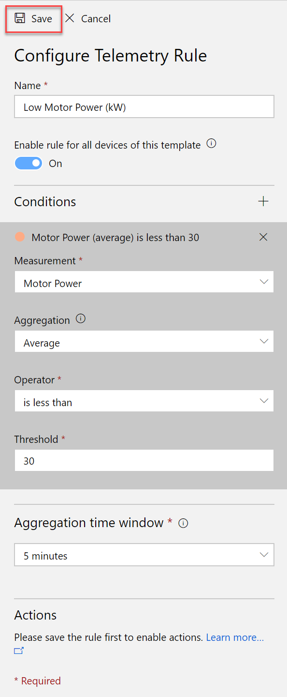

| Name                           | Measurement     | Aggregation | Agg. Time Window | Operator        | Threshold |
|--------------------------------|-----------------|-------------|------------------|-----------------|-----------|
| Low Motor Power (kW)           | Motor Power     | Average     | 5 minutes        | is less than    | 30        |
| Low Motor Speed (RPM)          | Motor Speed     | Average     | 5 minutes        | is less than    | 80        |
| Low Casing Friction (PSI)      | Casing Friction | Average     | 5 minutes        | is less than    | 830       |
| Low Pump Rate (SPM)            | Pump Rate       | Average     | 5 minutes        | is less than    | 25        |
| Low Time Pump On (Minutes)     | TimePumpOn      | Average     | 5 minutes        | is less than    | 65        |

15. Now, we can define the dashboard by pressing the *Dashboard* option in the top menu, and selecting *Line Chart* from the left-hand menu. Define a line chart for each of the telemetry fields (PumpRate, TimePumpOn, MotorPower, MotorSpeed, CasingFriction) - keeping all the default values:


16. A map is also available for display on the dashboard. Remaining on the Dashboard tab, select *Map*.


17. Fill out the values for the map settings as follows:


18. Finally, we can add an image to represent the equipment. Press on the circle icon left of the template name, and select an image file. The image used in this lab can be found on [PixaBay](https://pixabay.com/photos/pumpjack-texas-oil-rig-pump-591934/).


19. Review the application template by viewing its simulated device. IoT Central automatically creates a simulated device based on the template you've created. From the left-hand menu, select *Device Explorer*. In this list you will see a simulated device for the template that we have just created. Click the link for this simulated device, the charts will show a sampling of simulated data. 


### Task 4: Create and provision real devices

Under the hood, Azure IoT Central uses the [Azure IoT Hub Device Provisioning Service (DPS)](https://docs.microsoft.com/en-us/azure/iot-dps/). The aim of DPS is to provide a consistent way to connect devices to the Azure Cloud. Devices can utilize Shared Access Signatures, or X.509 certificates to securely connect to IoT Central.

[Multiple options](https://docs.microsoft.com/en-us/azure/iot-central/concepts-connectivity) exist to register devices in IoT Central, ranging from individual device registration to [bulk device registration](https://docs.microsoft.com/en-us/azure/iot-central/concepts-connectivity#connect-devices-at-scale-using-sas) via a comma delimited file. In this lab we will register a single device using SAS.

1. In the left-hand menu of your IoT Central application, select *Device Explorer*.

2. Select the *Rod Pump (1.0.0)* template. This will now show the list of existing devices which at this time includes only the simulated device.

3. Click the *+* button to add a new device, select *Real*.


4. A modal window will be displayed with an automatically generated Device ID and Device Name. You are able to overwrite these values with anything that makes sense in your downstream systems. We will be creating three real devices in this lab. Create the following as real devices:


| Device ID | Device Name          |
|-----------|----------------------|
| DEVICE001 | Rod Pump - DEVICE001 |
| DEVICE002 | Rod Pump - DEVICE002 |
| DEVICE003 | Rod Pump - DEVICE003 |

5. Return to the Devices list by selecting *Devices* in the left-hand menu. Note how all three real devices have the provisioning status of *Registered*.

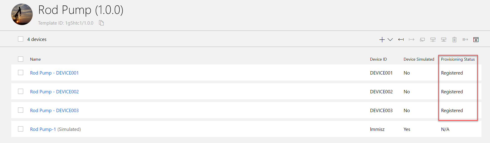

                
## Exercise 2: Running the Rod Pump Simulator

Duration: X minutes

Included with this lab is source code that will simulate the connection and telemetry of three real pumps. In the previous exercise, we have defined them as DEVICE001, DEVICE002, and DEVICE003. The purpose of the simulator is to demonstrate real-world scenarios that include a normal healthy rod pump (DEVICE002), a gradually failing pump (DEVICE001), and an immediately failing pump (DEVICE003).

### Task 1: Generate device connection strings

1. In IoT Central, select *Devices* from the left-hand menu. Then, from the devices list, click on *Rod Pump - DEVICE001*, and press the *Connect* button located in the upper right corner of the device's page. Make note of the Scope ID, Device ID, as well as the primary and secondary key values.


2. Utilizing one of the keys from the values you recorded in #5 we will be generating a connection string to be used within the source code running on the device. We will generate the connection string using command line tooling. Ensure you have Node v.8+ installed, open a command prompt, and execute the following to globally install the key generator utility:

```
npm i -g dps-keygen
```

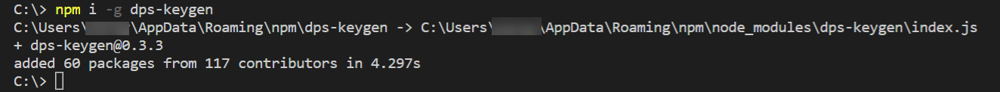

Next, generate the connection string using the key generator utility

```
dps-keygen -di:<Device ID> -dk:<Primary Key> -si:<Scope ID>
```
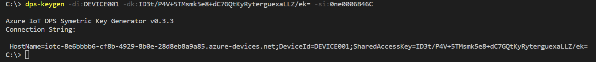

Make note of the connection string for the device.

3. Repeat steps 1 and 2 for DEVICE002 and DEVICE003 

### Task 2: Open the Visual Studio solution, and update connection string values

1.  Using Visual Studio Code, open the /Hands-on lab/Resources/Fabrikam.FieldDevice.Generator folder.

2. Open *appsettings.json* and copy & paste the connection strings that you generated in Task 1 into this file.

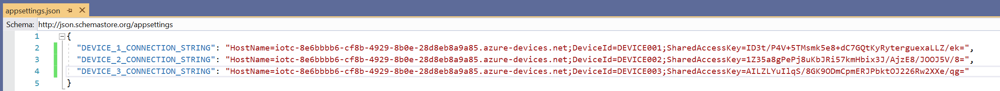

3. Open *Program.cs*, go to line 141 and you will find the *SetupDeviceRunTasks* method. This method is responsible for creating the source code representations of the devices that we have defined earlier in the lab. Each of these devices is identified by its connection string. Note that DEVICE001 is defined as the pump that will gradually fail, DEVICE002 as a healthy pump, and DEVICE003 as a pump that will fail immediately after a specific amount of time. Line 164 also adds an event handler that gets fired every time the Power State for a pump changes. The power state of a pump gets changed via a cloud to device command - we will be visiting this concept later on in this lab.

4. Open *Device.cs*, this class represents a device in the field. It encapsulates the properties (serial number and IP address) that are expected in the properties for the device in the cloud. It also maintains its own power state. Line 86 shows the *SendDevicePropertiesAndInitialState* method which updates the reported properties from the device to the cloud. This is also refered to as *Device Twins*.  Line 131 shows the *SendEvent* method that sends the generated telemetry data to the cloud.

### Task 3: Run the application

1. Using Visual Studio Code, Debug the current project by pressing *F5*.

2. Once the menu is displayed, select option 1 to generate and send telemetry to IoT Central

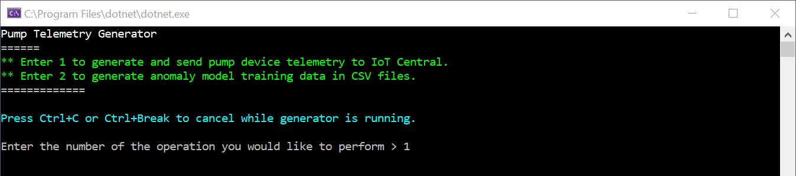

3. Allow the simulator to start sending telemetry data to IoT Central, you will see output similar to the following:

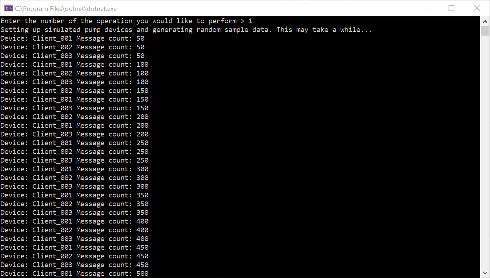

4. Allow the simulator to run while continuing with this lab.

5. After some time has passed, in IoT Central press the *Devices* item in the left-hand menu. Note that the provisioning status of DEVICE001, DEVICE002, and DEVICE003 now indicate *Provisioned*.

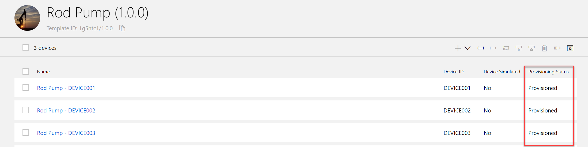

### Task 4: Interpret telemetry data

DEVICE001 is the rod pump that will gradually fail. Upon running the simulator for approximately 10 minutes (or 1100 messages), you can take a look at the Motor Power chart in the Device Dashboard, or on the measurements tab and watch the power consumption decrease.

1. In IoT Central, select the *Devices* menu item, then click on *Rod Pump - DEVICE001* in the Devices list.

2. Ensure the *Measurements* tab is selected, then you can toggle off all telemetry values except for Motor Power so the chart will be focused solely on this telemetry property.

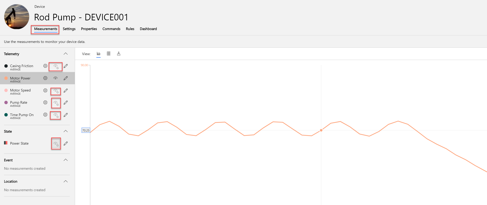

3. Observe how the Motor Power usage of DEVICE001 gradually degrades.


4. Press the *Rules* tab, and select the alert for *Low Motor Power (kW)*, be sure to set the *Time Range* to the *Last Hour* for a higher level look at the telemetry values received. Notice how when the pump is operating normally, it is over the 30 kW line shown by the horizontal dotted line on the chart. Once the pump starts failing, you see the gradual decrease of pump power usage as it ventures below the 30 kW threshold.

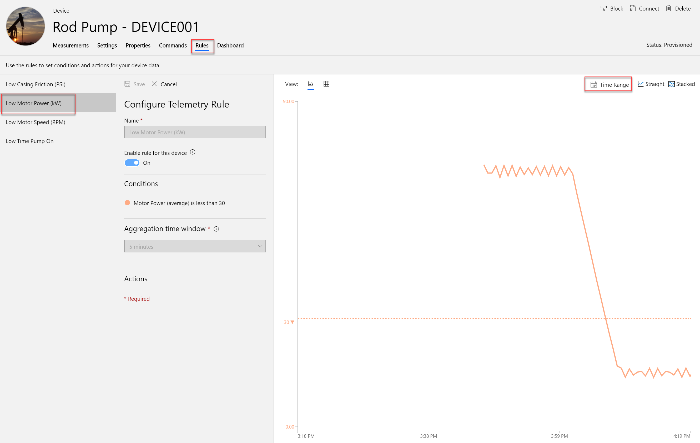

5. Repeat 1-4 and observe that DEVICE002, the non-failing pump, remains above the 30 kW threshold. DEVICE003 is also a failing pump, but displays an immediate failure versus a gradual one.

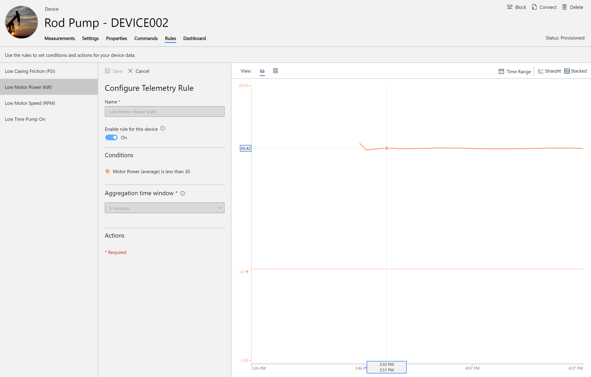


### Task 5: Restart a failing pump remotely

After observing the failure of two of the rod pumps, you are able cycle the power state of the pump remotely. The simulator is setup to receive the Toggle Motor Power command from IoT Central, and will update the state accordingly and start/stop sending telemetry to the cloud.

1. In IoT Central, select *Devices* from the left-hand menu, then press *Rod Pump - DEVICE001* from the device list. Observe that even though the pump has in all purposes failed, that there is still power to the motor - indicated by the Power State bar at the bottom of the device's Measurements chart.


2. In order to recover DEVICE001, select the *Commands* tab. You will see the *Toggle Motor Power* command. Press the *Run* button on the command to turn the pump motor off. 
   
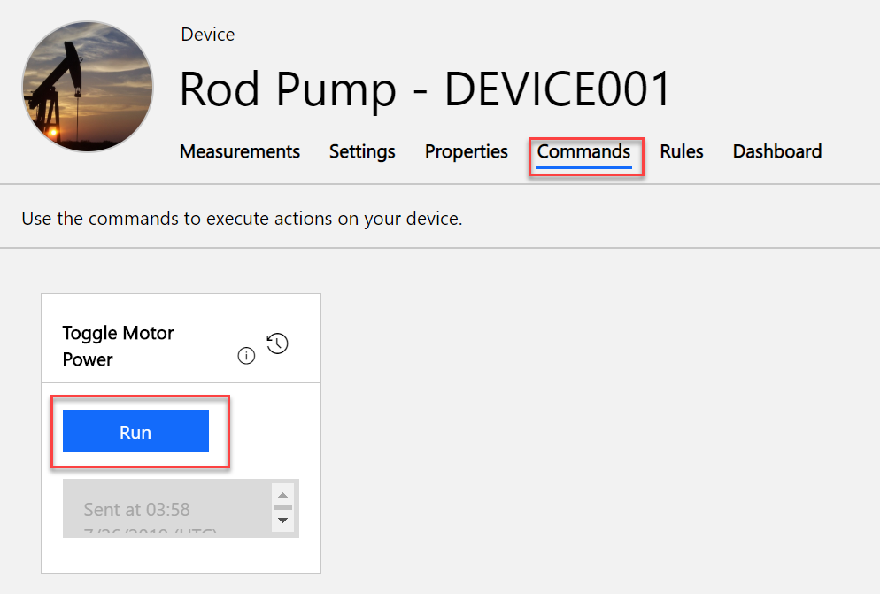

3. The simulator will also indicate that the command has been received from the cloud. Note in the output of the simulator, that DEVICE001 is no longer sending telemetry due to the pump motor being off.

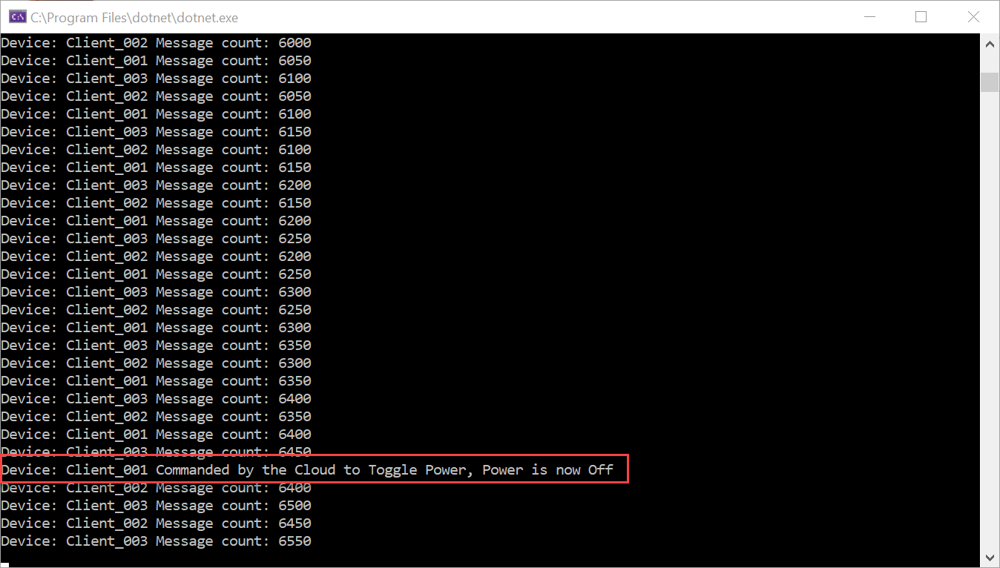

4. After a few moments, return to the *Measurements* tab of *DEVICE001* in IoT Central. Note the receipt of telemetry has stopped, and the state indicates the motor power state is off.


5. Return to the *Commands* tab, and toggle the motor power back on again by pressing the *Run* button once more. On the measurements tab, you will see the Power State switch back to online, and telemetry to start flowing again. Due to the restart of the rod pump - it has now recovered and telemetry is back into normal ranges!

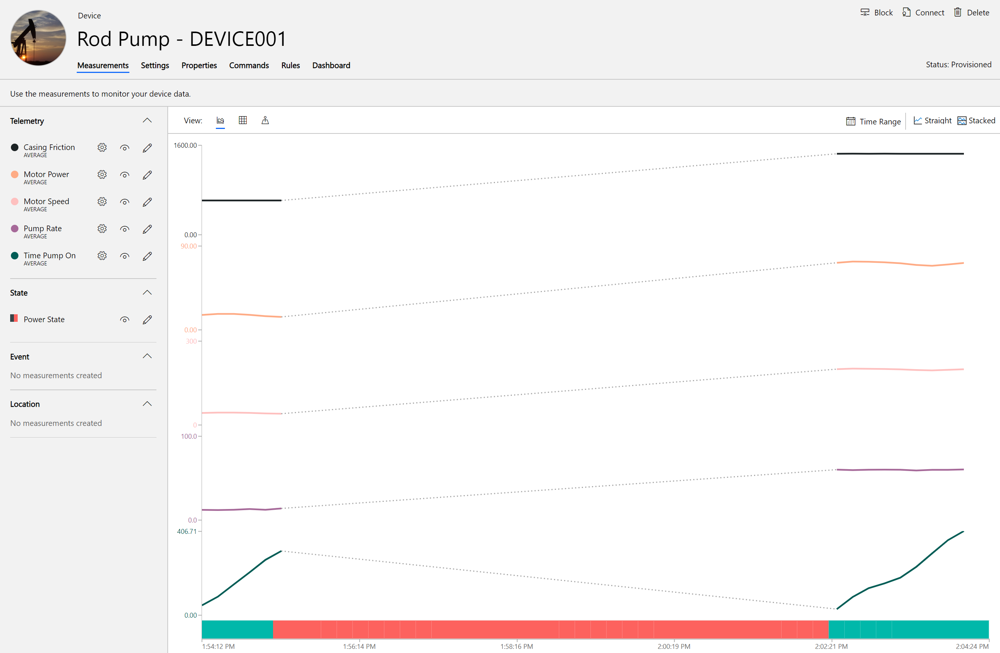


   

## Exercise 3: Creating a notification action on a telemetry rule
Duration: X minutes

Earlier in the lab, we created Rules in the Rod Pump device template so that we could easily visualize failures when telemetry measurements are received beneath a specific threshold. Fabrikam does not want to manually monitor these rules charts on every device in order to identify failures or impending failures. Instead, they wish to have their field workforce notified that there may be a problem with a specific rod pump. These notifications should take the form of an email. We will implement this notification workflow by adding an *Action* to a rule.

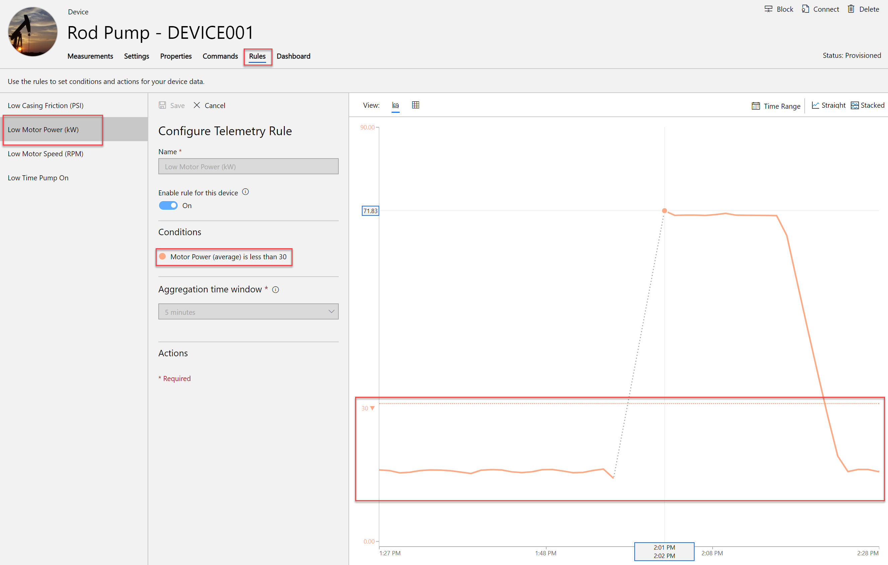

### Task 1: Create a workflow using Microsoft Flow

[Microsoft Flow](https://flow.microsoft.com) is a handy tool that can be used in a vast array of scenarios. We will be taking advantage of the built-in capabilities of Flow to create and send an email when the Motor Power (kW) reads below 30 kW.

1. Access the [Microsoft Flow website](https://flow.microsoft.com) and sign in (create an account if you don't already have one).

2. From the left-hand menu - select the *My Flows* item - then press the *New* button and select *Create from template* to begin defining our workflow.
   


3. A search form will be displayed, enter the search term *IoT Central* and press the *Enter* key. When the search results have been displayed - select the *Send an email to your team when an IoT Central rule is triggered* template.

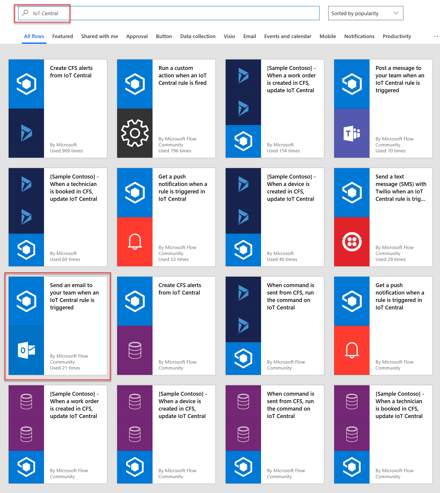

4. Next, you will need to provide Flow with the necessary permissions to integrate with the email platform, as well as with IoT Central. If you receive any error messages while trying to authenticate to IoT Central, please view the *Troubleshooting* section at the bottom of [this web page](https://docs.microsoft.com/en-us/azure/iot-central/howto-add-microsoft-flow).
   
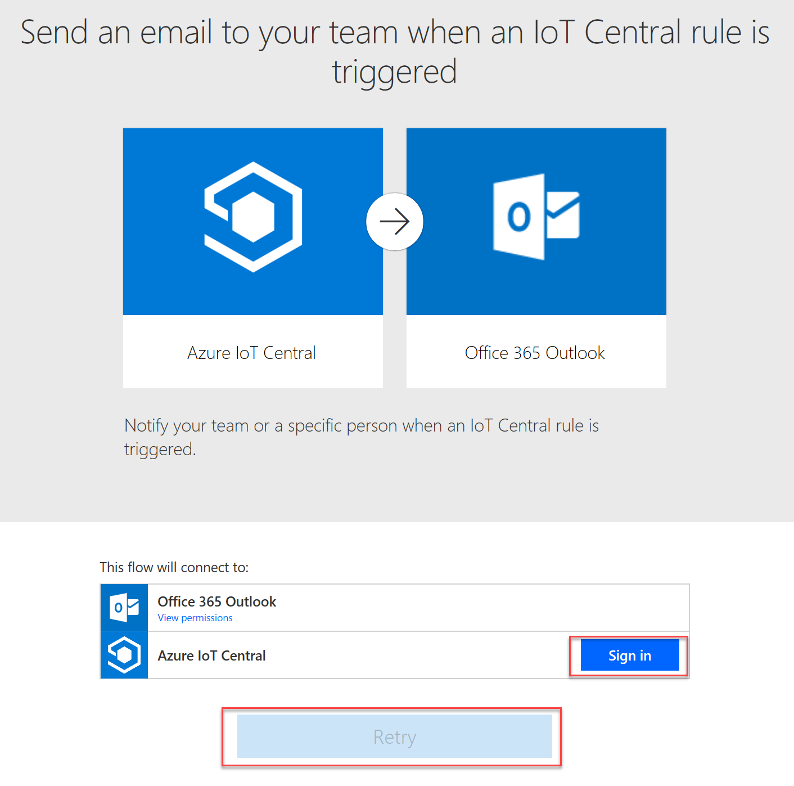

5. Define your workflow by selecting the appropriate IoT Central application, and the rule that you would like to trigger for the notification. In this case, select the *Low Motor Power (kW)* rule. Then enter one or more email addresses to send the notification to (semi-colon delimited). Finally, author the email subject and body using the dynamic content helper popup. When complete, press the *Save* button.
   
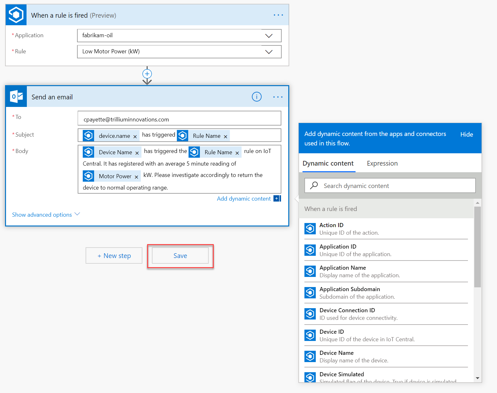

6. Once saved, you can see the workflow you've just defined by selecting the *My Flows* menu item.

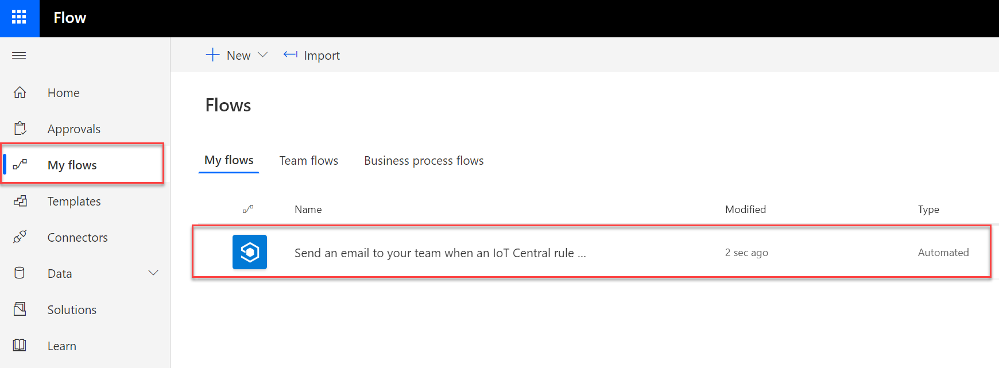

7. Return to IoT Central, select *Device Templates* from the left-hand menu and select the *Rod Pump* template. Press the *Rules* Tab and from the Rules list, select *Low Motor Power (kW)*, observe that an action has now been added to the rule.

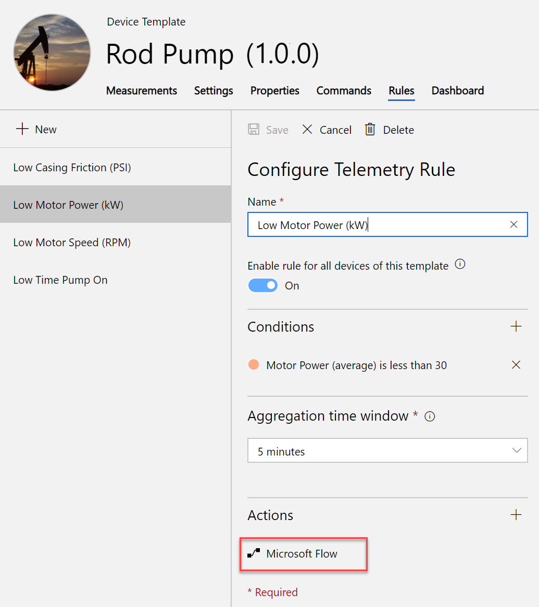

8. Once the 5 minute average device telemetry falls below the 30 kW threshold, an email notification is sent.

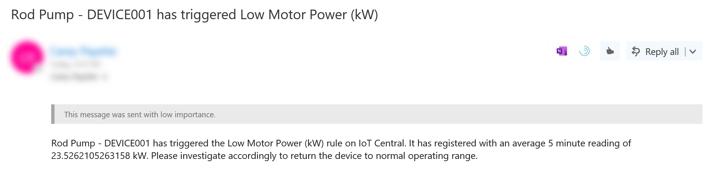

## Exercise 4: Creating a device set 

Device sets allow you to create logical groupings of IoT Devices in the field by the properties that defined them. In this case, we will want to create a device set that contains only the rod pumps located in the state of Texas (this will exclude the simulated Rod Pump). 

### Task 1: Create a device set using a filter

1. In the left-hand menu, select the *Device sets* menu item. You will see a single default device set in the list.Press the *+ New* button in the upper right-hand side of the listing.


2. In the field, all Texas pumps are located in the 192.168.1.* subnet, so we will create a filter to include only those pumps in this device set. Create the Device set with a condition as follows:

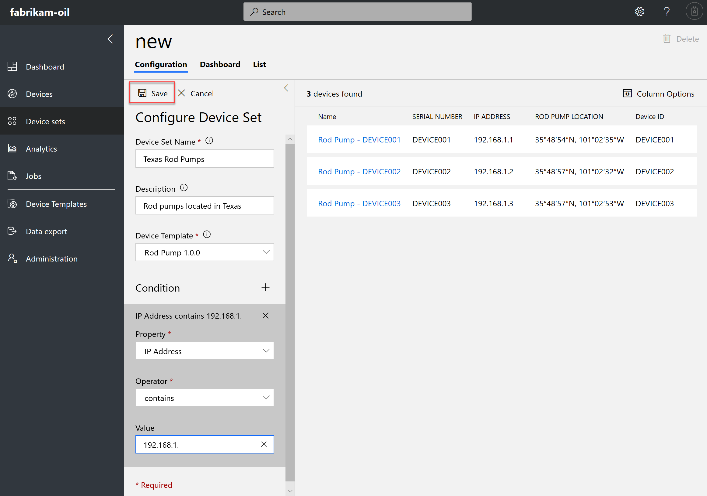

| Field               | Value                      |
|---------------------|----------------------------|
| Device Set Name     | Texas Rod Pumps            |
| Description         | Rod pumps located in Texas |
| Device Template     | Rod Pump (1.0.0)           |
| Condition: Property | IP Address                 |
| Condition: Operator | contains                   |
| Condition: Value    | 192.168.1.                 |

3. Note how the device list for this device set is automatically filtered to include only the real devices based on their IP Address. You are now able to act upon this group of devices as a single unit in IoT Central.


4. Similar to devices, you are also able to create a dashboard specific to this Device Set. Press the *Dashboard* tab from the top menu, then press the *Edit* button on the right-hand side of the screen.

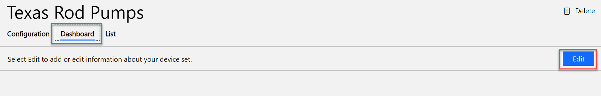

5. In this case, we will add a map that will show the location and current power state of each rod pump in the device set. From the *Library* menu, select *Map*

   

6. Configure the map as follows, and press *Save*:

| Field             | Value                       |
|-------------------|-----------------------------|
| Device Template   | Rod Pump (1.0.0)            |
| Device Instance   | Rod Pump - DEVICE001        |
| Title             | Rod Pump - DEVICE001 Status |
| Location          | Rod Pump Location           |
| State Measurement | Power State                 |

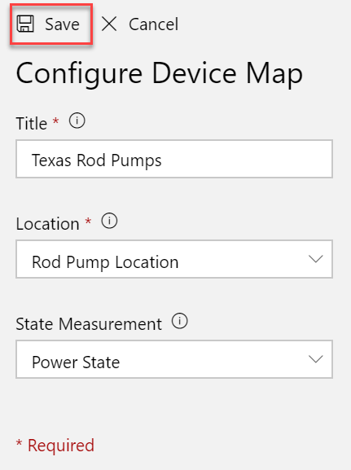

7. End Dashboard editing by pressing the *Done* button on upper-right corner of the dashboard editor.


8. Observe how the device set now has a map displaying markers for each device in the set. Feel free to adjust to zoom to better infer their location.

## Exercise 5: Creating a useful dashboard

One of the main features of IoT Central is the ability to visualize the health of your IoT system at a glance. Creating a customized dashboard that best fits your business is instrumental in improving business processes. In this exercise, we will go over adding a main dashboard that will be displayed upon entry to the IoT Central application.

### Task 1: Clearing out the default dashboard

1. In the left-hand menu, press the *Dashboard* item. Then, in the upper right corner of the dashboard - press the *Edit* button.
   


2. Press the *X* on each tile that you do not wish to see on the dashboard to remove them. The *X* will display when you hover over the tile.

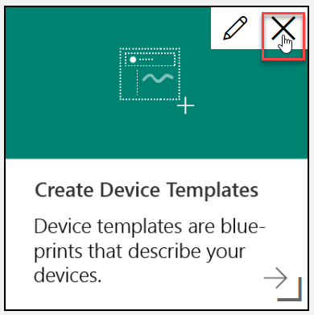
   
### Task 2: Add your company logo

1. Remaining in the edit mode of the dashboard, select *Image* from the *Library* menu.

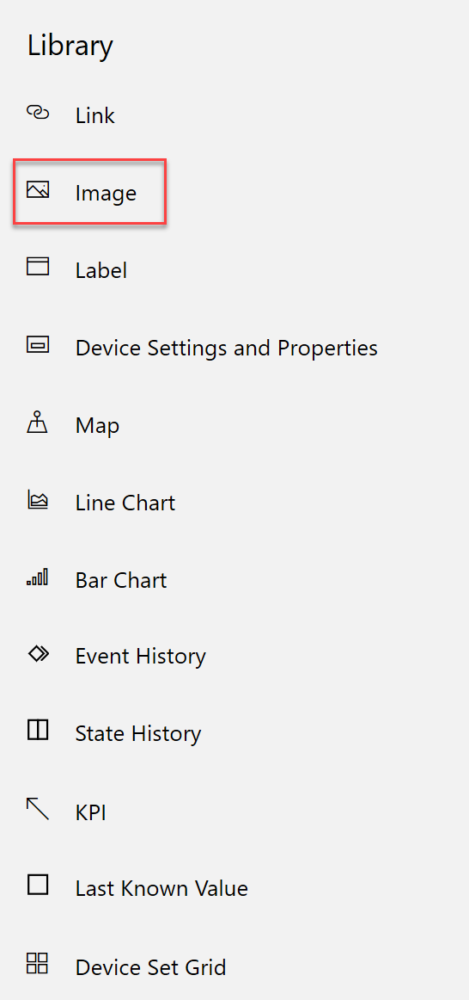

2. Configure the logo with the following file */Media/fabrikam-logo.png*.

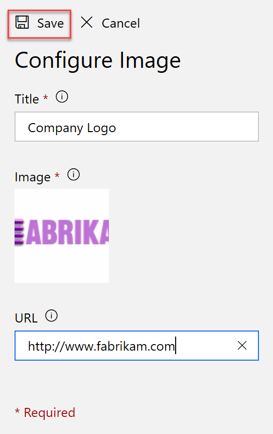

3. Resize the logo on the dashboard using the handle on the lower right of the logo tile.


### Task 3: Add a list of Texas Rod Pumps

In the previous exercise, we created a device set that contains the devices located in Texas. We will leverage this device set to display this filtered information.

1. Remaining in the edit dashboard mode, select *Device Set Grid* from the *Library* menu.
2. Configure the device list by selecting the *Texas Rod Pumps* Device Set, and assigning it the title of *Texas Rod Pumps*.
3. Add columns by pressing the *Add/Remove*, we will add *Device ID* and *IP Address*.
4. Press the *Save* button to add the tile to the dashboard.
   
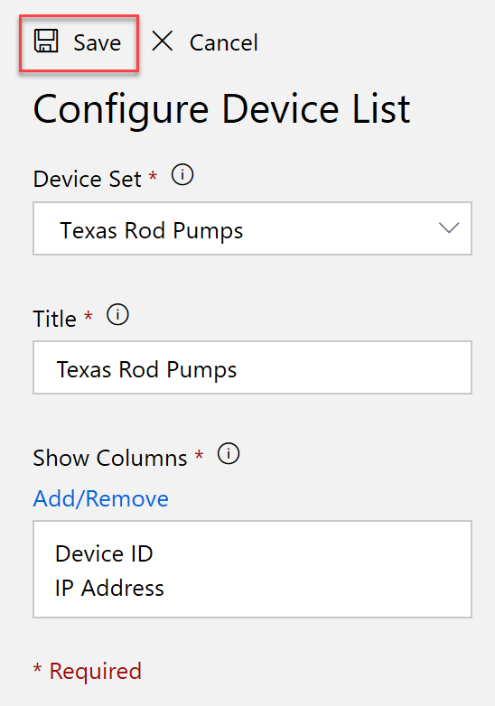


### Task 3: Add a map displaying the power state of DEVICE001
It is beneficial to see the location and power state of certain critical Texas rod pumps. We will add a map that will display the location and current power state of DEVICE001.

1. Select *Map* from the *Library* menu, configure the map as follows, and press *Save*:
   
| Field             | Value                       |
|-------------------|-----------------------------|
| Device Template   | Rod Pump (1.0.0)            |
| Device Instance   | Rod Pump - DEVICE001        |
| Title             | Rod Pump - DEVICE001 Status |
| Location          | Rod Pump Location           |
| State Measurement | Power State                 |
   


2. Press the *Done* button in the upper right corner of the Dashboard to finish editing.

   

## Exercise 6: Create an Event Hub and continuously export data from IoT Central

IoT Central provides a great first stepping stone into a larger IoT solution. Earlier in this lab, we responded to a crossed threshold by initiating an email sent to Fabrikam field workers through Flow directly from IoT Central. While this approach certainly does add value, a more mature IoT solution typically involves a machine learning model that will process incoming telemetry to logically determine if a failure of a pump is immenent. The first step into this implementation is to create an Event Hub to act as a destination for IoT Centrals continuously exported data. 

### Task 1: Create an Event Hub
The Event Hub we will be creating will act as a collector for data coming into IoT Central. The receipt of a message into this hub will utimately serve as a trigger to send data into a machine learning model to determine if a pump is in a failing state. We will also create a Consumer Group on the event hub to serve as an input to an Azure Function that will be created later on in this lab.

1. Log into the [Azure Portal](https://portal.azure.com)
2. In the left-hand menu, select **Resource Groups**
3. At the top of the screen press the **Add** button 
   
4. Create a new resource group with the name **Fabrikam_Oil**, ensure the proper subscription and region nearest you are selected. Then click the **Review + Create** button.
   
5. Open the newly created resource group. On the top of the screen, press the **Add** button, when the marketplace screen displays search for and select **Event Hubs**, this will allow you to create a new Event Hub Namespace resource.
   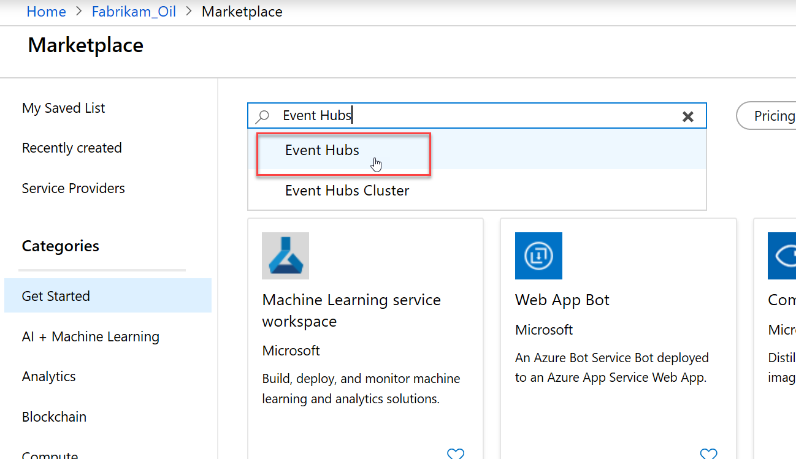
6. Configure the event hub as follows, and press the **Create** button:
   | Field             | Value                                 |
   |-------------------|---------------------------------------|
   | Name              | *anything must be globally unique*    |
   | Pricing Tier      | Standard                              |
   | Subscription      | *select the appropriate subscription* |
   | Resource Group    | Fabrikam_Oil                          |
   | Location          | *select the location nearest to you*  |
   
7. Once the Event Hubs namespace has been created, open it and press the **+ Event Hub** button at the top of the screen.
   
8. In the Create Event Hub form, configure the hub as follows and press the **Create** button:
   | Field             | Value                                 |
   |-------------------|---------------------------------------|
   | Name              | iot-central-feed                      |
   | Pricing Tier      | 1                                     |
   | Subscription      | 1                                     |
   | Capture           | Off                                   |
   
9.  Once the Event Hub has been created, open it by selecting *Event Hubs* in the left-hand menu, and clicking the hub from the list.
    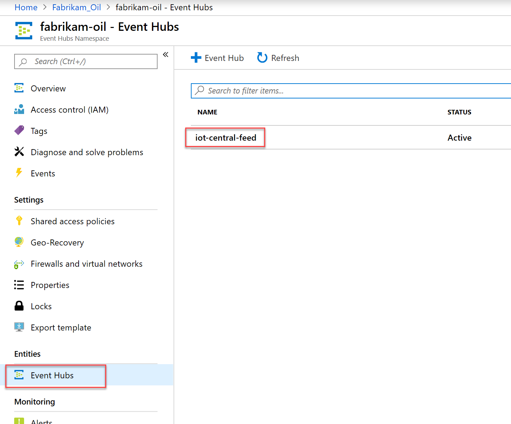
10. From the top menu, press the **+ Consumer Group** button to create a new consumer group for the hub. Name the consumer group *ingressprocessing* and press the **Create** button.
    

### Task 2: Configure continuous data export from IoT Central

1. Return to the IoT Central application, from the left-hand menu, select **Data Export**
   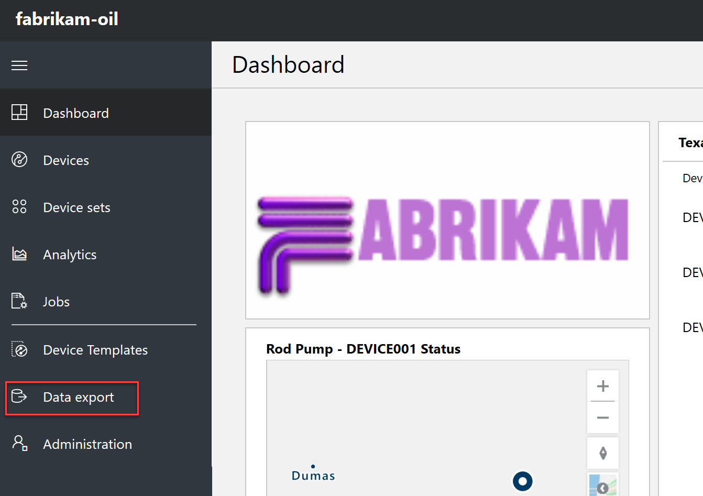
2. From the *Data Export* screen, press the **+ New** button from the upper right menu, and select **Azure Event Hubs**
   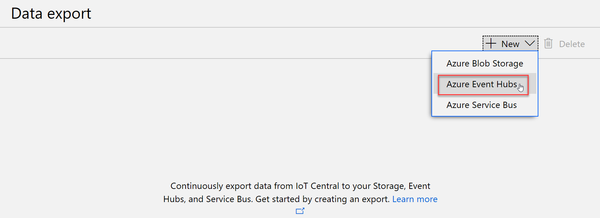
3. IoT Central will automatically retrieve Event Hubs namespaces and Event Hubs from the connected Azure Account. Configure the data export as follows and press the **Save** button:
   | Field             | Value                                 |
   |-------------------|---------------------------------------|
   | Display Name      | Event Hub Feed                        |
   | Enabled           | On                                    |
   | Event Hubs Namespace     | *select the namespace you created in Exercise 6* |
   | Event Hub    | iot-central-feed                          |
   | Measurements          | On  |
   | Devices | Off |
   | Device Templates | Off |
   
4. The Event Hub Feed export will be created, and then started (it may take a few minutes for the export to start)
   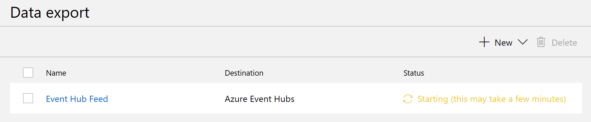
   

   

   


## After the hands-on lab 

Duration: X minutes

### Task 1: Delete the IoT Central application and Resource Group

1.  In IoT Central, select *Administration* from the left-hand menu. In the *Application Settings* screen, delete the application by pressing the *Delete* button. This will automate the removal of the IoT Application as well as all of its resources.
   

2. In the [Azure Portal](https://portal.azure.com), select **Resource Groups**, open the resource group that you created in Exercise 6, and press the **Delete resource group** button.
   
