<div class="MCWHeader1">
Predictive Maintenance for Remote Field Devices
</div>

<div class="MCWHeader2">
Hands-on lab step-by-step
</div>

<div class="MCWHeader3">
July 2019
</div>


Information in this document, including URL and other Internet Web site references, is subject to change without notice. Unless otherwise noted, the example companies, organizations, products, domain names, e-mail addresses, logos, people, places, and events depicted herein are fictitious, and no association with any real company, organization, product, domain name, e-mail address, logo, person, place or event is intended or should be inferred. Complying with all applicable copyright laws is the responsibility of the user. Without limiting the rights under copyright, no part of this document may be reproduced, stored in or introduced into a retrieval system, or transmitted in any form or by any means (electronic, mechanical, photocopying, recording, or otherwise), or for any purpose, without the express written permission of Microsoft Corporation.

Microsoft may have patents, patent applications, trademarks, copyrights, or other intellectual property rights covering subject matter in this document. Except as expressly provided in any written license agreement from Microsoft, the furnishing of this document does not give you any license to these patents, trademarks, copyrights, or other intellectual property.

The names of manufacturers, products, or URLs are provided for informational purposes only and Microsoft makes no representations and warranties, either expressed, implied, or statutory, regarding these manufacturers or the use of the products with any Microsoft technologies. The inclusion of a manufacturer or product does not imply endorsement of Microsoft of the manufacturer or product. Links may be provided to third party sites. Such sites are not under the control of Microsoft and Microsoft is not responsible for the contents of any linked site or any link contained in a linked site, or any changes or updates to such sites. Microsoft is not responsible for webcasting or any other form of transmission received from any linked site. Microsoft is providing these links to you only as a convenience, and the inclusion of any link does not imply endorsement of Microsoft of the site or the products contained therein.

© 2018 Microsoft Corporation. All rights reserved.

Microsoft and the trademarks listed at <https://www.microsoft.com/en-us/legal/intellectualproperty/Trademarks/Usage/General.aspx> are trademarks of the Microsoft group of companies. All other trademarks are property of their respective owners.

**Contents** 

<!-- TOC -->

- Predictive Maintenance for Remote Field Devices hands-on lab step-by-step](#predictive-maintenance-for-remote-field-devices-hands-on-lab-step-by-step)
    - [Abstract and learning objectives](#abstract-and-learning-objectives)
    - [Overview](#overview)
    - [Solution architecture](#solution-architecture)
    - [Requirements](#requirements)
    - [Before the hands-on lab](#before-the-hands-on-lab)
    - [Exercise 1: Configuring IoT Central with devices and metadata](#exercise-1-configuring-iot-central-with-devices-and-metadata)
        - [Task 1: Task name](#task-1-task-name)
        - [Task 2: Task name](#task-2-task-name)
    - [Exercise 2: Exercise name](#exercise-2-exercise-name)
        - [Task 1: Task name](#task-1-task-name-1)
        - [Task 2: Task name](#task-2-task-name-1)
    - [Exercise 3: Exercise name](#exercise-3-exercise-name)
        - [Task 1: Task name](#task-1-task-name-2)
        - [Task 2: Task name](#task-2-task-name-2)
    - [After the hands-on lab](#after-the-hands-on-lab)
        - [Task 1: Task name](#task-1-task-name-3)
        - [Task 2: Task name](#task-2-task-name-3)

<!-- /TOC -->

# Predictive Maintenance for Remote Field Devicesmhands-on lab step-by-step 

## Abstract and learning objectives 

In this hands-on-lab, you will build an end-to-end industrial IoT solution. We will begin by leveraging the Azure IoT Central SaaS offerings to quickly stand up a fully functional remote monitoring solution. Azure IoT Central provides solutions built upon recommendations found in the [Azure IoT Reference Architecture](https://docs.microsoft.com/en-us/azure/architecture/reference-architectures/iot/). We will customize this system specifically for rod pumps. Rod pumps are industrial equipment that is heavily used in the oil and gas industry.  We will then establish a model for the telemetry data that is received from the pump systems in the field and use this model to deploy simulated devices for system testing purposes. 

Furthermore we will establish threshold rules in the remote monitoring system that will monitor the incoming telemetry data to ensure all equipment is running optimally, and can alert us whenever the equipment is running outside of normal boundaries - indicating the need for alternative running parameters, maintenance, or a complete shut down of the pump. By leveraging the IoT Central solution, users can also issue commands to the pumps from a remote location in an instant to automate many operational and maintenance tasks which used to require staff on-site. This lessens operating costs associated with technician dispatch and equipment damage due to a failure.

Above and beyond real-time monitoring and mitigating immediate equipment damage through commanding - you will also learn how to apply the historical telemetry data accumulated to identify positive and negative trends that can be used to adjust daily operations for higher throughput and reliability.

TODO: AI/ML abstract

## Overview

The Predictive Maintenance for Remote Field Devices hands-on lab is an exercise that will challenge you to implement an end-to-end scenario using the supplied example that is based on Azure IoT Central and other related Azure services. The hands-on lab can be implemented on your own, but it is highly recommended to pair up with other members at the lab to model a real-world experience and to allow each member to share their expertise for the overall solution.

## Solution architecture

\[Insert your end-solution architecture here. . .\]

## Requirements

1.  Number and insert your custom workshop content here . . . 

## Before the hands-on lab

Refer to the Before the hands-on lab setup guide manual before continuing to the lab exercises.

To author: remove this section if you do not require environment setup instructions.

## Exercise 1: Configuring IoT Central with devices and metadata

Duration: X minutes

[Azure IoT Central](https://azure.microsoft.com/en-us/services/iot-central/) is a Software as a Service (SaaS) offering from Microsoft. The aim of this service is to provide a frictionless entry into the Cloud Computing and IoT space. The core focus of many industrial companies is not on cloud computing, therefore they do not necessarily have the personnel skilled to provide guidance and to stand up a reliable and scalable infrastructure for an IoT solution. It is imperative for these types of companies to enter the IoT space not only for the cost savings associated with remote monitoring, but also to improve safety for their workers and the environment.

Fabrikam is one such company that could use a helping hand entering the IoT space. They have recently invested in sensor technology on their rod pumps in the field, and they are ready to implement their cloud-based IoT Solution. Their IT department is small and unfamiliar with cloud-based IoT infrastructure; their IT budget also does not afford them the luxury of hiring a team of contractors to build out a solution for them.

The Fabrikam CIO has recently heard of Azure IoT Central - this online offering will streamline the process of them getting their sensor data to the cloud, where they can monitor their equipment for failures and improve their maintenance practices and not have to worry about the underlying infrastructure. A [predictable cost model](https://azure.microsoft.com/en-us/pricing/details/iot-central/) also ensures that there are no financial surprises.


### Task 1: Model the telemetry data

The first task is to identify the data that the equipment will be sending to the cloud. This data will contain fields that represent the data read from the sensors at a specific instant in time. This data will be used downstream systems to identify patterns that can lead to cost savings, increased safety and more efficient work processes.

The telemetry being reported by the Fabrikam rod pumps are as follows, we will be using this information later in the lab:

#### Telemetry Schema
| Field                | Type     | Description                                                                                                                                                                                                                                                                    |
|----------------------|----------|--------------------------------------------------------------------------------------------------------------------------------------------------------------------------------------------------------------------------------------------------------------------------------|
| SerialNumber         | String   | Unique serial number identifying the rod pump equipment                                                                                                                                                                                                                        |
| IPAddress            | String   | Current IP Address                                                                                                                                                                                                                                                             |
| TimeStamp            | DateTime | Timestamp in UTC identifying the point in time the telemetry was created                                                                                                                                                                                                       |
| PumpRate             | Numeric  | Speed calculated over the time duration between the last two times the crank arm has passed the proximity sensor measured in Strokes Per Minute (SPM) - minimum 0.0, maximum 100.0                                                                                             |
| TimePumpOn           | Numeric  | Number of minutes the pump has been on                                                                                                                                                                                                                                         |
| MotorPowerkW         | Numeric  | Measured in Kilowatts (kW)                                                                                                                                                                                                                                                     |
| MotorSpeed           | Numeric  | including slip (RPM)                                                                                                                                                                                                                                                           |
| CasingFriction       | Numeric  | Measured in PSI (psi)                                                                                                                                                   |

### Task 2: Create an IoT Central Application

1.  Access the (Azure IoT Central)[https://azure.microsoft.com/en-us/services/iot-central/] website.

2.  Press the *Get started* button 

    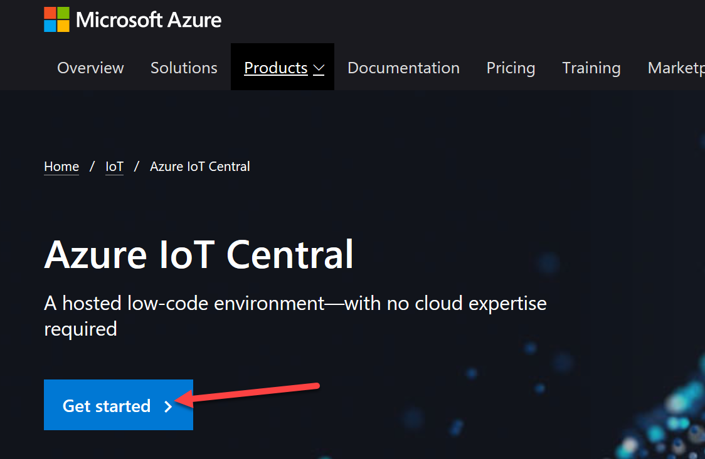

3.   If you are not currently logged in, you will be prompted to log in with your Microsoft Azure Account

4.   Press the *New Application* button

        

5.   Fill the provisioning form
        
        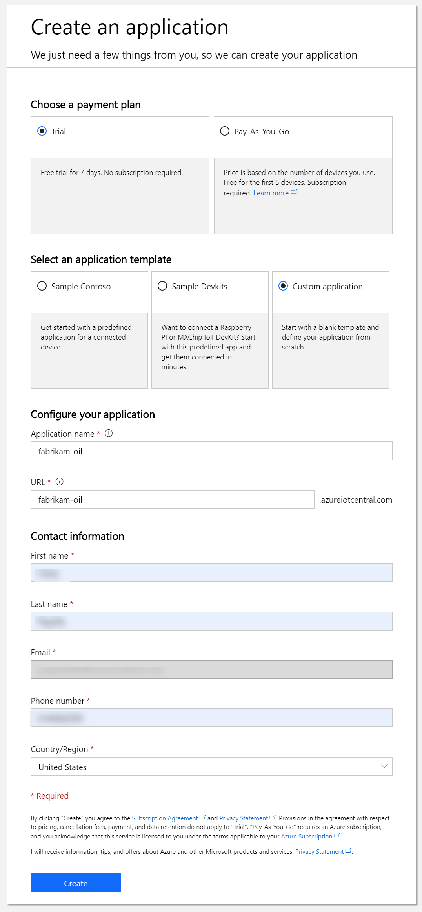

        a. *Payment Plan* - feel free to choose either the 7 day trial or the Pay as you Go option.

        b.  *Application Template* - select *Custom Application*

        c.  *Application Name* - give your application a name of your choice, in this example, we used *fabrikam-oil*

        d.  *Url* - this will be the URL for your application, it needs to be globally unique.

        e. Fill out your contact information (First Name, Last Name, Email Address, Phone Number, Country)

        f. Press the *Create* button to provision your application

### Task 3: Create the Device Template

1.   Once the application has been provisioned, we need to define the type of equipment we are using, and the data associated with the equipment. In order to do this we must define a *Device Template*. Press either the *Create Device Templates* button, or the *Device Templates* menu item from the left-hand menu.


2. Select *Custom* to define our own type of hardware

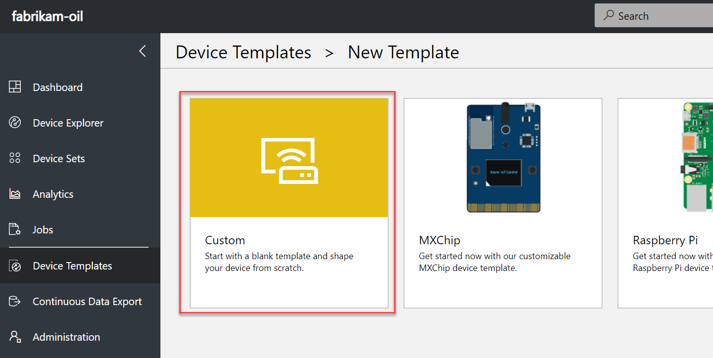

3.   For the device template name, enter *Rod Pump*, then press the *Create* button.

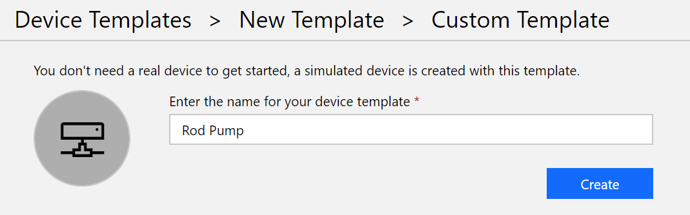

4.   The next thing we need to do is define the measurements that will be received from the device. To do this, press the *New* button at the top of the left-hand menu.


5.  From the context menu, select *Telemetry*


6.  Create Telemetry values as follows:

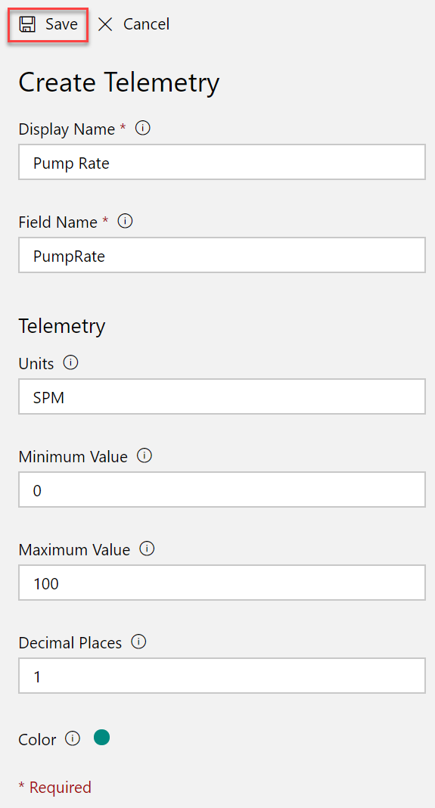


| Display Name    | Field Name     | Units   | Min. Value | Max. Value | Decimal Places |
|-----------------|----------------|---------|------------|------------|----------------|
| Pump Rate       | PumpRate       | SPM     | 0          | 100        | 1              |
| Time Pump On    | TimePumpOn     | Minutes | 0          |            | 2              |
| Motor Power     | MotorPowerKw   | kW      | 0          | 90         | 2              |
| Motor Speed     | MotorSpeed     | RPM     | 0          | 300        | 0              |
| Casing Friction | CasingFriction | PSI     | 0          | 1600       | 2              |


7. Remaining on the measurement tab - we also need to define the current state of the pump, whether it is running or not. Press *New* and select *State*.

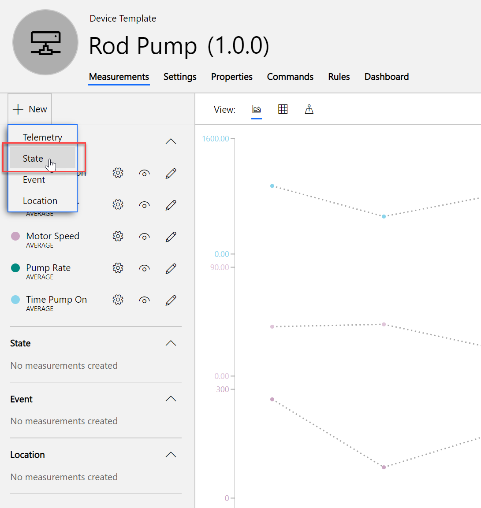

8. Add the state with the display name of *Power State*, field name of *PowerState* with the values *Unavailable*, *On*, and *Off* - then press the *Save* button.

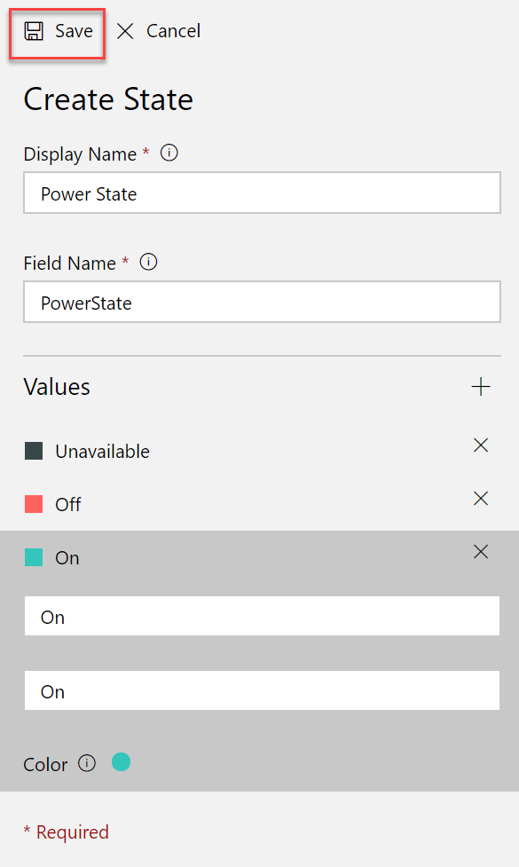

9. In the device template, Properties are read-only metadata associated with the equipment. For our template, we will expect a property for Serial Number and IP Address. From the top menu, select *Properties*, then *Device Property* from the left-hand menu. 
        


10. Define the device properties as follows:

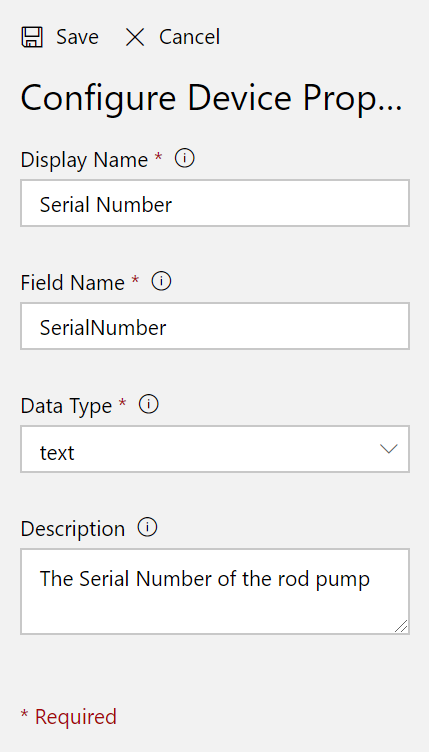

| Display Name  | Field Name   | Data Type | Description                       |
|---------------|--------------|-----------|-----------------------------------|
| Serial Number | SerialNumber | text      | The Serial Number of the rod pump |
| IP Address    | IPAddress    | text      | The IP address of the rod pump    |

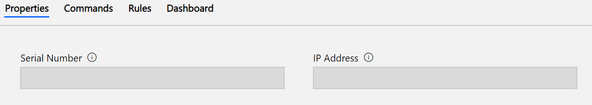 

11.  Operators and field workers will want to be able to turn on and off the pumps remotely. In order to do this we will define commands. Select the *Commands* tab, and press the *New* button to add a new command.

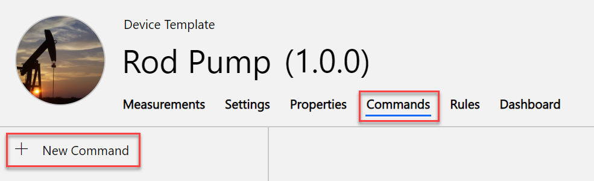

12.  Create a command as follows:
        
        a. *Display Name* - *Toggle Motor Power*
        b. *Field Name* - *MotorPower*
        c. *Default Timeout* - *30*
        d. *Data Type* - *toggle*
        e. *Description* - *Toggle the motor power of the pump on and off*

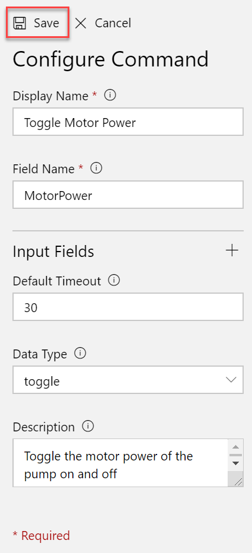

13. Now, we can define the dashboard by pressing the *Dashboard* option in the top menu, and selecting *Line Chart* from the left-hand menu. Define a line chart for each of the telemetry fields (PumpRate, TimePumpOn, MotorPower, MotorSpeed, CasingFriction) - keeping all the default values:

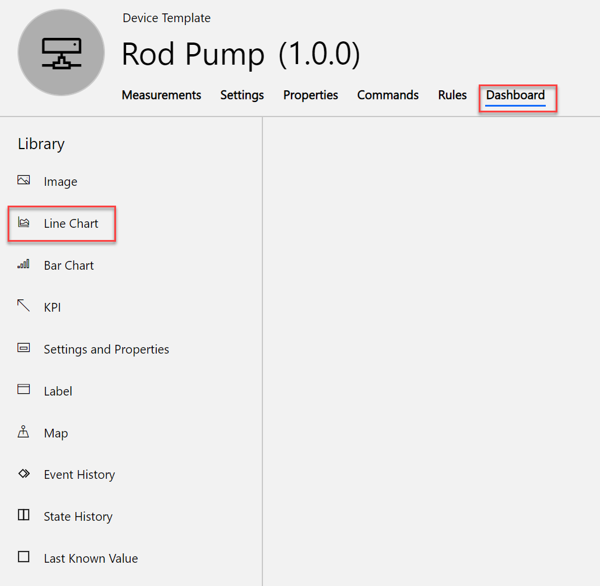

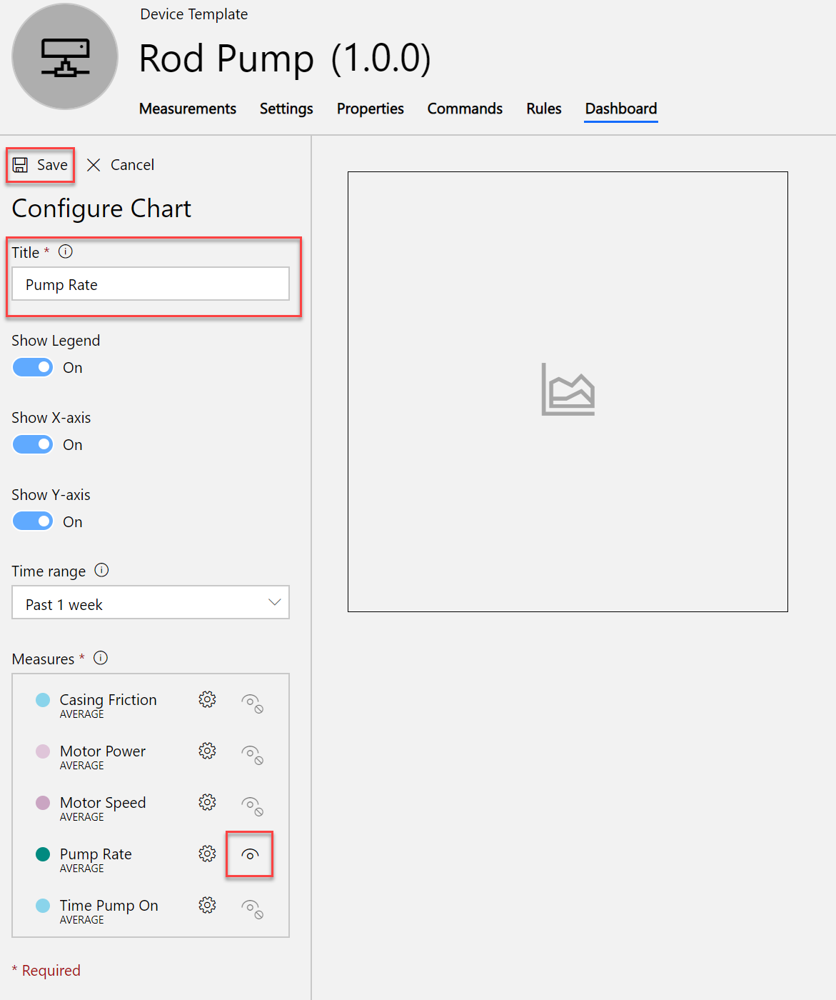

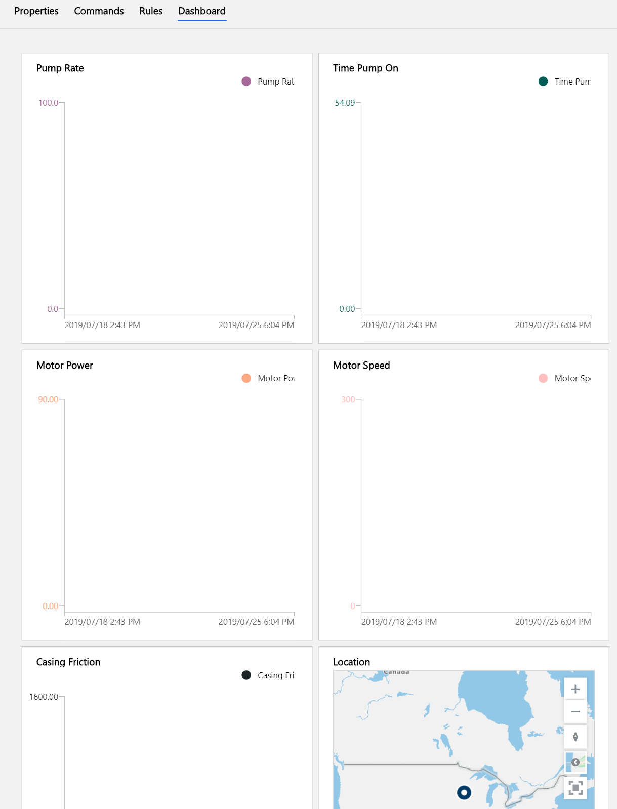

14. Finally, we can add an image to represent the equipment. Press on the circle icon left of the template name, and select an image file. The image used in this lab can be found on [PixaBay](https://pixabay.com/photos/pumpjack-texas-oil-rig-pump-591934/).

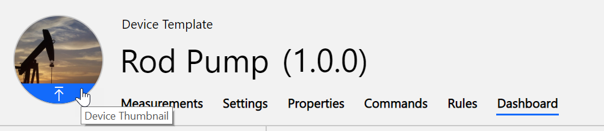

15. Review the application template by viewing its simulated device. IoT Central automatically creates a simulated device based on the template you've created. From the left-hand menu, select *Device Explorer*. In this list you will see a simulated device for the template that we have just created. Click the link for this simulated device, the charts will show a sampling of simulated data. 

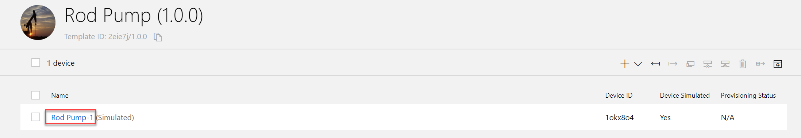

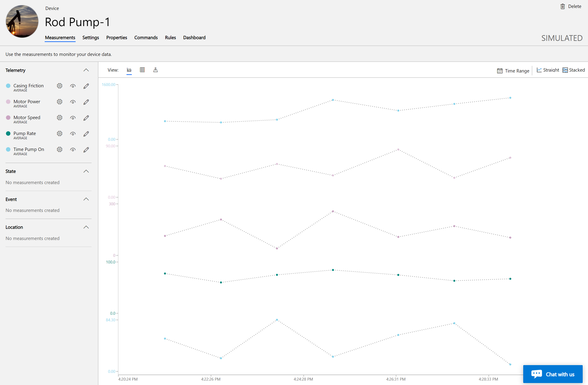

### Task 4 - Create and provision a real device

Under the hood, Azure IoT Central uses the [Azure IoT Hub Device Provisioning Service (DPS)](https://docs.microsoft.com/en-us/azure/iot-dps/). The aim of DPS is to provide a consistent way to connect devices to the Azure Cloud. Devices can utilize Shared Access Signatures, or X.509 certificates to securely connect to IoT Central.

### Task 1: Register the Device in IoT Central

[Multiple options](https://docs.microsoft.com/en-us/azure/iot-central/concepts-connectivity) exist to register devices in IoT Central, ranging from individual device registration to [bulk device registration](https://docs.microsoft.com/en-us/azure/iot-central/concepts-connectivity#connect-devices-at-scale-using-sas) via a comma delimited file. In this lab we will register a single device using SAS.

1. In the left-hand menu of your IoT Central application, select *Device Explorer*.

2. Select the *Rod Pump (1.0.0)* template. This will now show the list of existing devices which at this time includes only the simulated device.

3. Click the *+* button to add a new device, select *Real*.

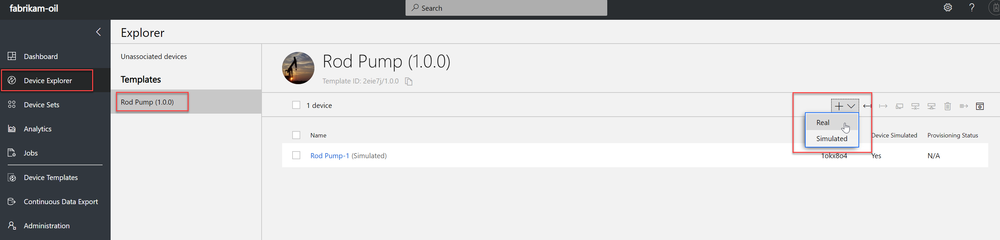

4. A modal window will be displayed with an automatically generated Device ID and Device Name. Feel free to edit these values to match your back-end systems. Make note of these values, and press the *Create* button.

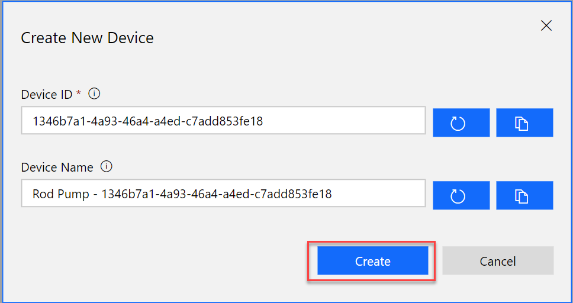

5. Once the device has been created, press the *Connect* button located in the upper right corner of the device's page. Make note of the Scope ID, Device ID, as well as the primary and secondary key values.

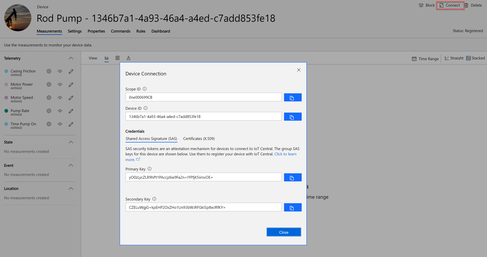

6. Utilizing one of the keys from the values you recorded in #5 we will be generating a SAS key to use in the source code running on the device. We will generate a SAS key using command line tooling. Ensure you have Node v.8+ installed, open a command prompt, and execute the following:

```
npm i -g dps-keygen
```

Next, generate the SAS key

```
dps-keygen -mk:<primary key value> -di:<device id>
```

                
## Exercise 2: Exercise name

Duration: X minutes

\[insert your custom Hands-on lab content here . . .\]

### Task 1: Task name

1.  

### Task 2: Task name

1.  Number and insert your custom workshop content here . . . 

    a.  Insert content here

        i.  


## Exercise 3: Exercise name

Duration: X minutes

\[insert your custom Hands-on lab content here . . .\]

### Task 1: Task name

1.  Number and insert your custom workshop content here . . .

    a.  Insert content here

        i.  

### Task 2: Task name

1.  Number and insert your custom workshop content here . . .

    a.  Insert content here

        i.  

## After the hands-on lab 

Duration: X minutes

\[insert your custom Hands-on lab content here . . .\]

### Task 1: Task name

1.  Number and insert your custom workshop content here . . .

    a.  Insert content here

        i.  

### Task 2: Task name

1.  Number and insert your custom workshop content here . . .

    a.  Insert content here

        i.  
You should follow all steps provided *after* attending the Hands-on lab.

