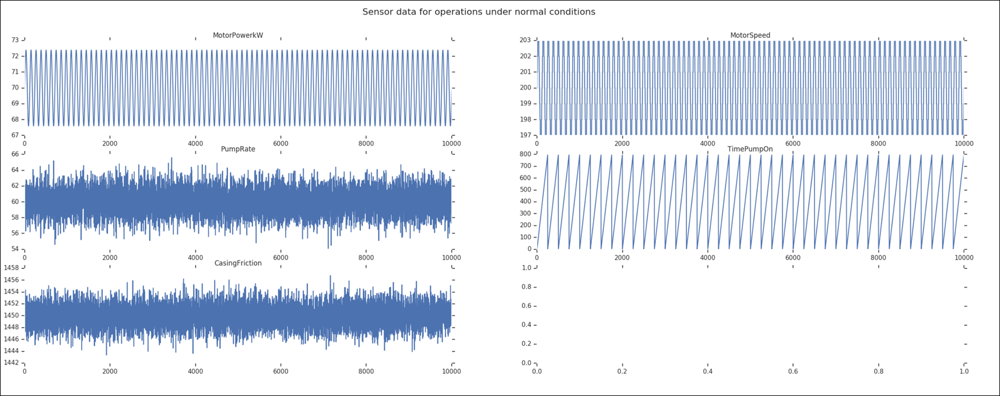
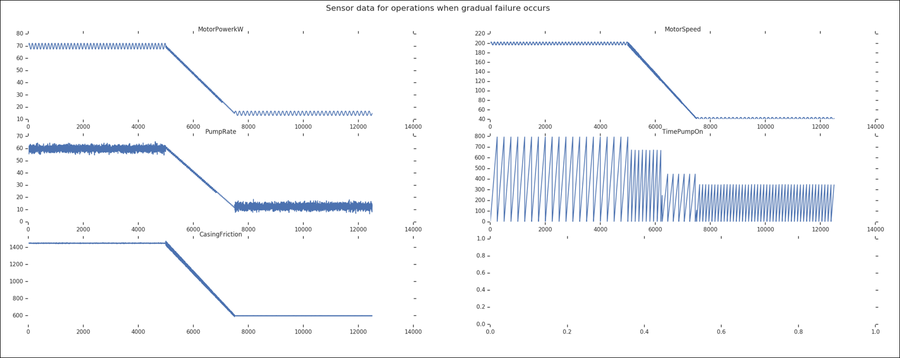
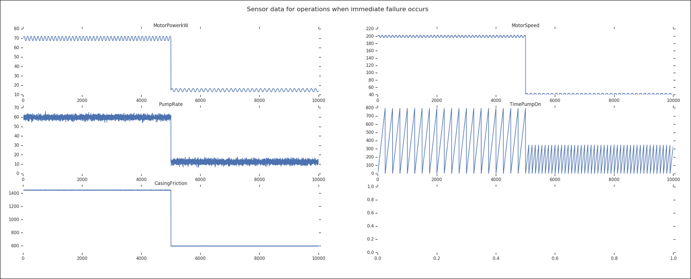
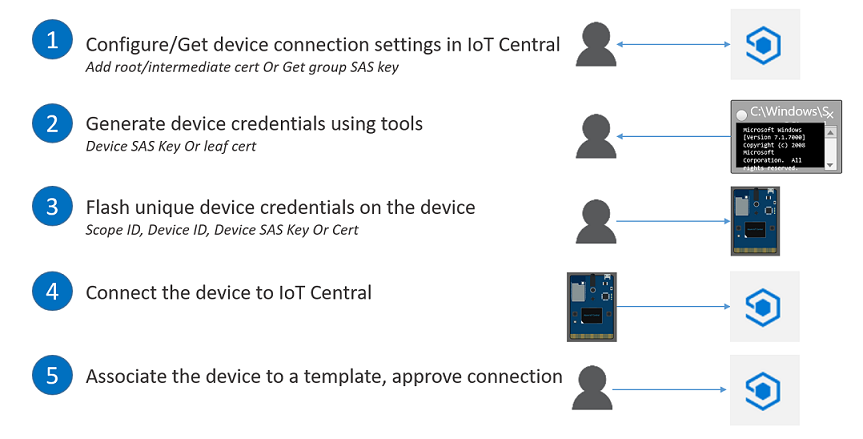
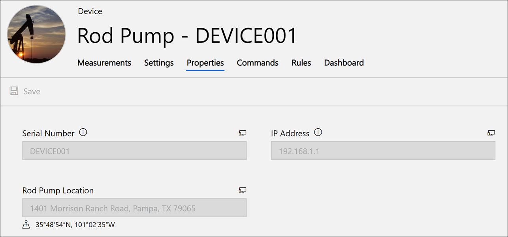

Predictive Maintenance for Remote Field Devices

Whiteboard design session trainer guide

July 2019

Information in this document, including URL and other Internet Web site references, is subject to change without notice. Unless otherwise noted, the example companies, organizations, products, domain names, e-mail addresses, logos, people, places, and events depicted herein are fictitious, and no association with any real company, organization, product, domain name, e-mail address, logo, person, place or event is intended or should be inferred. Complying with all applicable copyright laws is the responsibility of the user. Without limiting the rights under copyright, no part of this document may be reproduced, stored in or introduced into a retrieval system, or transmitted in any form or by any means (electronic, mechanical, photocopying, recording, or otherwise), or for any purpose, without the express written permission of Microsoft Corporation.

Microsoft may have patents, patent applications, trademarks, copyrights, or other intellectual property rights covering subject matter in this document. Except as expressly provided in any written license agreement from Microsoft, the furnishing of this document does not give you any license to these patents, trademarks, copyrights, or other intellectual property.

The names of manufacturers, products, or URLs are provided for informational purposes only and Microsoft makes no representations and warranties, either expressed, implied, or statutory, regarding these manufacturers or the use of the products with any Microsoft technologies. The inclusion of a manufacturer or product does not imply endorsement of Microsoft of the manufacturer or product. Links may be provided to third party sites. Such sites are not under the control of Microsoft and Microsoft is not responsible for the contents of any linked site or any link contained in a linked site, or any changes or updates to such sites. Microsoft is not responsible for webcasting or any other form of transmission received from any linked site. Microsoft is providing these links to you only as a convenience, and the inclusion of any link does not imply endorsement of Microsoft of the site or the products contained therein.

© 2019 Microsoft Corporation. All rights reserved.

Microsoft and the trademarks listed at https://www.microsoft.com/en-us/legal/intellectualproperty/Trademarks/Usage/General.aspx are trademarks of the Microsoft group of companies. All other trademarks are property of their respective owners.

**Contents**

<!-- TOC -->
- [Trainer information](#Trainer-information)
  - [Role of the trainer](#Role-of-the-trainer)
  - [Whiteboard design session flow](#Whiteboard-design-session-flow)
  - [Before the whiteboard design session: How to prepare](#Before-the-whiteboard-design-session-How-to-prepare)
  - [During the whiteboard design session: Tips for an effective whiteboard design session](#During-the-whiteboard-design-session-Tips-for-an-effective-whiteboard-design-session)
- [Predictive Maintenance for Remote Field Devices whiteboard design session student guide](#Predictive-Maintenance-for-Remote-Field-Devices-whiteboard-design-session-student-guide)
  - [Abstract and learning objectives](#Abstract-and-learning-objectives)
  - [Step 1: Review the customer case study](#Step-1-Review-the-customer-case-study)
    - [Customer situation](#Customer-situation)
      - [Telemetry data](#Telemetry-data)
    - [Customer needs](#Customer-needs)
    - [Customer objections](#Customer-objections)
    - [Infographic for common scenarios](#Infographic-for-common-scenarios)
  - [Step 2: Design a proof of concept solution](#Step-2-Design-a-proof-of-concept-solution)
  - [Step 3: Present the solution](#Step-3-Present-the-solution)
  - [Wrap-up](#Wrap-up)
  - [Additional references](#Additional-references)
- [Predictive Maintenance for Remote Field Devices whiteboard design session trainer guide](#Predictive-Maintenance-for-Remote-Field-Devices-whiteboard-design-session-trainer-guide)
  - [Step 1: Review the customer case study](#Step-1-Review-the-customer-case-study-1)
  - [Step 2: Design a proof of concept solution](#Step-2-Design-a-proof-of-concept-solution-1)
  - [Step 3: Present the solution](#Step-3-Present-the-solution-1)
  - [Wrap-up](#Wrap-up-1)
  - [Preferred target audience](#Preferred-target-audience)
  - [Preferred solution](#Preferred-solution)
  - [Checklist of preferred objection handling](#Checklist-of-preferred-objection-handling)
  - [Customer quote (to be read back to the attendees at the end)](#Customer-quote-to-be-read-back-to-the-attendees-at-the-end)
<!-- /TOC -->

# Trainer information

Thank you for taking time to support the whiteboard design sessions as a trainer!

## Role of the trainer

An amazing trainer:

- Creates a safe environment in which learning can take place.

- Stimulates the participant's thinking.

- Involves the participant in the learning process.

- Manages the learning process (on time, on topic, and adjusting to benefit participants).

- Ensures individual participant accountability.

- Ties it all together for the participant.

- Provides insight and experience to the learning process.

- Effectively leads the whiteboard design session discussion.

- Monitors quality and appropriateness of participant deliverables.

- Effectively leads the feedback process.

## Whiteboard design session flow

Each whiteboard design session uses the following flow:

**Step 1: Review the customer case study (15 minutes)**

**Outcome**

Analyze your customer's needs.

- Customer's background, situation, needs and technical requirements

- Current customer infrastructure and architecture

- Potential issues, objectives and blockers

**Step 2: Design a proof of concept solution (60 minutes)**

**Outcome**

Design a solution and prepare to present the solution to the target customer audience in a 15-minute chalk-talk format.

- Determine your target customer audience.

- Determine customer's business needs to address your solution.

- Design and diagram your solution.

- Prepare to present your solution.

**Step 3: Present the solution (30 minutes)**

**Outcome**

Present solution to your customer:

- Present solution

- Respond to customer objections

- Receive feedback

**Wrap-up (15 minutes)**

- Review preferred solution

## Before the whiteboard design session: How to prepare

Before conducting your first whiteboard design session:

- Read the Student guide (including the case study) and Trainer guide.

- Become familiar with all key points and activities.

- Plan the point you want to stress, which questions you want to drive, transitions, and be ready to answer questions.

- Prior to the whiteboard design session, discuss the case study to pick up more ideas.

- Make notes for later.

## During the whiteboard design session: Tips for an effective whiteboard design session

**Refer to the Trainer guide** to stay on track and observe the timings.

**Do not expect to memorize every detail** of the whiteboard design session.

When participants are doing activities, you can **look ahead to refresh your memory**.

- **Adjust activity and whiteboard design session pace** as needed to allow time for presenting, feedback, and sharing.

- **Add examples, points, and stories** from your own experience. Think about stories you can share that help you make your points clearly and effectively.

- **Consider creating a "parking lot"** to record issues or questions raised that are outside the scope of the whiteboard design session or can be answered later. Decide how you will address these issues, so you can acknowledge them without being derailed by them.

**\*Have fun**! Encourage participants to have fun and share!\*

**Involve your participants.** Talk and share your knowledge but always involve your participants, even while you are the one speaking.

**Ask questions** and get them to share to fully involve your group in the learning process.

**Ask first**, whenever possible. Before launching into a topic, learn your audience's opinions about it and experiences with it. Asking first enables you to assess their level of knowledge and experience, and leaves them more open to what you are presenting.

**Wait for responses**. If you ask a question such as, "What's your experience with (fill in the blank)?" then wait. Do not be afraid of a little silence. If you leap into the silence, your participants will feel you are not serious about involving them and will become passive. Give participants a chance to think, and if no one answers, patiently ask again. You will usually get a response.

# Predictive Maintenance for Remote Field Devices whiteboard design session student guide

## Abstract and learning objectives

This whiteboard design session is designed to help you gain a better understanding of implementing architectures that ...

At the end of this whiteboard design session, you will be better able to design ...

## Step 1: Review the customer case study

**Outcome**

Analyze your customer's needs.

Timeframe: 15 minutes

Directions: With all participants in the session, the facilitator/SME presents an overview of the customer case study along with technical tips.

1.  Meet your table participants and trainer.

2.  Read all of the directions for steps 1-3 in the student guide.

3.  As a table team, review the following customer case study.

### Customer situation

Fabrikam, Inc. creates innovative IoT solutions for the oil and gas manufacturing industry. It is beginning work on a new, predictive maintenance solution that targets rod pumps (the iconic pivoting pumps that dot oil fields around the world). With their solution in place, companies will be able to monitor and configure pump settings and operations remotely, and only send personnel onsite when necessary for repair or maintenance when the solution indicates that something has gone wrong. However, Fabrikam wants to go beyond reactive alerting- they want to enable the solution with the ability to recognize problems, based on automated observation of telemetry data, so they can be averted before a fault occurs and the damage is done.

One of Fabrikam's challenges is managing IoT devices at scale. They want to be able to securely store credentials on their devices before sending them to their customers. When the devices connect to the cloud, they want to have an approval process that activates those devices so they can start sending telemetry securely. All data in transit must be encrypted.

Another decision point for Fabrikam is whether they would benefit from a software-as-a-service (SaaS) cloud-based offering, or a more customized platform-as-a-service (PaaS) solution. Fabrikam's technical leadership believes that, since IoT is not one of their top disciplines, and because technology is rapidly changing in the IoT space, they would benefit most from a SaaS-based solution. On the other hand, they want to know what the range of IoT PaaS options there are on Azure so they can make an informed decision on which route they should invest their time and resources. Given their current lack of IoT experience, Fabrikam would like to build a proof of concept using a SaaS product that they can quickly get started with to evaluate whether it meets their immediate and long-term needs. These needs include device management, visualization, reporting, control, and monitoring. Ideally, the solution will be highly scalable and secure, should they decide to transition from a PoC to a pilot deployment with several customers. When they do start expanding to several customers, they would like a transparent pricing structure they can use to project costs and pass those costs to their customers based on their usage.

Whichever cloud-based solution Fabrikam pursues, they want to know how they can visualize all of the data generated by sensors on each rod pump. These sensors include power output from motors, motor speed, the pump rate measured in strokes per minute, how long the pump is on, and casing friction measured in psi, to name a few. Each of these sensors output data at different rates and measurements, complicating any effort to build meaningful charts and dashboards. The information needs to be easily digested by analysts and technicians alike, with options to filter and explore the data over a timeline and within groups (oil pumps located within the same oil field). Ideally, there will be a customizable dashboard that shows crucial information at a glance. Fabrikam wants to know if there are out-of-the-box solutions for creating these visualizations and dashboards without involving developers and other IT staff.

Fabrikam has collected and compiled thorough maintenance and operational data of rod pump components and used this information to identify failure thresholds that identify an immediate or impending mechanical failure. Each of the elements of the rod pump's mechanism generates a consistent pattern in their telemetry when operating under normal conditions. If one of these components starts to degrade or suffers an operational failure, the signal reflects this change in status. When this change in status occurs, Fabrikam would like to automatically send an alert to engineers and field pump supervisors so they can potentially mitigate the issue and prevent damage to the failing and related components. In many cases, the fuel rod's onboard controller can modify the operating parameters of the pump to avoid or mitigate the impact of unexpected changes. Alternatively, if necessary, it can shut down the pump before any damage occurs and notify the company that repairs are necessary—protecting the machinery, and preventing potential environmental damage. Fabrikam would like to have a mechanism within their solution to send commands to rod pump controllers to modify these operating parameters remotely.

Their goal in the use of these monitoring capabilities and controls is to increase operator efficiency and safety. Addressing a typical maintenance issue takes several people and at least three days of system downtime at the cost of up to $20,000 USD a day, not including parts and labor. "By proactively identifying pump problems through automated monitoring, companies reduce unplanned downtime, which decreases costs, increases production, and increases the agility of maintenance services," says Fabrikam's Chief Technology Officer, Peter Guerin. He adds that the majority of industrial accidents don't happen at the well site; they happen when personnel is driving between sites. By eliminating the need for many site visits, they can reduce those accidents.

They would like to understand their options for expediting the implementation of the PoC. Specifically, they are looking to learn what offerings Azure provides that could enable a quick end-to-end start on the infrastructure for monitoring and managing devices and the system metadata. On top of this, they are curious about what other platform services Azure provides that they should consider in this scenario.

#### Telemetry data

Fabrikam identified 33 rod pump components whose telemetry they want to capture and monitor. Of these, they want to automatically monitor five with thresholds set on each that will trigger alerts if signals fall below those thresholds. According to their research and historical data for the rod pump's components, values that fall below these thresholds indicate either an impending or active failure of the pump.

| Field          | Type    | Normal measurement  | Failure threshold                     | Description                                                                                                                                                                                                                                                   |
| -------------- | ------- | ------------------- | ------------------------------------- | ------------------------------------------------------------------------------------------------------------------------------------------------------------------------------------------------------------------------------------------------------------- |
| MotorPowerkW   | Numeric | ~70kW               | ~30kW                                 | Measured in Kilowatts (kW); The power output of the motor should be steady, but will drop if there is a problem                                                                                                                                               |
| MotorSpeed     | Numeric | ~200 RPM            | ~80 RPM                               | Measured in RPM (including slip); Can change based on density of oil. Lower density causes this to go up (like if you have pockets of gas and it jumps up). If there's a failure it will go down below the normal operating average.                          |
| CasingFriction | Numeric | ~1450 psi           | ~830 psi                              | Measured in PSI (psi); The pressure will drop if a fissure is developing in the casing, indicating a failure.                                                                                                                                                 |
| PumpRate       | Numeric | ~60 SPM             | ~25 SPM                               | Speed calculated over the time duration between the last two times the crank arm has passed the proximity sensor measured in Strokes Per Minute (SPM) - minimum 0.0, maximum 100.0. A significant slow down could be an indicator of failure within the pump. |
| TimePumpOn     | Numeric | Amplitude: 0 - ~800 | Amplitude: 0 - ~340; higher frequency | Number of minutes the pump has been on. This should be a steady sawtooth pattern with a regular cadence of the pump cycling power. A consistently shorter than average cadence can indicate problems with the pump.                                           |

Normal signal readings from these five sensors appear in the chart below, with 10,000 intervals. The frequency of the output is condensed to fit:

The next chart shows the telemetry for these five components during a gradual failure. In many cases, there is time to react and prevent total failure through remote commands to the pump controller:

This final chart shows the telemetry for these five components when there is an immediate failure:

### Customer needs

1. We are interested in comparing SaaS and PaaS-based offerings on Azure. Based on our needs, will a SaaS solution meet our needs for a rapid PoC?
2. Need web-based access to metadata management of the rod pump devices for simplified management by our users.
3. When we expand beyond the PoC, we need to be able to add devices in bulk for our customers.
4. We would like to have configurable standard dashboards for all users and personalized dashboards.
5. Need collection and export of real-time telemetry, at scale. There should be an intuitive interface for analyzing collected data as it arrives, or within timelines to include historical information.
6. Require strong device security with encryption at transit and at rest, as well as ample cloud-based security and user management.
7. We want to configure alerts when sensor data reaches certain thresholds so engineers can take action and send remote commands to pump controllers to prevent damage due to mechanical failure. Alert options should be flexible for choosing a destination and executing automated tasks.

### Customer objections

1. Is there an out of the box solution we can use to jump-start the creation of the solution?
2. We are worried about being constrained by a "black box" if we go with a SaaS solution. Do we have access to all of our collected telemetry we can use for external workloads?
3. How would alerts be generated and delivered when the automated monitoring predicts a failure? What integration options do we have?
4. How can the operators view the current status of the rod pumps in a single dashboard?

### Infographic for common scenarios

Potential picture goes here...

## Step 2: Design a proof of concept solution

**Outcome**

Design a solution and prepare to present the solution to the target customer audience in a 15-minute chalk-talk format.

Timeframe: 60 minutes

**Business needs**

Directions: With all participants at your table, answer the following questions and list the answers on a flip chart:

1.  Who should you present this solution to? Who is your target customer audience? Who are the decision makers?

2.  What customer business needs do you need to address with your solution?

**Design**

Directions: With all participants at your table, respond to the following questions on a flip chart:

_High-level architecture_

1. Without getting into the details (the following sections will address the particular details), diagram your initial vision for using a SaaS-based IoT solution on Azure with device management, custom dashboards, user management, real-time telemetry capture, analysis, and export. If you can, include the underlying architecture of the SaaS solution by identifying its major components.

_IoT options in Azure_

1. What are the SaaS-based IoT options in Azure?

2. What are the PaaS-based IoT options in Azure?

3. Would you recommend SaaS or PaaS for this customer situation? What are the pros and cons of each?

_Device and metadata management_

1. How do you connect devices one at a time?

2. How do you connect multiple devices at scale? What options are there to secure device connections?

3. When Fabrikam is ready to mass manufacture devices, can they configure their devices to automatically connect to the cloud when turned on, or do they all have to be registered during installation?

4. What communication protocols are supported? What if they are using devices that do not support those protocols?

5. Is there a way to define common metadata for devices, such as location and serial number? How is this metadata applied to devices, and how can developers set this metadata programmatically?

6. How can control messages be sent to rod pump controllers from the cloud to perform tasks like turn off the pump engine or change settings?

_Dashboards and telemetry analysis_

1. How would you propose Fabrikam create visualizations for each rod pump?

2. How can they create shared dashboards, and can users create their own personalized dashboards?

3. What options are available to view and filter device telemetry?

4. Can telemetry be automatically exported to external storage for offline batch processing? What other options are available to gain access to telemetry outside of the core IoT solution?

_Security_

1. Is device data encrypted both in transit and at rest?

2. Can Fabrikam use standard certificates for device authentication? How do Fabrikam's administrators approve new devices that attempt to connect to the cloud?

3. What user management options are available for the dashboards? What roles are defined?

_Alerts and integrations_

1. Fabrikam wants to use their knowledge of rod pump component operating parameters and proactively monitor telemetry for immediate or impending failure. How can they set thresholds for sensor data and trigger alerts when those thresholds are crossed?

2. What options can they use to send alerts? They are interested in available integrations that may work with services they already use, like Office 365 or Dynamics CRM.

**Prepare**

Directions: With all participants at your table:

1.  Identify any customer needs that are not addressed with the proposed solution.

2.  Identify the benefits of your solution.

3.  Determine how you will respond to the customer's objections.

Prepare a 15-minute chalk-talk style presentation to the customer.

## Step 3: Present the solution

**Outcome**

Present a solution to the target customer audience in a 15-minute chalk-talk format.

Timeframe: 30 minutes

**Presentation**

Directions:

1.  Pair with another table.

2.  One table is the Microsoft team and the other table is the customer.

3.  The Microsoft team presents their proposed solution to the customer.

4.  The customer makes one of the objections from the list of objections.

5.  The Microsoft team responds to the objection.

6.  The customer team gives feedback to the Microsoft team.

7.  Tables switch roles and repeat Steps 2-6.

## Wrap-up

Timeframe: 15 minutes

Directions: Tables reconvene with the larger group to hear the facilitator/SME share the preferred solution for the case study.

## Additional references

| Description                                                           | Links                                                                                                     |
| --------------------------------------------------------------------- | --------------------------------------------------------------------------------------------------------- |
| About IoT Central                                                     | <https://docs.microsoft.com/en-us/azure/iot-central/overview-iot-central>                                 |
| About IoT Hub                                                         | <https://docs.microsoft.com/azure/iot-hub/iot-hub-what-is-iot-hub>                                        |
| What are IoT solution accelerators?                                   | <https://docs.microsoft.com/en-us/azure/iot-accelerators/iot-accelerators-what-are-solution-accelerators> |
| Azure IoT Hub Device Provisioning Service (DPS)                       | <https://docs.microsoft.com/azure/iot-dps/about-iot-dps>                                                  |
| Conceptual understanding of X.509 CA certificates in the IoT industry | <https://docs.microsoft.com/en-us/azure/iot-hub/iot-hub-x509ca-concept>                                   |
| Creating a certificate chain when signing devices                     | <https://github.com/Azure/azure-iot-sdk-c/blob/master/tools/CACertificates/CACertificateOverview.md>      |

# Predictive Maintenance for Remote Field Devices whiteboard design session trainer guide

## Step 1: Review the customer case study

- Check in with your table participants to introduce yourself as the trainer.

- Ask, "What questions do you have about the customer case study?"

- Briefly review the steps and timeframes of the whiteboard design session.

- Ready, set, go! Let the table participants begin.

## Step 2: Design a proof of concept solution

- Check in with your tables to ensure that they are transitioning from step to step on time.

- Provide some feedback on their responses to the business needs and design.

  - Try asking questions first that will lead the participants to discover the answers on their own.

- Provide feedback for their responses to the customer's objections.

  - Try asking questions first that will lead the participants to discover the answers on their own.

## Step 3: Present the solution

- Determine which table will be paired with your table before Step 3 begins.

- For the first round, assign one table as the presenting team and the other table as the customer.

- Have the presenting team present their solution to the customer team.

  - Have the customer team provide one objection for the presenting team to respond to.

  - The presentation, objections, and feedback should take no longer than 15 minutes.

  - If needed, the trainer may also provide feedback.

## Wrap-up

- Have the table participants reconvene with the larger session group to hear the facilitator/SME share the following preferred solution.

## Preferred target audience

Peter Guerin, Chief Technical Officer (CTO), Fabrikam, Inc.

The primary audience is the business decision makers and technology decision makers. From the case study scenario, this includes Peter Guerin, CTO of Fabrikam, Inc. Usually we talk to the infrastructure managers who report to the chief information officers (CIOs), or to application sponsors (like a vice president \[VP\] line of business \[LOB\], or chief marketing officer \[CMO\]), or to those who represent the business unit IT or developers that report to application sponsors.

## Preferred solution

_High-level architecture_

1. Without getting into the details (the following sections will address the particular details), diagram your initial vision for using a SaaS-based IoT solution on Azure with device management, custom dashboards, user management, real-time telemetry capture, analysis, and export. If you can, include the underlying architecture of the SaaS solution by identifying its major components.

  DIAGRAM HERE

  > **Note**: The preferred solution is only one of many possible, viable approaches.

_IoT options in Azure_

1. What are the SaaS-based IoT options in Azure?

    Azure IoT Central is an end-to-end SaaS solution that provides the most common features used in a broad range of IoT solutions without requiring cloud-based development expertise. Most of the configuration can be done through the provided web-based UI, and device management follows a model-based approach where device templates are created to define IoT device metadata for simplified management. Devices are added to a device set that is based on a version of the template, organizing like-devices for reporting and management. Although IoT Central uses several Azure services under the covers, such as IoT Hub, those details are hidden from the user, allowing them to focus on customizing their personalized IoT Central application through its innovative UI.

2. What are the PaaS-based IoT options in Azure?

    Azure IoT Hub is a PaaS service that allows users to connect and manage millions of IoT devices, ingest millions of events per second from these devices, automate IoT device provisioning, and cloud-to-device messaging for command and control. IoT Hub also helps enforce security on devices through per-device identity, allowing operators and admins to authorize and revoke device connections. Azure IoT solution accelerators are packaged solutions built on top of IoT Hub and other Azure components to kick-start PaaS-based IoT projects. When using Azure IoT solution accelerators, you have access to the underlying Azure services of the solution as well as the source code that comes with the starter solution. The flexibility level is high, but so is the skill level to customize the accelerator to your needs.

    Both IoT Central and Azure IoT solution accelerators use IoT Hub along with other Azure services. However, these are not needed to use IoT Hub by itself in your own custom solution.

3. Would you recommend SaaS or PaaS for this customer situation? What are the pros and cons of each?

    Fabrikam stated their interest in a SaaS-based solution that provides a fully managed, end-to-end IoT solution without required cloud-based IoT architecture and development expertise. Azure IoT Central's features meet the base requirements for their PoC, and can easily scale to manage and ingest telemetry from millions of devices. Also, IoT Central provides a straightforward and predictable, device-based pricing structure. This pricing structure allows them to project costs and provide a transparent breakdown of fees to their customers.

    When compared to using PaaS-based options for Fabrikam's IoT project, IoT Central offers the following benefits:

      - It reduces the device management burden through an intuitive interface and simplified device registration flow.
      - Reduces operational costs and overhead by abstracting away the underlying architecture, allowing Fabrikam to focus on customizing the application, managing devices, and writing device application code.
      - Uses industry-leading services on Azure without requiring deep knowledge of these components, such as Azure IoT Hub and Azure Time Series Insights (time-series data store).
      - Automatically provides end-to-end encryption, X.509 CA certificate management, user management, and other security features.

    There are some drawbacks to using IoT Central, as with any SaaS-based solution. The primary drawback is limited flexibility because the underlying infrastructure is not customizable because its components are not exposed. Fabrikam will need to find workarounds if ever their requirements change, and they need customization beyond what is provided by IoT Central's interface and SDK. Another limiting factor is how data is accessed. Although all the data is stored within a time-series data store, you only have access to it either through IoT Central's UI, which offers flexible filtering and visualizations, or by enabling continuous export of data to Azure Storage, Azure Event Hubs, or Azure Service Bus. You cannot directly query the datastore from an external application.

    Fabrikam could opt to create an IoT solution from scratch with IoT Hub and their own web applications and related services, or start with an Azure IoT solution accelerator for maximum flexibility. If they go this route, they have full control over the development and deployment lifecycle of their solution, including automated deployments to development, staging, and production environments. The primary drawbacks to this approach are increased time to develop and deploy the solution, required expertise for end-to-end IoT development and customization, and a more opaque pricing structure where they must fine-tune the services to control costs.

_Device and metadata management_

1. How do you connect devices one at a time?

    Connect single devices for rapid testing and building small proofs of concept. Since Azure IoT Central uses Azure IoT Hub under the covers, you use the [Azure IoT Hub Device Provisioning Service (DPS)](https://docs.microsoft.com/azure/iot-dps/about-iot-dps) to manage device registration and connections.
    
    The first step is to create a device template in IoT Central. This template defines the device metadata, such as properties and telemetry fields, that are common to one or more IoT devices you connect to IoT Central. The next step is to select the template and add a new real device. The options here are to add a simulated device that IoT Central manages and uses to generate simulated telemetry or a real device. Real devices represent IoT devices that you connect to IoT Central through application code, or credentials flashed to the device. Finally, select the real device in IoT Central and click Connect to display the connection details, Scope ID, Device ID, and Device Primary key. These values are used with the `dps-keygen` command-line [key generator utility](https://github.com/Azure/dps-keygen) to generate a shared access signature (SAS) connection string:
    
    `dps-keygen -di:<Device ID> -dk:<Primary or Secondary Key> -si:<Scope ID>`
    
    Use the connection string on your device to connect to IoT Central.

2. How do you connect multiple devices at scale? What options are there to secure device connections?

    There are two types of device authentication you can use when connecting devices. For testing and development, use shared access signature (SAS) connection strings. For production workloads, use industry-standard X.509 certificates.

    SAS device keys are generated using the `dps-keygen` command-line [key generator utility](https://github.com/Azure/dps-keygen), along with the group Primary Key value from the Device Connection page under Administration in IoT Central, and the unique, lower-case Device ID for each device you add in bulk:

    `dps-keygen -mk:<Primary_Key(GroupSAS)> -di:<device_id>`

    Flash each IoT device with the Scope ID (also found in the Device Connection page), Device ID, and the generated SAS key. When turned on, the device will connect to DPS to retrieve its IoT Central registration information, then connect to the IoT Central application.

    [X.509 Certificate Authority (CA)](https://docs.microsoft.com/en-us/azure/iot-hub/iot-hub-x509ca-concept) authentication simplifies device identity creation and life-cycle management in the supply chain. This is because X.509 CA certificate has a one-to-many relationship with its downstream services by registering all of your devices with IoT Hub (and by extension, IoT Central) by registering the X.509 CA certificate once. To create a certificate, Fabrikam must first generate a public/private key pair and sign the public key into a certificate. They can purchase the X.509 CA certificate from a public root certificate authority, or create one through a self-signed process. They may use a self-signed certificate for testing until they are ready to purchase an authority certificate. However, if they do not intend to connect their IoT devices to any third party services outside of IoT Central, then they can use the self-signed X.509 CA certificate in production.

    When multiple manufacturers are involved in creating IoT devices, Fabrikam, as the owner of the X.509 CA certificate, can cryptographically sign an intermediate CA. This intermediate CA can sign another intermediate CA who works on the next phase of the IoT device manufacturing process, and so on. This process completes when the last intermediate CA signs a device certificate. This cascaded chain of certificates is known as a certificate chain of trust. The device certificate, also called a leaf certificate, must have its _Subject Name_ set to the Device ID.

    To use X.509 CA certificates in IoT Central, navigate to the Device Connection page under Administration and select Certificates (X.509) to add the root or intermediate certificate. The next step requires you to verify the certificate by generating a verification code and using it to create an X.509 verification certificate. This step ensures Fabrikam is the certificate owner by verifying they possess the certificate's private key. The device leaf certificates need to be generated using this uploaded root or intermediate certificate. As mentioned before, the CNAME value (or Subject Name) of each leaf certificate needs to be set to the unique Device ID. Finally, program the IoT devices with provisioning service information and add the leaf certificate. As with the SAS key process, when the device is switched on for the first time, it retrieves its connection information to Fabrikam's IoT Central application from DPS.

    Whether using SAS or X.509 certificates for device authentication, the process is the same to import and register devices in bulk. Create a CSV file to import device IDs and device names (`IOTC_DeviceID` and `IOTC_DeviceName`, respectively). This file can be uploaded in the Device Explorer of the IoT Central application, either within a device template or under unassociated devices. This process creates entries in IoT Central for the devices. To connect your real devices to their registration entries in IoT Central, you can export the Device IDs, Device Names, SAS connection strings, and X.509 certificate thumbprints in bulk by using the export option in Device Explorer.

3. When Fabrikam is ready to mass manufacture devices, can they configure their devices to connect to the cloud when turned on automatically, or do they all have to be registered during installation?

    The bulk device registration and provisioning steps described in the previous section require Fabrikam to register devices in IoT Central as a first step before any new devices can connect. This works fine when adding tens of devices, but what if they are ready to mass-produce and connect thousands of devices? Fortunately, IoT Central provides a method for connecting devices without requiring the registration step. To do this, Fabrikam generates credentials and configures its devices in the factory. When these devices turn on for the first time, they automatically connect to the IoT Central application. The final step is for an IoT Central operator to approve the device so it can start sending data.

    The steps to complete this process are as follows:

    

    - _Configure and retrieve device connection settings in IoT Central_: For X.509 certificate authentication, add and verify the root or intermediate certificate. For SAS, copy the group SAS primary key from the Device Connection page under Administration.
    - _Generate device credentials_: For X.509, generate leaf certificates with the root/intermediate certificate added to IoT Central. Use the lower-case Device ID as the CNAME. For SAS, use the `dps-keygen` command-line tool to generate device SAS keys.
    - _Flash unique credentials on the device_: Flash each device with the Scope ID, Device ID, and the X.509 device leaf certificate or SAS key.
    - _Turn on the device_: Program the IoT devices with provisioning service information. When a device is first turned on, it connects to DPS to retrieve its IoT Central registration information.
    - _Associate the devices to a template and approve the connection_: All devices initially show up under Unassociated devices within IoT Central's Device Explorer with a _Registered_ provisioning status. Associate the devices to a device template and approve them. This changes the provisioning status to _Provisioned_, allowing them to retrieve a connection string from IoT Hub and start sending data.

4. What communication protocols are supported? What if they are using devices that do not support those protocols?

    IoT Central supports the following protocols:

    - MQTT
    - AMQP
    - HTTPS

    There are many machine-to-machine protocols in use today that are standard across industrial automation industries and manufacturing. Fabrikam is likely using components in their rod pumps that adhere to the OPC Unified Architecture (OPC UA), which uses a high-performance binary protocol (`opc.tcp://`) or HTTP protocol. If so, these devices can connect to IoT Central using the HTTP protocol, but the binary protocol is typically preferred. Another common protocol is SCADA, which has been in use for years but is incompatible with direct communication to IoT Central. If Fabrikam is required to use devices that are not natively supported by IoT Central, or by extension, IoT Hub, they can use an Azure IoT Edge device to perform protocol conversion. IoT Edge devices can do other things besides protocol conversion, such as pre-processing and analyzing data "at the edge", before sending it to the cloud.

    As of this writing, IoT Central does not natively support connecting IoT Edge devices. In the interim, Fabrikam can use an [Azure IoT Central Edge Device Bridge module](https://github.com/iotblackbelt/EdgeIOTCBridgeSolution) to connect IoT Edge devices. The current limitation is that device communication is unidirectional. This means that Fabrikam will not be able to send cloud-to-device messages to any devices connected to IoT Edge for command and control.

5. Is there a way to define common metadata for devices, such as location and serial number? How is this metadata applied to devices, and how can developers set this metadata programmatically?

    Device management in IoT Central is model-based. This means that you do not need to program the cloud-end of the solution to ingest, process, and display device information and telemetry. You also do not need to program cloud-to-device message sending at this end of the spectrum. The model refers to what is called a device template in IoT Central. It is with the device template that you define the metadata for a set of related devices:

    - _Measurements_: Add fields for the device telemetry, defining the display name, field name (as sent by the device), and data type.
    - _Settings_: Settings are used to control a device by providing operators with inputs to the device. For instance, the pump rate can be adjusted by providing a numeric value that gets sent to the pump controller, which it uses to adjust the crank arm rotation rate. Settings can be in one of the three following states: `Synced`, `Pending`, and `Error`.
    - _Properties_: Used to specify metadata, such as serial number, location, IP address, or other data associated with a device.
    - _Rules_: Apply automated behavior based on device data. Rules are what Fabrikam can use to send alerts when pump telemetry crosses predefined thresholds.
    - _Dashboards_: Device-level dashboards that display customized views of the device, like aggregate values over time slices, or a map of the device's location.

    An IoT device is associated with a device template, allowing it to send telemetry, set properties, receive settings and commands, and appear in dashboards and other visualizations in IoT Central. Fabrikam writes code that runs on their IoT devices to perform these interactions. The code can be written in any language that is compatible with the device platform. However, Azure IoT software development kits (SDKs) can be used to accelerate and simplify device application development. There are [SDKs available](https://github.com/Azure/azure-iot-sdks) in C, Python, Node.js, Java, and .NET. Developers use the SDKs to connect devices, send device telemetry, set properties, and receive command messages and settings.

    Below is a screenshot of device properties that were set by application code running on a rod pump device:

    

    Device templates come with automatic versioning. This is to help prevent breaking changes from impacting connected devices because often, changes that trigger a version change also require code changes on the devices that are using the template. Versioning helps you rapidly iterate changes by testing new device code on new template versions. When you are ready to apply code changes to your other devices, you deploy the updated device code and migrate the updated devices to the new device template version.

    Changes that prompt a version change are adding or deleting a required property, changing the field name of a property, adding or deleting a setting, or changing the field name of a setting.

6. How can control messages be sent to rod pump controllers from the cloud to perform tasks like turn off the pump engine or change settings?

    Use the IoT Central portal to edit a device template to add settings and configure commands.
    
    Settings control a device and allow operators to apply persistent settings to the device through the IoT Central application. These settings, which can be anything you want, such as temperature or fan speed, are applied to the device, even after it restarts. Define a setting by editing a device template, choosing the Settings tab, then entering values for the setting name, description, field name, unit of measure (RPM, psi, etc.), data type (e.g. number, text, date, or toggle), initial value, and minimum or maximum values allowed, if applicable. Once added, an operator can use the Device Explorer to change the setting on a device.

    Use commands to run commands on the device remotely from IoT Central instantly. The application code on the IoT device watches for commands sent from IoT Central. When it receives a command, code is executed to perform control actions on that device or other devices to which it has access. For example, create a command to restart the device remotely. Once created, the operator will see the command in the Device Explorer and use it to run the command when the device is connected instantly.

_Dashboards and telemetry analysis_

1. How would you propose Fabrikam create visualizations for each rod pump?

2. How can they create shared dashboards, and can users create their own personalized dashboards?

3. What options are available to view and filter device telemetry?

4. Can telemetry be automatically exported to external storage for offline batch processing? What other options are available to gain access to telemetry outside of the core IoT solution?

_Security_

1. Is device data encrypted both in transit and at rest?

2. Can Fabrikam use standard certificates for device authentication? How do Fabrikam's administrators approve new devices that attempt to connect to the cloud?

    Yes, Fabrikam can use industry-standard X.509 CA certificates for device authentication. However, simply using the X.509 CA certificate alone does not ensure absolute security of the devices. As with any digital certificate, its public information is susceptible to eavesdropping. An eavesdropper can intercept the certificate and try to use it as its own, attempting to register their unauthorized device with IoT Central. The IoT Hub portion of the IoT Central architecture combats eavesdropping through a [proof-of-possession (PoP) flow](https://tools.ietf.org/html/rfc5280#section-3.1), by generating a random number to be signed by Fabrikam, using its private key. This proof-of-possession challenge is part of the X.509 CA registration process when a new device is added. Because of this, Fabrikam must make sure the private keys are protected from outsiders who can use them to pass the proof-of-possession challenge. The best way to protect the keys is to use Hardware Secure Modules (HSM)-based silicon chips in their IoT devices, which are capable of internally generating and protecting private keys. When HSM is used in this fashion, the private keys never see the light of day, securing them from potentially devastating leaks.

3. What user management options are available for the dashboards? What roles are defined?

_Alerts and integrations_

1. Fabrikam wants to use their knowledge of rod pump component operating parameters and proactively monitor telemetry for immediate or impending failure. How can they set thresholds for sensor data and trigger alerts when those thresholds are crossed?

2. What options can they use to send alerts? They are interested in available integrations that may work with services they already use, like Office 365 or Dynamics CRM.

## Checklist of preferred objection handling

1. Is there an out of the box solution we can use to jump-start the creation of the solution?
2. We are worried about being constrained by a "black box" if we go with a SaaS solution. Do we have access to all of our collected telemetry we can use for external workloads?
3. How would alerts be generated and delivered when the automated monitoring predicts a failure? What integration options do we have?
4. How can the operators view the current status of the rod pumps in a single dashboard?

## Customer quote (to be read back to the attendees at the end)

"Quote goes here ..."

--- Peter Guerin, CTO, Fabrikam, Inc.
